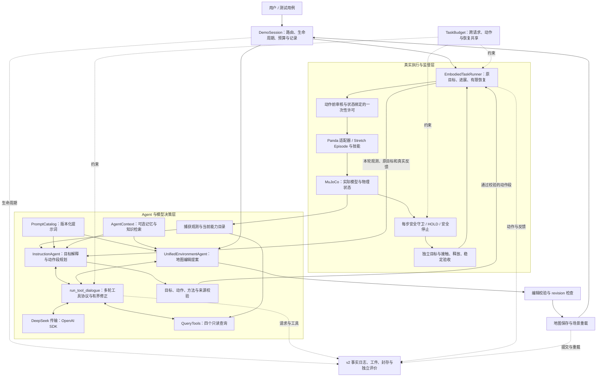
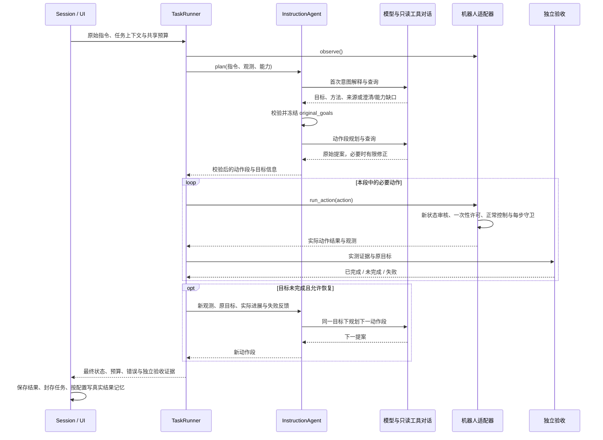
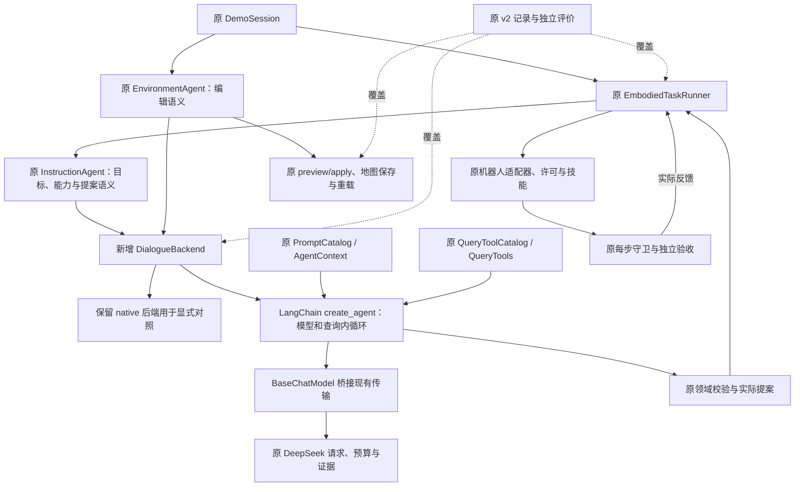

# 当前 Agent 架构、功能覆盖与 LangChain 替代分析

分析日期：2026-10-09（Asia/Shanghai）。源码基线：`7431bb8`。

本文分析当前实现。上一份 [LangChain 技术方案](LANGCHAIN_TECHNICAL_PLAN.md) 中的后端、模块与 CLI 参数尚未落地；当前虚拟环境未安装 LangChain/LangGraph。本次核查源码与已有测试定义，没有重新执行机器人或真实模型验收。

## 1. 当前架构的结论

项目已经实现一个基于已知仿真状态、注册技能和确定性安全约束的具身 Agent 系统。高层通过 LLM 解释目标、查询状态并规划动作段，低层执行真实 MuJoCo 控制，实测效果决定是否完成和是否需要继续规划。

系统有两个业务角色：

- **InstructionAgent**：Panda/Stretch 共用的指令规划核心，产生目标解释与动作提案。
- **UnifiedEnvironmentAgent / EnvironmentAgent**：桌面/家居地图编辑，产生编辑提案并经过 preview/apply 提交。

**EmbodiedTaskRunner 是执行监督器**，负责外层任务闭环，并不是另一个依赖 LLM 的规划 Agent。两个业务角色由 Session 按请求类型路由，目前没有主 Agent 分派多个专家并协同讨论的调度系统。

架构中的两个循环已有明确分工：`models/dialogue.py` 管理“模型 → 只读工具 → 模型 → 最终提案”；`execution/supervisor.py` 管理“动作段 → 单动作审核与执行 → 独立验收 → 真实反馈 → 再规划”。后者不会在每个成功动作后无条件请求一次 LLM。

## 2. 当前整体架构图

图中的记忆/知识组件已经有实现，默认配置关闭；只读工具读取本次决策的捕获快照。等待模型时物理状态可能经 HOLD 改变，因此动作执行前会重新观测和审核。环境编辑流程修改经过验证的地图初态，机器人控制流程通过技能改变实时物理状态。

### 2.1 文件与接口对应

| 层次 | 当前代码 | 主要接口或职责 |
| --- | --- | --- |
| 应用组装 | [DemoSession](src/embodied_agent/apps/demo/session.py)、[Demo UI](src/embodied_agent/visualization/demo_ui.py) | `run_agent`、地图选择/重置、TaskBudget、线程与 HOLD、任务记录 |
| 指令规划 | [InstructionAgent](src/embodied_agent/agents/instruction.py) | `plan`、首次解释意图、冻结目标、`last_*` 提案/目标/decision/对话证据 |
| 环境编辑 | [EnvironmentAgent](src/embodied_agent/agents/environment.py)、[家居扩展](src/embodied_agent/agents/map_environment.py) | `plan`、`preview`、`apply`；桌面/家居不同编辑约束 |
| 语义契约 | [GoalSpec](src/embodied_agent/agents/goals.py)、[观测](src/embodied_agent/agents/observation.py)、[能力目录](src/embodied_agent/tools/capabilities.py) | 通用目标、实体与技能 schema、几何候选、领域校验 |
| 模型与工具循环 | [dialogue](src/embodied_agent/models/dialogue.py)、[DeepSeek](src/embodied_agent/models/deepseek.py) | 原生 tool_calls、严格整批检查、有限修正、请求/响应记录 |
| 可替换组件 | [prompts](src/embodied_agent/prompts/catalog.py)、[tools](src/embodied_agent/tools/registry.py)、[context](src/embodied_agent/context.py) | 版本化提示词、目录与 handler、辅助记忆和知识 |
| 任务执行 | [EmbodiedTaskRunner](src/embodied_agent/execution/supervisor.py) | 真实进展、动作段执行、目标复验、有限恢复、可靠收尾 |
| 机器人适配 | [PandaInstructionAdapter](src/embodied_agent/execution/panda_adapter.py)、[StretchDemoEpisode](src/embodied_agent/simulation/robot_episode.py) | `observe/review_next_action/run_action/hold/safe_stop/evaluate_goal_evidence` |
| 技能与物理安全 | [skills](src/embodied_agent/skills/)、[simulation](src/embodied_agent/simulation/)、[safety](src/embodied_agent/safety/) | 导航/抓放控制、逐步物理检查、状态与权限约束 |
| 审计与评价 | [recording](src/embodied_agent/recording/)、[evaluation](src/embodied_agent/evaluation/) | 不可由模型改写的执行事实、独立评价、查询和数据导出 |

### 2.2 一次机器人任务的时序

如果模型返回 clarify，当前 TaskRunner 以 `CLARIFICATION_REQUIRED` 结束本次任务；返回 capability_gap 则以 `CAPABILITY_GAP` 结束。已具备澄清检测与问题输出，但没有在同一任务内等待用户补充再恢复的会话协议。

## 3. 已经实现的 Agent 功能

“已实现”指源码存在对应处理，且可找到相关测试或项目说明；不表示本次重新运行验收，也不表示任意机器人、任务和环境都适用。

| 编号 | 功能 | 当前实际实现与边界 | 主要依据 |
| --- | --- | --- | --- |
| F01 | 统一高层 Agent 与任务路由 | Panda/Stretch 共用 InstructionAgent；Session 分派机器人与环境请求；保留不同物理适配器 | `agents/instruction.py`、`apps/demo/session.py` |
| F02 | 意图理解与任务约束 | 模型先解释目标，保留方法、来源、顺序与禁忌；支持澄清与能力缺口；重规划保留原目标 | `agents/instruction.py`、`agents/goals.py` |
| F03 | 结构化世界与能力查询 | 仿真实测/声明地图形成对象、支撑、机器人状态；动态实体 ID、动作 schema、几何抓放候选 | `agents/observation.py`、`tools/capabilities.py` |
| F04 | 原生多轮工具调用 | observe/query_world/inspect/get_capabilities 四个只读工具；整批原始参数校验、实际结果回传；查询不控制机器人、不保存地图 | `models/dialogue.py`、`tools/registry.py`、`tools/query.py` |
| F05 | 提示词版本与组件注入 | 意图、动作、桌面/家居编辑提示词独立；正文/version/hash；目录、context、工具实现可替换 | `prompts/catalog.py`、`AGENT_COMPONENTS.md` |
| F06 | 动作提案与有限修正 | 生成完整或相关部分动作段；严格 JSON、目标/方法/能力约束；错误反馈后有限修正 | `agents/instruction.py`、`models/dialogue.py` |
| F07 | 任务进展与反馈重规划 | 根据实际效果继续规划，复验已完成动作效果，跳过仍成立的成功前缀；存在硬失败与有限恢复分类 | `execution/supervisor.py`、`tests/test_task_supervisor.py` |
| F08 | 跨机器人真实执行 | Panda 抓取/放置；Stretch 导航、停靠、抓取、携物、释放及 stop/wait；正常控制驱动 MuJoCo，受几何/质量/姿态限制 | `execution/panda_adapter.py`、`simulation/robot_episode.py`、`skills/` |
| F09 | 动作前审查与一次性许可 | 针对新观测检查实体、前提、权限、路径；许可绑定状态/版本，复验后消费；防止过期计划和重复放行 | `execution/panda_adapter.py`、`simulation/robot_episode.py` |
| F10 | 动态导航与安全监督 | 剩余路线检查、障碍运动的保守检查、受监控制动、有限重新寻路；每物理步检查碰撞、危险、非有限值、抓持/失稳等 | `skills/navigation.py`、`simulation/robot_episode.py`、`safety/` |
| F11 | 独立目标验收 | 9类目标谓词；实际接触、释放、支撑、位置与稳定窗口，以及来源/方法/次序/禁忌；效果满足才能判定物理成功 | `agents/goals.py`、`evaluation/home.py`、`evaluation/placement.py` |
| F12 | 任务预算、取消与收尾 | 任务共享请求/token/动作/恢复/时限；等待期间 HOLD；取消后阻断后续执行，迟到回复不消费；首错与清理错误分别保留 | `models/budget.py`、`execution/supervisor.py`、`apps/demo/session.py` |
| F13 | 环境编辑 Agent | 桌面/家居编辑提案、preview/apply、有限编辑权限、revision 冲突检查；保存与场景重载分别留证 | `agents/environment.py`、`agents/map_environment.py` |
| F14 | 经验记忆基础 | MemoryStore 按 namespace/revision 存储/检索有限条目；支持共享 store 注入和角色隔离，只在真实任务收尾后写摘要；默认关闭、进程内保存 | `memory/store.py`、`context.py` |
| F15 | 知识检索基础 | 本地版本化文档、词面匹配、top_k/字符预算、辅助上下文字段；默认关闭，无 embedding/向量库 | `knowledge/base.py`、`context.py` |
| F16 | 事实记录、评价与数据导出 | v2 manifest/journal/artifacts/seal、模型/工具/动作关联、完整性检查、独立可信规格评价；六种导出有资格检查 | `recording/`、`evaluation/task_writer.py`、`TASK_RECORDS.md` |
| F17 | 可视运行与批量回归 | 原 Demo 显示真实执行状态；支持地图选择、连续指令、重置、用例、显式 headless 批量；批量地图隔离 | `visualization/`、`apps/demo/cli.py` |

当前共享任务预算为24次请求、131072个已报告 tokens、128次动作、4次恢复、300秒；单工具对话最多8轮、24次工具调用、2次提案修正。默认记忆/知识关闭，见 [运行配置](configs/agent_runtime.json)。缺失供应商 usage 时日志保留未知消耗，计数器的已报告小计不能证明完整费用。

9类谓词是 `supported_on/inside/near/robot_at/held/state_equals/released/stable/action_completed`。能表示或检查某种状态，不代表有改变该状态的物理技能；例如能力目录的 `state_changes` 当前为空，家居容器内部操作不能靠箱顶支撑证明。

六种导出为 `trajectory/decision/sft/configuration/task_pool/preference`。导出成功与合格训练样本、真实参数更新分别判断；当前导出明确声明 `no_trainer_or_policy_update`，`rl_update.eligible=false`。

## 4. 还需要实现或增强的功能

下面按现有具身 Agent 路线与本次 LangChain 实践目标列出缺口。已有基础能力与需要新增的工程分开说明；后续研究项并不是首期框架接入的全部前置条件。

| 编号 | 能力缺口 | 已有基础 | 需要补的具体内容 | 顺序建议 |
| --- | --- | --- | --- | --- |
| N01 | LangChain 编排后端 | 模型传输、工具循环、Planner 契约和组件注入 | 标准模型桥接、后端注入、消息转换、create_agent、兼容性/记录/预算回归 | 首期 |
| N02 | 通用模型后端与本地模型验证 | OpenAI 兼容客户端、可配置 endpoint/client_factory | 不同供应商与本地服务的独立适配、工具/参数探针、部署与质量/延迟验收 | 首期按需要 |
| N03 | 持久会话与澄清后恢复 | 可输出澄清问题、任务进展与记忆接口 | 保留待澄清任务、用户回复关联、明确目标更新规则、恢复后的新观测和预算 | 近期 |
| N04 | 跨进程长期记忆 | 进程内 namespace/revision 记忆、实际结果摘要 | 持久化 store、生命周期/淘汰/隔离、跨会话可检索经验、隐含失败与重复任务处理 | 近期按收益 |
| N05 | 语义检索与知识维护 | 已有词面检索增强基础 | 文档加载/切分、embedding、语义或混合检索、版本化索引、检索质量评测 | 词面不足时 |
| N06 | 图状态持久化与物理恢复 | 事实日志、当前观测、初态重置数据 | 规划状态 checkpoint；完整 MuJoCo/控制器状态复制与恢复协议；副作用对账、重观测与旧许可失效 | 分阶段 |
| N07 | 完整审查门面与隔离预演 | 确定性单动作审核、一次性许可、路径检查、逐步守卫已经存在 | 统一多类审查结果/版本；多个候选与情景的隔离预演、预算和缓存失效；仿真副本不污染现场 | 后续安全研究 |
| N08 | 视觉/部分观测感知 | 已知地图与仿真状态、渲染图像 | 传感器观测、物体识别/定位、状态估计、不确定性；需要时接 SLAM/感知模型 | 后续能力扩展 |
| N09 | 更复杂物理技能与实机适配 | 受限抓放、已知地图导航、地板/沙发/平台几何支持 | 容器内取放、门/抽屉/电器、液体/柔性物体等控制与验收；实机通信、标定及安全验证 | 按任务逐项 |
| N10 | 真实模型训练与迭代优化 | 原始采样/事实记录、可信规格评价、合格数据导出 | LoRA-SFT/DPO 等训练器、真实权重更新、部署复验；RL另需行为概率/token、重置/状态、奖励和算法适配 | 后续训练路线 |
| N11 | 协作/对抗 Agent 与持续泛化评测 | 两个业务角色、任务集、批量与独立评价 | 专家分工/汇总、对抗反例生成、版本隔离、跨布局/技能组合基准与统计比较 | 有明确实验目标时 |

当前动态导航是有限的路线检查、制动和重新寻路，不能外推为任意移动障碍下都可靠的实时导航栈。若进一步研究复杂动态场景，还需更完整的局部轨迹/速度规划、控制与感知误差模型，以及系统化误拒/漏检和延迟评测。

### 4.1 历史文档中需要更新理解的地方

历史 [Hook 调研](HOOK_STABILITY_RESEARCH.md) 和 [通用 Agent 改造方案](通用具身Agent差距与改造方案.md) 明确标注了旧源码/改造前状态。当前代码已经有统一 InstructionAgent、有限恢复、共享总预算、HOLD、单动作一次性许可与六种数据导出，不能再把它们列为完全缺失。

另一方面，已实现上述保护并不代表路线图中的“完整 Hook/多层预演系统”已完成。当前重点是确定性的真实执行保护，还没有已验证的隔离物理预演、候选×情景评估或训练迭代。

## 5. LangChain 能替代什么

这里的“替代”指替换通用软件机制。任务意义、真实工具 handler、机器人控制和评价规则仍需项目提供。框架集成不会自动增加机器人技能，也不会直接产生已训练模型。

### 5.1 三个组件应分别理解

| 组件 | 可承担的职责 | 本项目的位置 |
| --- | --- | --- |
| LangChain | 标准模型接口、模型/工具 Agent 循环、工具 schema、结构化输出、middleware 和检索组件 | 优先替代 `models/dialogue.py` 中通用编排和模型接口的一部分 |
| LangGraph | 自定义状态图、条件路由、规划状态 checkpoint/store、interrupt/resume | 后续持久会话与显式工作流；物理恢复仍需自建协议 |
| LangSmith | 调用 trace、调试、可观测性与评价平台 | 可选的开发/比较辅助，不替换本地 v2 事实日志与物理判定 |

LangChain 的 create_agent 建立在 LangGraph 之上；使用其内置 Agent 循环与显式重写项目外层状态机是两种不同改造范围。[LangChain 概览](https://docs.langchain.com/oss/python/langchain/overview)、[LangGraph 工作流](https://docs.langchain.com/oss/python/langgraph/workflows-agents)、[LangSmith 可观测性](https://docs.langchain.com/langsmith/observability)。

### 5.2 已有功能的替代矩阵

| 已有功能 | 替代程度 | 框架机制 | 必须保留/补充的项目逻辑 |
| --- | --- | --- | --- |
| DeepSeek 调用与消息接口（F01/F04） | 通用接口可替代；供应商协议需适配 | ChatModel/provider integration，或 BaseChatModel 桥接 | thinking/reasoning_content、原始参数、请求前留证、错误码和真实计数 |
| 多轮模型—查询循环（F04/F06） | 可替代主要编排 | `create_agent` | 单对话/总任务预算、有界修正、只读工具边界、快照一致性 |
| 工具 schema 与模型绑定（F04） | 可替代框架包装 | `@tool` / StructuredTool / tool binding | 真实 QueryTools handler、目录版本、闭合 schema、权限和整批原始协议检查 |
| 提示词组装（F05） | 可替代模板机制 | 消息/提示词模板、system_prompt、动态提示词 middleware | PromptCatalog 的版本、正文、hash 与内容；任务约束不会由模板自动提供 |
| 最终输出格式（F06） | 部分替代 | ToolStrategy / ProviderStrategy / Pydantic schema | 原始输出证据、重复键/非有限值检查、动态实体、目标/方法/来源与动作语义 |
| 目标解释与动作规划（F02/F06） | 框架可承载；领域能力需实现 | create_agent + 项目提示词/输出 schema | 用户意图理解由模型与任务设计决定；冻结目标、能力与评价规则继续自建 |
| 上下文与经验记忆（F14） | 存储/状态可替代，写入语义保留 | AgentState、LangGraph store/checkpointer、上下文 middleware | run/task/role 隔离、真实终态才写入、经验不覆盖实时状态或权限 |
| 本地知识检索（F15） | 可替代检索实现并扩展 | Retriever、文档加载/切分、embedding/vectorstore integration | 文档可信边界、版本/来源/预算、检索评测、auxiliary_context 语义 |
| 请求包装、Hook 与预算（F09/F12） | 部分替代组织方式 | before/after/wrap_model_call/wrap_tool_call middleware | 整任务 TaskBudget、动作/恢复计数、实际截止、异常分级；物理步守卫仍独立 |
| 任务进展、外层恢复（F07） | LangGraph 可重写编排；首期建议保留 | StateGraph + 条件边与自定义节点 | 真实执行反馈、硬失败、同目标恢复、已完成效果复验、物理停止 |
| 运行 trace 与比较（F16） | 可增强可观测性 | callbacks + LangSmith | 原 journal/artifacts/seal、完整性与因果证据；不得仅以云 trace 宣称真实完成 |
| 环境编辑 Agent（F13） | 模型/工具/提案编排可替代 | 同一 create_agent 后端 + 编辑 schema | preview/apply、revision/权限、原子保存、重载与 persisted 状态 |
| 机器人控制与运动几何（F03/F08/F10） | 需项目实现，可由框架调用 | 自定义工具/节点只是包装 | Panda/Stretch 控制、抓放几何、路径求解、真实接触和动态制动 |
| 每物理步安全与独立验收（F09/F10/F11） | 需项目实现 | middleware 可接审查入口 | 安全守卫、一次性许可消费、真实测量、稳定窗口、可信规格评价 |
| 可视化、事实数据导出（F16/F17） | 需项目实现；平台辅助可选 | trace UI 与评测工具只能辅助 | MuJoCo Viewer、现场同步、v2封存/导出资格/组隔离、原 Demo 操作 |

工具绑定和结构化输出可减少通用代码，但不是直接删除所有校验。框架已解析成 dict 的 arguments 可能丢失重复 JSON 键信息；逐项工具 middleware 也不能天然满足本项目“整批通过前零 handler 执行”的要求。应在原始响应进入框架前保留并验证协议。[工具接口](https://docs.langchain.com/oss/python/langchain/tools)、[结构化输出](https://docs.langchain.com/oss/python/langchain/structured-output)。

middleware 可包装模型和工具调用，适合复用预算检查、审计、异常处理和上下文组装。它提供的是执行这些规则的位置，碰撞、安全距离、动态路径、硬失败和实际停止规则仍由项目定义。[自定义 middleware](https://docs.langchain.com/oss/python/langchain/middleware/custom)。

### 5.3 尚缺能力中，框架能帮助实现的部分

| 待实现能力 | 可采用的框架能力 | 框架之外还要做什么 |
| --- | --- | --- |
| N01 标准 Agent 后端 | LangChain create_agent、模型/消息/工具接口 | 适配现有两阶段提案与全部行为约束，完成回归 |
| N02 模型切换 | 官方各 provider integration、本地模型 integration | 部署模型服务、验收模型能力与延迟、兼容供应商字段 |
| N03 澄清后继续执行 | LangGraph interrupt/resume + checkpointer | UI/用户回复关联、目标更新语义、等待时机器人 HOLD/停止策略 |
| N04 持久记忆 | LangGraph store 与持久后端 | 实际结果写入、隔离/淘汰、错误经验处理和收益评价 |
| N05 语义检索 | LangChain 文档/检索/embedding/vectorstore 组件 | 文档准备、模型/数据库选择、版本与索引维护、检索指标 |
| N06 规划状态恢复 | LangGraph checkpointer | MuJoCo/控制器完整状态、动作和地图副作用对账；图 checkpoint 不等于物理 checkpoint |
| N07 审查/预演 | middleware 组织审查、图节点组织候选/情景 | 审查依据、隔离仿真、状态复制、权限/预算、缓存与检出收益 |
| N08/N09 感知与复杂技能 | 可调用视觉模型、感知工具、自定义控制节点 | 视觉/SLAM算法、几何/控制/硬件、安全和物理验收 |
| N10 训练 | 可编排采样与调用外部训练流程；LangSmith可辅助比较 | 训练器、优化算法、训练数据资格、权重更新、部署与泛化验证 |
| N11 协作/对抗流程 | LangGraph路由、并行节点、评估反馈循环 | 每个角色/反例生成器、权限隔离、独立真实评价及预算；共享物理现场不能任意并发写 |

规划持久化、会话中断和跨线程 store 属于 LangGraph 能力；它们不会自动重建项目的物理状态或撤销已执行副作用。[持久化](https://docs.langchain.com/oss/python/langgraph/persistence)、[interrupt/resume](https://docs.langchain.com/oss/python/langgraph/interrupts)。

知识检索可以先保留原词面后端、适配成 retriever，再在有实测收益时接 embedding/vectorstore。[检索构件](https://docs.langchain.com/oss/python/deepagents/retrieval)、[Embedding 集成](https://docs.langchain.com/oss/python/integrations/embeddings)、[Vector store 集成](https://docs.langchain.com/oss/python/integrations/vectorstores)。

## 6. 推荐接入后架构（尚未实现）

首期主要替换模型/查询内循环，保留物理外循环；两个业务 Agent 可以共用新对话后端。后续如要用 StateGraph 表达外层监督，应把原审查、执行、停止和验收作为自定义节点逐项迁移，而不是仅用工具返回字符串替代。

建议顺序是先做模型桥接和 native 对照，再做 create_agent 后端与双机器人回归，然后根据明确需求实现澄清恢复、持久记忆或语义检索。隔离物理预演、视觉技能、训练与实机能力独立立项验收。详细步骤见 [LangChain 实施方案](LANGCHAIN_TECHNICAL_PLAN.md)。

## 7. 本次分析依据与验证范围

源码核查覆盖32个核心模块；静态索引15个相关测试文件、148个测试方法定义，以核对已有行为覆盖，**未重新运行这些测试**。这份索引不能作为148项测试已通过的报告。

关键现有测试包括 [指令规划](tests/test_instruction_agent.py)、[执行监督](tests/test_task_supervisor.py)、[任务预算](tests/test_task_budget.py)、[工具协议](tests/test_tool_dialogue.py)、[动态执行](tests/test_dynamic_execution.py)、[记忆](tests/test_agent_memory.py)、[知识](tests/test_agent_knowledge.py)、[组件集成](tests/test_agent_component_integration.py)、[环境工具](tests/test_environment_tools.py)、[记录与导出](tests/test_recording_exports.py)、[模块边界](tests/test_module_boundaries.py)。

当前代码与近期 [实际执行链路](自然语言任务执行链路.md)、[组件说明](AGENT_COMPONENTS.md)、[记录资格](TASK_RECORDS.md) 作为现状依据。历史路线图用于识别后续目标，框架官方资料用于功能映射；框架能提供的软件机制与项目已经验证的机器人能力分别判断。
