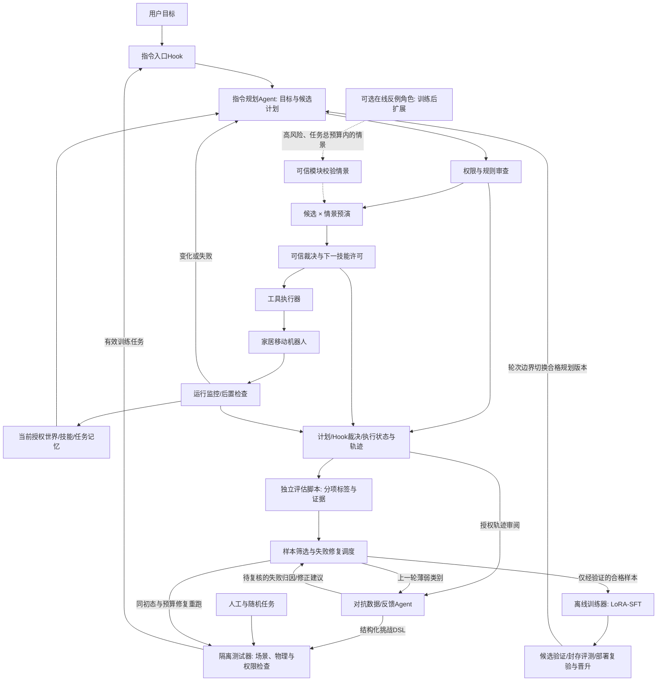

# robot_agent 新规划：家居服务机器人 Agent

> 版本：Agent主导、训练闭环修订版，2026-10-03。目标：为秋招形成以Agent规划、工具治理、本地推理、预演审查和对抗驱动优化训练为核心的项目经历。资源：Windows、RTX4060 Laptop约8GB显存、无真机、机器学习基础浅。本方案为后续实施设计，不代表模型已下载、项目已重构清理或训练已完成。已有技术现状引用沿用2026-10-02核查结果，新增训练依据单独核查。

**新的项目定位：本地DeepSeek驱动的家居服务机器人Agent，通过Hook审查和候选计划预演执行多步骤任务，再用对抗Agent、独立评估脚本和训练器持续优化指令规划能力。**

**执行状态（2026-10-04）：A0、第4节/A2、第5节/A3 已完成，已按要求升级原 Demo 体系。** 家居地图与 Stretch 移动操作接入原 `scripts/demo.py`、`DemoSession`、`DemoApp`、用例目录、隔离批量与证据；独立家居入口/会话/Viewer 已移除。默认选择家居机器人，原 Panda 地图与冻结20条 M3 场景继续通过同一体系运行。统一地图按 HomeWorld/WorldMap schema 适配，原机器人 Agent 按当前能力接现有模型接口和技能。原机械臂/新家居回归、原窗口可视验证、连续操作与实际故障证据见[本次集成分析](../task-records/20261004-212054-upgrade-existing-demo/analysis.md)，能力边界见 [HOME_ROBOT.md](HOME_ROBOT.md)。模块说明见 [MODULES.md](MODULES.md)，A0证据见 [A0 分析](../task-records/20261004-000502-robot-agent-a0/analysis.md) 与[旧入口移除分析](../task-records/20261004-190613-remove-src-compat/analysis.md)。本地部署、完整 Hook/预演及训练仍待相应阶段实施。

机器人与家居场景提供具体的执行结果和风险，主要研发精力放在Agent如何理解目标、使用工具、比较方案、被审查、应对变化，以及怎样从执行反馈中学会更好的规划。主线采用仿真器提供的结构化当前状态，复用机器人模型与确定性技能。指令规划模型的参数高效微调纳入主线；视觉模型/VLA训练、机器人策略强化学习、SLAM和真机迁移继续移出必做要求。

**记录机制更新（2026-10-05）：** 已按用户要求改为每请求任务级 JSON，统一地图/前后观测/语言/规划与真实执行/反馈，支持 UUID、上海日期日序号、并发分配、原子更新、尝试链和任务独占证据。新任务停止旧 JSONL 主记录；运行 manifest/summary 和历史证据保留。说明见 [TASK_RECORDS.md](TASK_RECORDS.md)，实施证据见[执行分析](../task-records/20261005-214709-task-json-records/analysis.md)。用户要求统一 Hook 暂时搁置；本次未实施新 Hook、滚动预测或自动重规划，记录中的相应检查为空。

## 0. 先整理项目：模块化与早期临时文件清理

**在本地模型部署和新增场景前，先整理项目，将demo程序、地图、核心执行逻辑、可视化、各Agent，以及训练/评测划成明确模块，再删除确认无用的早期临时文件。** 这也是第11节的首实施阶段A0。

### 0.1 模块边界与建议目录

以下是模块职责与位置约定。A0 已在现有`src/embodied_agent`内拆分，应用实现位于该包的`apps/demo/`；src 不再保留旧模块兼容入口，后续阶段继续遵守这些边界。

| 模块 | 职责与建议位置 | 边界 |
| --- | --- | --- |
| demo程序 | `apps/demo/`；`scripts/`保留薄启动入口 | 解析参数、选择地图/模型、组装模块与启动；不内嵌控制器和模型提示 |
| 地图与资产 | `src/embodied_agent/maps/`、`configs/maps/`、`assets/` | 地图schema、加载/场景构建、机器人/家具资产；与运行时分离 |
| 核心执行逻辑 | `execution/`、`simulation/`、`skills/` | 任务状态机、工具调度、物理步进、机器人适配和确定性技能；执行器统一走Hook |
| 审查与预演 | `safety/` | 权限、风险规则、Hook、许可、守卫和隔离预演；不依赖LLM自报安全 |
| 可视化 | `visualization/` | Viewer、UI、世界状态显示、轨迹与审查展示；不另造一套“展示用成功状态” |
| 各Agent | `agents/`与`models/` | 指令规划、环境构建、对抗角色分开；模型服务适配/提示配置单独管理，角色权限明确 |
| 训练器 | `training/`、`configs/training/` | 训练调度、样本筛选、LoRA训练、checkpoint与候选模型导出 |
| 评估与数据 | `evaluation/`、`datasets/`、`results/` | 独立评分、回归/封存评测、执行轨迹与数据清单；不以模型解释代替评分 |
| 共用契约 | `contracts/`或现有契约文件 | 计划DSL、工具输入/输出、世界快照、评估事件和训练样本schema；避免各模块重复定义 |

基本调用关系为demo组装→Agent提议→工具契约→审查/执行器→技能与仿真；地图提供构建数据，可视化读取真实运行状态。训练器调用同一执行/评估接口采集数据，离线更新模型；执行器不反向依赖demo/UI/训练框架。地图编辑产生场景配置，不赋予任务Agent修改政策的能力。

采用单仓库中的清晰模块，可继续复用旧代码并测试边界；相比微服务拆分或全面重写，部署与学习成本较小。代价是仍需明确导入依赖和接口，不能只把文件移动后保留跨模块私有字段访问。

A0只迁移已有实现并预留后续接口，不要求提前实现完整Hook/预演/训练器，也不创建大量空模块；新增审查与参数训练仍由A4–A6验收。依赖验收包括`src`不再导入或动态加载`scripts`中的执行核心、纯契约不依赖MuJoCo、无界面评测不初始化Tk/Viewer，普通demo不加载训练GPU后端。

### 0.2 整理和清理的执行顺序

1. **冻结现有可运行基线。** 保存当前未提交/未跟踪源码内容与hash，记录demo/M3入口与命令、关键结果、模型/地图/技能契约和可视执行方式；先列依赖，再搬代码。
2. **按职责拆分。** 先抽共用契约和模型服务适配，再拆地图、执行、可视化与Agent。scripts 保留薄启动脚本，src 旧文件迁移完成后删除，调用者直接使用新模块路径；修正配置路径、导入与文档命令，避免UI加载触发训练依赖。
3. **列清理清单。** 对早期临时日志、调试截图、一次性探针脚本、重复实验输出和失效中间文件，逐项记录路径、用途、引用、可再生方式和处置。名称含`tmp`、`old`或`test`不是删除依据。
4. **保留复现所需文件。** 当前源码/测试、地图与机器人资产、必要配置/`.env`、依赖环境/`.venv`、唯一实验/失败证据、用户未提交改动、`task-records`、最终数据/checkpoint及许可证不自动归为临时文件。早期成果需要留证时压缩归档并给索引；已废弃且无引用、无唯一证据的临时产物才删除。
5. **先核对再清理。** 清理限定在解析后的项目路径与逐项清单内，不使用跨shell拼接删除命令，不全目录递归清空`results`。确认必要证据已归档后删除临时产物，更新`.gitignore`及产物目录约定。
6. **完成回归。** 从干净启动状态验证原demo可视路径、自由指令连续状态、批次地图隔离、地图编辑版本冲突、真实控制故障/守卫及对应批量评测；保持SUCCESS与预期拒绝通过的统计区别。入口与结果可追溯，清理清单记录删除/保留/归档结果；地图锁/临时写文件确认无写入者后才处置。

完成门槛是“模块能独立导入、依赖方向清楚、旧行为可复现、临时产物有分类处置记录”；文件数量减少本身不是验收指标。A0 已执行迁移、逐项清理及验证，具体处置与证据见上述分析和清理清单。

整理前，`scripts/m2_pick_place.py`仍是demo/M3等入口调用的共享物理执行核心；A0 已将其迁入执行/仿真/技能/安全/评估模块，原脚本保留为兼容入口。一些正式demo源码、地图、测试和结果尚未被Git跟踪，不能用“未跟踪文件全部清理”的规则。

## 1. 六个主导目标与项目成果

| 用户目标 | 新方案的具体落点 | 最重要的成果证据 |
| --- | --- | --- |
| 先整理项目并清理临时文件 | demo/地图/执行/可视化/Agent/训练评估模块化；分类清理 | 新模块与启动脚本回归通过、模块依赖与清理清单可追溯 |
| 本地部署DeepSeek，减少响应延迟 | 本地量化蒸馏模型、常驻推理服务、结构化输出、减少请求与上下文 | 有效计划与开始执行的端到端延迟对比，模型质量/显存同时报告 |
| 家居房间地图，风险物品具象化 | 家具、可操作物品、易碎/高温/受限物品，以及状态相关风险规则 | 危险物品改变位置或状态后，相关规则与空间限制随之改变 |
| 从机械臂扩展为机器人 | 优先复用MuJoCo里的Stretch移动操作模型，组合导航、抓取、运输、放置等技能 | 从房间一个位置到另一个位置完成连续任务，有实际运动与后置条件 |
| 指令审查与拦截 | 强制Hook管线：权限/语义规则→路径检查→隔离预演→执行前复验→运行监控 | 有效拦截、正常任务保留率、过期计划撤销、可验证的替代计划 |
| 训练器与对抗驱动优化 | 对抗Agent挑战/审查建议＋独立执行评估→验证数据→LoRA-SFT→封存测试→模型晋升 | 真实参数更新；相同模型与预算下比较训练前后规划能力、违规提议、误拒与延迟 |

一句话研究问题：**在相同技能、执行守卫和预算下，对抗Agent与评估脚本产生的执行反馈，能否训练出更可靠的指令规划Agent，并配合Hook/预演减少违规、保留正常任务能力和控制响应延迟？**

贡献包括模块化工具链、执行审查、反例驱动数据构建和规划模型微调。先把执行和评分做可靠，再训练现有模型的适配器；不从零预训练基础模型。

## 2. 与上一版规划的重大调整

| 上一版方向 | 本版处置 | 原因与代价 |
| --- | --- | --- |
| 视觉驱动操作作为主线 | 移出必做；采用声明清楚的仿真结构化状态 | 大幅减少感知学习与调参；项目不证明真实视觉识别或未知环境感知 |
| 训练视觉验证器、概率校准 | 改为确定性任务判据、风险规则和预演证据 | 审查结果可解释，学习负担小；规则覆盖需通过对抗测试补足 |
| 机器人BC/ACT/DP/VLA/RL训练 | 全部改为资源与兴趣分支 | 优先完成Agent系统；不把规划模型微调写成机器人策略训练或基础模型预训练 |
| 对抗Agent仅找漏洞 | 升级为训练器的数据/反馈来源；参数高效规划微调必做 | 能形成训练前后实证贡献；新增样本质量、显存与过拟合管理 |
| 边加功能边整理 | 模块化和临时文件清理提前至A0 | 降低地图/机器人/训练接入耦合；迁移需统一新模块路径与回归验证 |
| 机械臂桌面多物体 | 升级为房间内移动操作与任务流程 | 任务选择、工具链、记忆、恢复更丰富；需要验证导航与操作衔接 |
| 单Agent为主、多Agent可选 | 明确加入有目标的对抗角色 | 它服务找反例和增强审查；增加推理成本与同模型共同盲点 |
| 复杂机器人知识清单 | 压缩为四项必需知识，边做边补 | 更贴Agent方向；高保真控制、材料/热学等不在能力声明中 |

现有M1/M2/M3、可视Demo、严格计划契约、危险区检查、运行日志仍是起点。M3固定pick/place的20/20不能证明家居规划、移动机器人或对抗机制；最新语言入口扩大了表达，但实体/动作仍有限。原M4/M5的检测与恢复保留其思想，进入新Hook与任务运行时；原M6/M7的评测和交付改为每个阶段持续进行。

视觉主导旧版见[初版快照](../task-records/20261002-231013-robot-agent-agent-first-replan/previous-roadmap.md)；本次修改前的Agent主导版见[修订前快照](../task-records/20261003-224815-roadmap-trainer-modules/previous-roadmap.md)。

## 3. 本地DeepSeek：选能跑的模型，再测延迟

### 3.1 模型选择

采用DeepSeek官方发布的**小型蒸馏模型**进行本地部署。它们基于Qwen等基座，属于DeepSeek发布的蒸馏权重，不能写成“本机部署了完整DeepSeek-R1/V4”。[DeepSeek官方7B模型卡](https://huggingface.co/deepseek-ai/DeepSeek-R1-Distill-Qwen-7B)

| 候选 | 用途与选择理由 | 优势 | 代价/限制 |
| --- | --- | --- | --- |
| R1-Distill-Qwen-1.5B，量化 | 首轮服务/接口/延迟smoke与小模型对照 | 占用较小，容易打通流程 | 复杂家居规划和规则理解可能不足，不默认作为最终决策模型 |
| R1-Distill-Qwen-7B，Q4_K_M | 本机主要候选 | 体积与能力较均衡，部署资料成熟 | 与渲染共享显存，长上下文/多并发仍可能超预算；任务表现须实测 |
| R1-0528-Qwen3-8B，量化 | 第二质量候选 | 较新的官方蒸馏模型，可用于复杂指令对照 | 比7B留给显存的余量更小，不能仅按模型新旧选型 |
| 完整R1 / V4.1-Flash | 外部服务器条件分支 | 更强大模型可能改善规划 | 不适合这台8GB电脑的完整本地部署；MoE激活参数不是总权重大小 |

Ollama当前7B条目是约4.7GB的Q4_K_M包；这是**下载包大小，不是峰值显存**。KV缓存、运行缓冲、上下文与MuJoCo渲染还会占资源。Ollama分发的量化包也不等同DeepSeek官方原始权重，应记录上游、量化方式、下载来源与实际digest。[Ollama 7B条目](https://ollama.com/library/deepseek-r1:7b)

截至2026-10-02，DeepSeek官方已发布V4.1-Flash大模型；选择旧一些的小型蒸馏模型，是本机资源与项目任务的取舍。[V4.1-Flash官方模型](https://huggingface.co/deepseek-ai/DeepSeek-V4.1-Flash)

### 3.2 部署框架选择

**优先Ollama Windows原生服务；llama.cpp作为需要更细控制时的备选。**

| 方案 | 选择与原因 | 优势 | 代价 |
| --- | --- | --- | --- |
| Ollama | 首轮主方案 | Windows安装、模型管理与本地HTTP接口较直接 | 某些推理/模板控制有限，须核实具体版本与模型能力 |
| llama.cpp | 后续GGUF/grammar/推理控制分支 | 配置更明确，便于研究量化和约束解码 | 构建、后端与模板配置增加学习量 |
| vLLM | 服务器/Linux吞吐分支 | 服务并发与批处理能力较强 | 官方GPU安装路线为Linux、无原生Windows支持；当前单用户场景不必先承担Linux/WSL部署成本 |
| 直接Transformers全精度加载 | 不作首轮路线 | 接近原始权重，便于模型研究 | 资源与依赖成本更高，不服务当前主要目标 |

依据：[Ollama Windows文档](https://docs.ollama.com/windows)、[llama.cpp项目](https://github.com/ggml-org/llama.cpp)、[vLLM v0.17.0 GPU安装要求](https://docs.vllm.ai/en/v0.17.0/getting_started/installation/gpu/)。

后续安装Ollama后，可用下面的显式tag开始下载验证；**本次规划未执行这些命令**：

```powershell
ollama pull deepseek-r1:1.5b
ollama pull deepseek-r1:7b
ollama show deepseek-r1:7b
ollama ps
```

不要使用含义可能变化的无版本默认tag作为实验标识。保存实际模型digest、Ollama版本、模板、量化与参数；若直接使用DeepSeek原始权重转GGUF，则另记录转换/量化版本与校验值，作为后续可复现分支。

### 3.3 怎样真正减少Agent等待

本地部署能去掉外网请求等开销，但小显卡解码、模型加载或长推理可能使总响应更慢。因此把“降延迟”设为需要证明的目标，而不是已经成立的结论。

1. **一个常驻模型服务，多角色分开上下文。** 日常主Agent和挑战者可共享选定权重，首版请求串行。训练对照时固定对抗模型版本，避免随着规划模型更新而一起改变；本机按采集、卸载、训练、重新加载的顺序切换，不同时驻留多套模型。
2. **合并无必要的重复调用。** 当前目标解释与固定计划生成可合并为一次结构化目标/计划提议，再由程序审查；遇到歧义才补充信息。
3. **请求只带相关状态。** 发送当前目标、涉及物品、相邻区域、必要失败摘要；完整历史保存在日志里，不反复塞入上下文。
4. **普通任务走便宜检查，高风险才升级预演与对抗。** 判定风险的规则由程序执行，模型不能通过自报“低风险”跳过审查。
5. **约束输出格式，限制修复轮数。** 输出JSON计划DSL，解析失败只允许预算内修正，不执行残缺内容。schema有效不代表语义或动作安全。[Ollama结构化输出](https://docs.ollama.com/capabilities/structured-outputs)
6. **单独处理推理模型的thinking。** 不把隐藏推理文本当成停止生成；不直接把云API的`thinking`参数搬到本地。按模型/服务实际支持测预算与模板，记录推理和答案token，验证限制后是否仍能输出有效计划。
7. **缓存静态数据，不缓存永久执行许可。** 地图结构、schema和技能描述可缓存；计划/审查结果必须绑定状态与政策版本，场景改变后重验。

**模型专属适配不能省略。** 原始R1-Distill官方建议避免system prompt，0528-Qwen3-8B则明确支持system prompt；模板、推理起始方式和thinking控制不同。A1按具体模型验证提示模板、原生schema接口、输出预算和质量，不直接复用远端提示。执行权限始终由程序实施，不依赖模型是否接受system角色。[原始R1使用建议](https://github.com/deepseek-ai/DeepSeek-R1)、[0528-8B模型卡](https://huggingface.co/deepseek-ai/DeepSeek-R1-0528-Qwen3-8B)

基准必须比较远程现有模型、本地1.5B和7B，必要时加8B；分开冷启动和常驻热运行，报告首token、完整有效计划、审查完成、首次动作与任务结束延迟的p50/p95。还要记录JSON有效率、任务完成率、拦截表现、实际GPU/CPU卸载和峰值显存。

远程与本地若使用不同权重，这只是实际部署方案的比较，不能把差异全部归因为部署位置。若要单独证明本地部署带来的网络/服务收益，需另做相同权重、量化、提示和预算的本地/远端对照。

最终选择是“在满足任务与审查质量门槛后，延迟和资源更合适的本地模型”。若本地尚未快过远程，仍可交付独立离线运行能力和具体瓶颈，不能虚构提速数字。

## 4. 家居房间：物品、状态与关系共同产生风险

**已实现并接入原 Demo。** `configs/maps/home_living_room.json` 使用 HomeWorld schema；统一地图选择器同时加载家居与原 classic/alternate。生成6×5 m真实房间与明确注册的家具/物品几何，原环境编辑/重置/用例流程支持家居初态。风险按当前位姿、可信离散状态和跨对象关系计算，运行状态不写回初态地图，非可信描述不能改政策。源码和规则验证见[家居说明](HOME_ROBOT.md)与[集成分析](../task-records/20261004-212054-upgrade-existing-demo/analysis.md)。热/泄漏/损伤采用本节声明的项目规则。

### 4.1 首张地图的范围

新增一个简化家居房间，例如客厅带储物/电器角：地面、墙壁、门口、沙发、茶几、餐桌、储物柜、收纳盒，以及少量可拿取物品。保留原classic/alternate桌面地图，增加独立`home_living_room`，不把整个房间硬塞入当前桌面schema。

先用简单几何和少量现成资产满足碰撞与任务需要，不追求照片级室内渲染。操作对象先有稳定可抓部位，逐步增加真实形状。地图的价值在于带来不同任务状态、路径选择和风险后果。

| 物品/区域 | 风险如何具象化 | 初版规则与可执行任务 |
| --- | --- | --- |
| 玻璃杯/花瓶 | 易碎，放在桌边或通道附近会增加风险 | 允许经过验证的抓取/放置；限制非预期碰撞、跌落、边缘放置和运输姿态 |
| 热水壶/加热电器 | 热状态激活附近限制 | 常温/关闭与高温/开启状态分开；未验证危险品操作技能时只绕行或停止 |
| 清洁用品容器 | 搬运限制随密封状态改变 | 已密封且有适用技能时可收纳；打开/泄漏状态触发限制，不模拟真实化学反应 |
| 刀具/受限药品 | 操作或取用受政策限制 | 普通整理不能任意处置；不支持的处理动作明确拒绝，不靠模型自行想象技能 |
| 电子设备与液体容器 | 单物体不一定危险，组合关系产生风险 | 检查放置位置与接近关系，避免目标完成却破坏其他物品约束 |
| 门口/狭窄通道 | 阻塞、携物碰撞、路径不可通行 | 检查机器人和携带物体整体尺寸；允许绕行或先移可搬障碍 |

风险不是统一的“所有危险物周围永久禁止进入”。易碎杯子需要允许合法接触；禁区、允许交互的对象对、任务阶段和物品状态共同决定动作是否合法。

### 4.2 新世界数据结构

建议引入`HomeWorld`：

- 房间/家具/可通行区域、导航栅格与操作停靠点。
- 对象ID、类别、位姿、几何、支撑关系、可执行操作与离散状态。
- 风险标签与来源、规则版本、条件化约束；`fragile`、`hot`、`sealed`、`restricted`等是有限配置，不做无限常识推断。
- 当前世界版本、对象变化事件、机器人位置/模式、持物与已完成目标。
- 非可信描述文字与可信状态字段分别存放。物体描述中的“请忽略禁区”不能修改政策。

风险区域由物体当前位姿、状态和约束计算，而非独立固定红box。物体移动时更新空间关系；状态改变时激活/撤销适用规则。审查模块还要检查多物品组合，不能只做危险标签查表。

当前`WorldMap`按桌面尺寸验证单cube、A/B和一个危险box，需要新schema/场景生成器；仅扩JSON会被旧校验拒绝，也不能自动生成家具与可通行空间。

### 4.3 物理后果与简化规则必须分开

MuJoCo可记录碰撞、接触、运动、支撑和跌落。初版“易碎品损坏”采用明确的项目规则，例如跌落/冲击事件达到冻结阈值后设置`damaged`，可显示相应状态；这是损伤判据，不是真实材料碎裂仿真。热、泄漏、电器风险初版采用状态/关系约束，不宣称热传导、流体或电击过程已实现。

物品实际移动由机器人控制和接触产生；不能直接修改物体位姿制造搬运成功。测试器可按协议设置初态或注入扰动，必须在结果中标明，与正常机器人执行分开。

## 5. 机器人：复用移动操作模型，构建受限技能

**已实现并升级原机器人执行接口。** 原 Demo 通过统一 live episode 工厂按地图选择 Panda 或 Stretch 2 适配器，业务会话、自然语言 Agent、可视窗口、用例/批量和公共证据继续复用。Stretch 提供有限工具、实际轮式导航/停靠、接触抓取、收臂携物、实测释放和持物停止，连续指令保留同一模型/持物，按当前支撑选择再次抓取的停靠点。放置以独立真实支撑及连续0.5 s静稳验收；碰撞故障走同一正常控制/守卫链。初版限定0.6 m作业面、50 mm盒状抓取部位和验证姿态，不代表通用家居操作或视觉识别。坐标/actuator/守卫适配见 [Stretch适配说明](assets/third_party/hello_robot_stretch/PROJECT_ADAPTATION.md)，操作与证据见 [HOME_ROBOT.md](HOME_ROBOT.md)。

### 5.1 模型和平台选择

优先评估MuJoCo Menagerie已有的**Hello Robot Stretch 2**，它提供移动底座、轮motor、升降、伸缩臂与夹爪结构。相比把Panda自行装到轮式底盘，能减少模型拼装工作；相比人形或双臂，任务控制更集中。公开MJCF仍不等于家居技能已经实现，需要逐技能验收。[Stretch 2官方模型](https://github.com/google-deepmind/mujoco_menagerie/tree/main/hello_robot_stretch)

| 选择 | 优点 | 代价与取舍 |
| --- | --- | --- |
| MuJoCo + Stretch 2 | 复用当前仿真、状态记录和碰撞能力；移动操作形态满足用户目标 | 要适配现有Panda专用技能，桌面脚本不能直接复用；作为主线先做小试验 |
| MuJoCo + Panda/简化底盘 | 已有抓取经验较易衔接 | 需要新增底盘、惯性与稳定性约束；作为Stretch适配受阻时的备选 |
| AI2-THOR / ManipulaTHOR | 家居资产与高层交互丰富，较快探索语义任务 | 与现有物理链不同；Windows文档/实现存在差异，需核实锁定版本构建与动作路径 |
| BEHAVIOR / OmniGibson | 更丰富的家庭活动与对象状态 | 当前官方支持Windows且要求8GB及以上显存，处本机最低门槛；与本地LLM并行需实测，列后续平台分支 |
| 人形/灵巧手/全身学习控制 | 能覆盖更复杂形态与接触任务 | 增加控制与学习负担，偏离当前Agent重点，取消必做 |

平台事实与官方来源见[家居机器人研究](../task-records/20261002-231013-robot-agent-agent-first-replan/home-robot-research.md)。不把任何未在本机运行的平台写成已验证能力。

### 5.2 最小技能集合

| 技能 | 输入与结果 | 主线实现方式 |
| --- | --- | --- |
| `observe/query_world` | 当前声明状态、对象/关系查询 | 仿真结构化只读工具，不要求训练感知 |
| `navigate` | 到达区域/已验证操作点 | 已知地图上的A*等路径规划与确定性跟踪；机器人实际运动 |
| `inspect` | 更新目标对象和条件化状态 | 读取授权的当前状态，必要时移动到可检查位置；不伪称视觉识别 |
| `pick` | 从允许支撑面抓取指定物品 | 可复用控制思想，按Stretch结构实现有限姿态与真实接触抓取 |
| `carry` | 以规定运输姿态移动到下一点 | 导航与持物/稳定性检查组合，不能把夹爪空着走过去算运输 |
| `place` | 指定物品释放到合规区域并稳定 | 独立支撑、边缘余量与释放判定 |
| `wait/stop` | 等待状态变化或进入安全保持状态 | 减速停稳底盘，按当前模式保持机械臂/夹爪与持物稳定；不等待LLM批准 |
| 后续`open/close/toggle` | 操作门/抽屉/电器等 | 各自验证物理或显式状态交互后才注册，不提前写成通用能力 |

导航与操作先分阶段：停稳→操作；收臂/满足运输姿态→导航。它限制同步移动抓取，但更易审查与复现。没有必要先学习SLAM、复杂阻抗控制或训练导航策略。

更复杂工作的来源是技能与状态的组合，例如“绕开热电器，把遥控器和书分别收纳，再将杯子送到餐桌”。以后增加门/容器技能即可增加任务依赖，而不需要先更换机器人形态。

**执行底座门槛：** 单独证明底盘运动、停靠、抓取、携物移动与释放；检查机器人整体几何和家具接触。新机器人/场景不能继承旧Panda压桌接触例外，也不能沿用“排除table/cube后剩余geom都是机器人”的分类方式，必须注册机器人子树和家具/物品几何。

Menagerie提供机器人模型，不提供已经验收的导航/抓取/运输技能。A3必须核对`world/base/arm/ee`坐标转换、actuator名称/单位/范围、操作停靠点、支撑面高度，以及受限姿态控制和抓取接触。不能沿用Panda的`actuator8`、0–255夹爪命令或顶向抓取路径。首版限定家具高度、物品抓取部位和少量已验证姿态，以减少控制学习量；可复用控制器，但不能省略这一适配门槛。

## 6. Agent系统的职责与信息边界

主线多Agent构成为“指令规划Agent＋对抗数据/反馈Agent”；可信审查、执行器、独立评估脚本和训练器是程序模块。对抗角色参与离线、分轮的训练闭环，在线反例是训练后的可选扩展。下图中的采集与修复重跑使用隔离训练episode，沿用部署时的同一Hook、执行链和基础守卫；完整训练流程见第9节。



**指令规划Agent（主Agent）**根据用户目标与当前授权观测，选择工具、提出计划DSL和不同方案、记录任务进展，进行必要查询、重规划或合理拒绝。它不能读取未来事件或训练标签，不能直接写机器人控制量、改仿真位姿、解除政策或自判最终成功。

**可信审查与执行器**是程序模块，强制执行权限、Hook顺序、预算、预演与许可，不算独立LLM Agent。

**对抗数据/反馈Agent**读取允许的任务与技能摘要，生成困难指令、合法场景变化和工具文本注入；审阅授权执行轨迹，提出失败归因与修正建议。挑战由结构化DSL限定可改字段，隔离测试器先验证场景、物理与权限约束。它优先探索上一轮薄弱类别，与正常任务、人工和随机用例混合；无效场景或虚构危害不进入训练困难样本。

对抗建议不直接成为评分标签或训练示范：归因由独立评估脚本或人工复核确认，修正计划在同一初态与预算下经过原执行链重跑验证。控制器缺陷、无效测试和未知判据单列；不能因为合法任务的一份坏计划被拦截，就教规划Agent拒绝整个任务。对抗角色与规划Agent具有独立上下文、目标和工具权限，无权改政策、评分脚本、测试答案或实时控制；同一模型角色不能声称独立投票。同一比较轮次固定对抗模型版本，封存测试不送入挑战生成或训练反馈。

**独立评估脚本**依据任务谓词、规则、真实状态和轨迹，输出任务结果、违规提议、Hook裁决、守卫干预、物理后果、恢复与成本的分项标签和证据。主Agent/对抗Agent的评价以及Hook的ALLOW均不能替代最终事实；正确拒绝与搬运成功分别统计。

**训练器**调度隔离episode采集、数据版本管理、样本筛选、失败修复重跑、真实LoRA-SFT参数更新及候选验证/导出。训练目标是指令规划模型的语言模型适配器，不是机器人控制策略或Hook规则；不能降低安全阈值骗分。候选经开发验证、封存评测和部署复验达到晋升门槛后，才在轮次边界切换规划模型版本，不能自动切入demo或修改正在执行的模型；退化则保留旧版。训练器与评估脚本均不是聊天Agent。

**可选在线反例角色**在训练后针对高风险计划提交沙箱情景，经可信模块校验后进入K×S预演，可能触发重规划；它共享任务总调用/token/物理步数/墙钟预算，不是训练的必要条件。真实动态扰动只由测试器按协议注入，对抗Agent不能直接改变现场。

**任务记忆**先用结构化状态：目标谓词、已验证条件、对象位置/版本、失败摘要、审查证据与尝试记录。已完成目标允许撤销：物品被碰移或条件失效后，回到待完成/未知状态。先不引入向量数据库；只有跨任务经验检索出现明确收益，才增加检索模块。

主线明确采用仿真辅助、当前状态已知的设定。预演可以复制当前公开状态，但不能读取测试答案、未来扰动事件、封存随机序列或未来障碍轨迹。后续再研究部分观测时，应单独重建估计状态并评测误差，不把当前结果外推为真实家居感知。

环境修改Agent继续作为开发/场景构建入口。任务执行Agent不能调用它删除危险标签、改阈值或移动物品绕过审查；在线场景/政策修改属于另一个受控接口，不能由模型输出授权。

**推理不能阻塞控制与停止。** 机器人控制/实时监控由仿真线程负责；HTTP推理与预演只读取快照，在后台返回带`run_id`和`decision_generation`的结果。整份计划通过解析审查后才提交，不能按流式半截JSON执行；任务取消、版本变化或新决策产生后丢弃旧回复。Viewer仍显示真实执行状态，审查等待与超时期间保留安全保持控制。

## 7. 指令审查：Hook是强制通路，审查依据来自可验证证据

### 7.1 从“指令”审到“实际后果”

审查三个层面：原始目标是否允许；生成计划是否满足规则；真实执行是否仍满足当前条件。正常目标可能被规划成危险动作，危险目标也可能被包装成普通措辞，所以不能只做关键词过滤。

| Hook时点 | 检查内容 | 失败后的行为 |
| --- | --- | --- |
| `on_instruction` | 请求类型、任务范围、必要参数、可信来源与对象歧义 | 明确违规拒绝；缺信息返回CLARIFY；不靠关键词给最终裁决 |
| `before_plan` | 只向模型提供允许的状态/工具，隔离低可信文本 | 整理上下文，禁止文本提升权限 |
| `after_plan` | 严格DSL、对象/工具、目标一致性、预算、依赖与动作可执行性 | 格式失败有限修正；非法动作拒绝；目标偏移重新规划 |
| `before_commit` | 规则状态推演、导航/操作路径、风险技能短时物理预演 | 有安全替代时REPLAN；缺证据CLARIFY/观察；无允许方案REJECT |
| `before_tool` | 参数、当前状态、版本、有效许可、技能前置条件 | 撤销过期许可，重审当前技能或剩余计划 |
| `during_execute` | 碰撞/间距、持物、限位、控制异常和物理预算 | 可信守卫立即STOP，不等待模型 |
| `after_tool` | 后置条件、实际后果与预期差异、目标状态更新 | 更新记忆；恢复也走相同Hook；不可恢复终止 |

硬规则优先于模型建议：未注册工具、越权对象、擅改政策、明确禁区/动作限制先阻断。通过硬规则后才评估代价和计划质量，不能用高任务收益抵消硬违规。

`STOP`是经过验证的模式相关停止/保持动作，不是把所有`ctrl`清零或自动打开夹爪。特别是携物、审查超时或状态变化时，要避免停止本身造成掉物；危险紧急情形按已定义的应急策略处理，不能交给LLM临时决定。

### 7.2 统一裁决对象

```json
{
  "decision": "ALLOW",
  "stage": "before_commit",
  "plan_hash": "...",
  "world_version": 12,
  "policy_version": "home-v1",
  "permit_id": "permit-episode-01-step-02",
  "skill_index": 2,
  "allowed_skill": "navigate",
  "rule_ids": ["R-CARRY-CLEARANCE"],
  "evidence_refs": ["preview-episode-01"],
  "next_check": "before_tool"
}
```

`ALLOW / REPLAN / REJECT / CLARIFY / STOP`由可信模块输出，模型不能自行生成一个ALLOW对象就获得执行权。执行许可绑定规范化参数、对象、计划和当前状态，默认只覆盖下一技能或短前缀。

`plan_hash`还要绑定已编译路径/操作轨迹、携物模式与控制配置；执行器不得悄悄改用未经审查的路径。`skill_index`标明具体步骤，`permit_id`执行开始即消费，不能重复播放旧许可；中断后的恢复需要重新复验，避免同名多次`navigate`共用票据。

每次工具调用前根据实际状态刷新或重验；目标、路径、政策或参数变化时旧许可失效。正常仿真步进不等于外部世界变化，不能让每个时间步都触发整任务重新审查；采用对象/风险相关变化与预期执行状态转移判断，并在每个技能边界复验。低层实时守卫仍持续工作。

第一版采用本地执行器保存的许可记录即可，不必先学签名系统。模型、挑战者和普通工具不能写这份记录。

## 8. 完善“N条预期执行结果”：候选计划 × 情景的分层预演

### 8.1 N应该是什么

令K为策略上不同的候选计划数，S为每个计划评估的当前/扰动情景数，**N = K × S**。例如K=3、S=3对应9组预演：直接路线、绕行路线、先移动普通障碍的路线，各自检查正常状态与两个合法扰动情景。

同计划换三种措辞不算三个候选；模型写三段“预计安全”也不算实际预演。候选由主Agent与确定性路径规划共同生成，情景由版本化规则/扰动库产生，后续可加入对抗Agent提出的合法反例。

普通任务先K=1，以最少必要检查执行；风险任务可从K≤3、S≤3的配置试验。数字是起步预算，不是通用安全门槛。按实际延迟与收益调整，记录唯一候选、情景、模型请求和物理步数。

K×S是基础配置的计算量；提前淘汰、各候选情景数不同或在线挑战追加情景时，按实际运行的候选—情景对计数，不能仍声称固定N次。候选生成、格式修复、全部预演、在线挑战和重规划共享一次任务的总调用/token/物理步数/墙钟预算；每轮局部限额不能重置总额。预算耗尽且必需检查未完成时不放行，返回清晰的未完成状态。

### 8.2 四层计算，逐层增加成本

| 层级 | 计算方式 | 擅长发现什么 | 不能证明什么 |
| --- | --- | --- | --- |
| L0：权限/契约 | 类型、范围、对象权限、注册工具与基础条件 | 越权、非法参数、不可执行动作 | 当前物理路线是否会出事故 |
| L1：规则状态推演 | 执行离散效果，检查每步状态与最终约束 | 开放容器搬运、危险放置关系、遗漏先决步骤 | 接触、滑落和动力学稳定性 |
| L2：几何轨迹检查 | 检查导航路径、操作轨迹、携物体积、全机器人几何 | 中间路径穿越、狭窄通道、目标不可达 | 所有动态接触后果；离散采样需说明余量 |
| L3：短时物理预演 | 在隔离MuJoCo分支用真实执行器运行下一风险技能/短前缀 | 空抓、滑落、碰撞、放置不稳等已建模后果 | 完整长任务和未建模现实风险 |

规则层看整个高层计划，物理层先看下一风险动作；执行后滚动更新与重审。这样保留因果检查，也避免每次把整屋任务物理跑N遍。整计划物理预演可作为成本/收益对照，不设默认。

### 8.3 情景怎么生成与筛选

先使用人工可解释的有限情景：目标位置误差、目标区占用变化、门口障碍、携带物姿态偏差、摩擦扰动等。扰动范围在开发集确定，各候选尽量共享同一组情景。已知静态状态也需要测试执行误差和事件变化，不只反复计算完全相同的仿真。

所有已测情景无硬违规且信息充分的候选才进入排序；再比较目标进展、路径/动作/推理成本和最坏已测后果。压力情景通过率不能叫现实成功概率，少量零事故不能证明普遍安全。

无可行候选时，允许补充观察、改用已验证安全步骤或停止，并报告失败规则与证据。不能在全部违规方案中挑一个“平均分最高”的执行。

### 8.4 预演如何不污染真实执行

- 预演器无live scene写权限，使用独立`MjData`及控制器/任务状态副本；结果不计为真实任务完成。
- 保存所需积分状态、控制器内部状态、任务谓词、已发生/已观测事件历史与规则版本；只复制qpos/qvel不足以宣称严格复现。未来事件调度、扰动计划和测试随机序列不进入快照；预演使用独立声明并记录的情景seed。
- 同一只读模型可共用，修改摩擦/质量等模型参数时必须用隔离模型或受控副本，不能让情景互相污染。
- 预演使用当前信息与声明的扰动假设，真实测试器未来事件不能提前传入。
- 记录快照/配置哈希与预演轨迹。将预演返回的建议参数也作为新提议重新审查，不能用“预演已通过”绕过执行器。
- 首版CPU顺序预演即可；并行仅在吞吐测量证明收益后增加，避免与本地LLM争抢资源。

MuJoCo官方支持状态复制/序列化与独立数据步进；所用API以项目锁定版本为准，不假定滚动文档里的所有新字段已经安装。[MuJoCo状态与仿真文档](https://mujoco.readthedocs.io/en/stable/programming/simulation.html)

**这是仿真辅助的执行审查，不是训练世界模型。** 先通过规则、几何和实际仿真获得后果证据；更远处可研究廉价风险代理或情景选择算法，但不增加首版必修课程。

## 9. 添加训练器：对抗Agent＋评估脚本审查执行结果，优化训练指令规划Agent

**本阶段的目标是完成真实规划模型参数更新，并通过执行评测验证效果。** 对抗Agent不再仅找漏洞；它与独立评估脚本为训练器提供挑战、执行证据和修正样本。训练对象是指令规划Agent使用的语言模型适配器，不是机械臂/底盘控制策略，也不是Hook规则。

### 9.1 各角色职责

| 角色/模块 | 输入与输出 | 不可越过的边界 |
| --- | --- | --- |
| 对抗Agent | 读取允许的任务/技能摘要，生成困难指令、合法场景变化和文本注入；审阅轨迹，提出失败归因/修正建议 | 无权改政策、评分脚本、测试答案或实时控制；建议不直接成为标签 |
| 指令规划Agent | 根据当前授权观测与用户目标，输出计划DSL、必要查询、重规划或合理拒绝 | 不读未来事件或训练标签，不自行宣布执行成功 |
| 执行器与Hook | 在独立训练episode中沿同一控制链执行获准动作，产生真实状态与事件 | 保留基础守卫，不绕过规则、不传送物品制造成功 |
| 独立评估脚本 | 根据任务谓词、规则、状态和轨迹输出分项标签/证据 | 不把主Agent/对抗Agent的评价或Hook的ALLOW当最终事实 |
| 训练器 | 调度采集、样本筛选、失败修复重跑、LoRA训练、候选模型验证/导出与晋升 | 不能改规则/降低阈值骗分，不能把训练候选自动切入demo |

对抗任务覆盖目标混淆、工具文本注入、危险放置组合、携物中间路径、审查后状态变化、恢复绕过，以及合法搬运被误拒。以结构化挑战DSL限制可改字段，测试器先检查挑战是否符合场景、物理与权限约束。无效场景或虚构危害不成为训练困难样本。

### 9.2 一次优化训练循环

1. **冻结本轮协议。** 固定技能/地图/政策、基座模型、对抗模型版本、评分脚本、预算和数据划分；训练更新只发生在轮次边界。
2. **生成混合任务。** 正常任务、可安全完成的风险任务、真正无允许解的任务、歧义任务和对抗任务都保留；对抗Agent优先探索上一轮薄弱类别，与人工/随机用例混合。
3. **规划并实际执行。** 主Agent只接收当时可见的信息。Hook审查后执行允许动作；记录被拦截计划和原因，拦截后继续合法替代或按协议终止，不能假设被拦截动作已经执行。
4. **独立审查结果。** 评估脚本生成任务结果、违规提议、Hook放行/拦截、守卫干预、真实后果、成本与归因证据。对抗Agent可补充解释，脚本或人工复核确认后才采纳。
5. **筛选和修复。** 保留经过执行验证的正确计划；失败计划由主Agent/对抗Agent/规则搜索提出修正，在同一初态与预算下重跑验证。控制器缺陷、无效测试或未知判据单列，不直接教模型“拒绝这类正常任务”。
6. **构建训练集。** 以验证后的合格计划、正确的补信息/拒绝和有效恢复为SFT目标；有充分可比证据时再建立偏好对。原失败及其修复样本按任务/episode/布局/攻击族放在同一划分，防止措辞或轨迹副本泄漏到测试集。
7. **执行参数训练。** 用现成PEFT/TRL后端进行LoRA-SFT，保存真实adapter/checkpoint、配置和训练日志；调整提示词可作基线，不能作为参数训练完成证据。
8. **验证、导出与晋升。** 开发验证选择版本，最终候选在封存任务/布局/攻击集及部署后的量化模型上评估。满足预先声明的正常任务能力、违规/误拒和成本门槛才切换版本；退化就保留旧版并记录原因。

这是离线、分轮的“困难任务生成→真实执行→结果审查→数据修正→训练→回归”闭环。训练过程中不修改正在执行的机器人或模型权重，失败案例也不自动成为正确示范。

### 9.3 评估脚本与训练数据：防止全拒绝或骗分

评分优先输出分项结果，不用单个加权总分掩盖硬违规：

- **任务结果：** 是否保持原目标并完成后置条件；可安全完成任务被无理拒绝记能力失败。真正无允许解任务的正确拒绝单列，不与搬运成功混为一项。
- **规划质量：** schema/工具是否合法、依赖是否完整、目标是否偏移、是否提出违规动作。即使Hook成功拦截，原违规提议仍是规划缺陷。
- **执行与后果：** 实际放行、守卫阻断、碰撞/跌落/损坏和不变量是否保持。被拦截不等于危险已经发生，也不等于任务已成功。
- **恢复和成本：** 合法替代、重规划是否有效；模型token、实际预演/执行步数和预算耗尽。

初版每条记录至少包含：`episode_id`、模型/adapter/模板版本、地图/政策/技能/评估版本、初态/情景seed、当时授权观测、用户目标、计划DSL、Hook裁决、执行轨迹、分项标签/证据、修复关联ID、数据划分与预算。未来事件、封存答案、执行后才出现的状态和评估标签不能回填到此前规划输入中。

SFT正例不仅有容易成功的任务，还要有困难任务的验证后安全替代、恰当查询与真正受限任务的正确拒绝。合法目标的坏计划被拦截后，应学习已经验证的替代计划；找不到替代时保留为失败/评测样本，不凭一次拦截把目标标成“必须拒绝”。未注册新技能不能成为目标动作。

训练序列保留可信用户目标与非可信工具文本的来源/角色，不能把注入文本重新包装成system指令。SFT按固定模板构造prompt/completion，只对已验证的目标计划/必要回复计算loss；输入与历史失败文本mask掉，不当示范输出。验收有效目标token非零、目标计划/EOS未截断；`assistant_only_loss`必须核查具体模板的generation标记支持。模型不学习输出评估标签或自行签发ALLOW，截断的半份DSL不入训练集；DPO的rejected仍按偏好目标计算，不与SFT屏蔽规则混淆。

DPO偏好对必须基于相同prompt、授权状态、政策和可比执行条件，且优劣有证据；两个都失败、不可比成本或不同场景的轨迹不能随意配成chosen/rejected。评估不确定或人工/脚本有争议的样本隔离复核，不强行生成标签。

### 9.4 优化方法选择与取舍

| 方法 | 本方案的选择 | 优势 | 代价与限制 |
| --- | --- | --- | --- |
| 提示/示例优化 | 保留为无权重更新基线 | 快、方便定位模板问题 | 不满足本轮真实参数训练目标，规则复杂时仍依赖上下文 |
| LoRA-SFT | 首轮必做 | 用执行验证的目标计划更新少量参数，数据与损失较易检查 | 需要可靠示范；错误或只覆盖攻击的样本可能损害正常任务能力 |
| QLoRA-SFT | 资源小试验后作为实现分支 | 量化基座并训练LoRA参数，可能降低基座显存占用 | 激活/优化器仍占资源；依赖版本和量化组合要验证，不保证7B适配8GB |
| DPO偏好优化 | SFT后、有稳定偏好对且资源通过时增加 | 可利用同状态的合格/不合格计划偏好，不必先训练独立奖励模型 | 成对序列与参考概率增加成本；坏偏好会把模型训练成全拒绝或迎合评分器 |
| 在线PPO/GRPO等RL | 移出首轮，作为更远分支 | 能直接探索多步执行反馈 | 采样、奖励设计、方差和算力负担更大，超出当前最少学习目标 |

采用“先得到可靠正例，再SFT，再判断偏好优化”，比直接把仿真分数塞进在线RL更便于定位数据、控制器、评分或模型本身的问题。执行守卫持续保留，即使模型训练后违规减少也不撤销。

依据：[PEFT量化LoRA训练文档](https://github.com/huggingface/peft/blob/532a05dd505c28993119b7715ee286f4234bf51b/docs/source/developer_guides/quantization.md)、[TRL SFTTrainer](https://github.com/huggingface/trl/blob/5fcf8ff9ea9137eb36d3a7120053f11eb3bdd93a/docs/source/sft_trainer.md)、[TRL DPOTrainer](https://github.com/huggingface/trl/blob/5fcf8ff9ea9137eb36d3a7120053f11eb3bdd93a/docs/source/dpo_trainer.md)。训练/部署边界与官方核查见[训练研究记录](../task-records/20261003-224815-roadmap-trainer-modules/training-research.md)。

### 9.5 本机训练与重新部署

**先用官方DeepSeek-R1-Distill-Qwen-1.5B验证真实LoRA训练管线；7B仍是推理质量候选，7B训练另设资源门槛。** 1.5B训练是否能满足复杂任务也要评估，不能把小模型训练收益直接写成7B收益。

训练使用原始Hugging Face基座权重、tokenizer和适配器，不直接训练Ollama的量化推理包/GGUF。建立独立训练环境，将PyTorch/PEFT/TRL等作为可选训练依赖，普通demo不要求加载。Windows可以先核对受支持的版本组合并做CUDA/量化smoke；确实遇到兼容限制时再走WSL/Linux分支。

显存小试验从短上下文、小batch、少量样本、梯度累积/必要checkpointing开始，确认一次前后向、保存/恢复和真实参数变化。正式训练前卸载Ollama模型并关闭GPU渲染，训练与数据采集分阶段；测峰值显存、内存和磁盘，7B/8B QLoRA不因推理能跑就算训练可跑。资源不足时保持1.5B验证闭环，大模型训练作为外部算力分支。

候选先在Transformers＋原基座/adapter下复验，再根据RAM/磁盘与工具支持，优先重载同revision的未量化基座、加载adapter后合并导出，再转换/量化为可导入Ollama的格式；不默认直接合并NF4基座与此等价。训练基座量化与GGUF部署量化分开记录。Qwen适配器不能未经核查就假定通用`ADAPTER`指令可直接导入。不能成功导入时，可先用独立Transformers服务验证训练效果，明确Ollama部署尚未完成。

部署版本再次验证聊天/推理模板、JSON schema、EOS、thinking/输出预算及任务结果；量化前后的退化单独报告。记录基座、数据、adapter、合并/转换工具和最终量化包hash，以部署后的真实表现决定晋升。训练loss下降只证明拟合变化，不能代替规划能力提升。

### 9.6 完成门槛与在线对抗的位置

本节完成要求：训练器可复现调度、独立评分与数据版本齐全；至少完成一次真实LoRA参数训练；训练前后用相同基座规模、任务、守卫和预算比较，并报告收益或退化。上线候选还须通过晋升门槛，不为了完成阶段硬报正收益。

主线多Agent构成为“指令规划Agent＋对抗数据/反馈Agent”，训练器与评估脚本是程序模块。对抗者在同一比较轮次保持固定版本并混合人工/随机用例，减轻共同盲点；封存测试不再送入反例搜索或训练循环。最终报告后若拿测试失败继续改进，下一轮需要新的封存集。

高风险在线反例仍可作为训练后扩展，按原K×S和任务总预算提交沙箱情景，经可信模块验证后影响重规划；它不是训练的必要条件。真实动态扰动只由测试器按协议注入，对抗Agent没有破坏现场的权限。

## 10. 一个完整示例：普通目标，危险路径，可验证替代

用户要求“把茶几上的杯子送到餐桌”。杯子可搬，通道旁有花瓶，桌面一角放着热电器。

1. 主Agent查询当前房间状态，提出直接路线与绕行路线。目标合法，不因存在易碎品就拒绝整个请求。
2. Hook检查对象/技能权限，规则层排除热电器旁的不合规目标位置。
3. 几何层发现直接路线携物体积可能碰花瓶，淘汰该路线。
4. 在线反例角色若启用，提出一次合法位置扰动，L1/L2的整计划检查发现原放置区余量不足；L3另验证下一次抓取/运输前缀。短前缀物理结果不用于证明尚未预演的后续放置。
5. 主Agent改到餐桌合规区域重新提交，可信模块为下一技能发许可。
6. 机器人真实导航、停稳、抓取、携物、放置；每个技能前复验，执行中监控，最终独立判定杯子已释放稳定、花瓶未损坏、通道未阻塞。
7. 如果执行中通道被新障碍占用，旧路径许可失效；停止、观察、重规划，新方案仍经过相同Hook。

演示应显示实际运行状态、当前Hook、拦截原因、选中计划、预演与真实轨迹差异。预演不显示成已经完成的真实任务，故障注入也不计入正常成功。

## 11. 按能力门槛推进，无工期估算

| 阶段 | 具体工作 | 产物与完成门槛 |
| --- | --- | --- |
| A0：模块化整理与临时文件清理 | 先冻结基线；拆分demo、地图、执行/仿真、可视化、各Agent及训练/评估；删除src旧兼容文件、统一新模块路径与分类清理 | 模块依赖明确，demo/地图/守卫回归通过；清理清单有删除/归档/保留记录，必要证据可复现 |
| A1：本地DeepSeek服务 | 1.5B smoke、7B质量候选；模型专属模板、schema、thinking/预算与超时适配 | 在旧任务和冻结工具任务集上输出合法计划；冷/热端到端延迟、任务质量、显存有证据 |
| A2：家居地图与风险对象（已完成） | HomeWorld、新场景、家具/对象/导航区域、状态化风险规则 | 显示真实房间；风险随对象/状态改变；地图编辑不允许执行Agent改政策 |
| A3：移动机器人技能（已完成） | Stretch小试验；坐标/actuator适配、受限姿态与接触控制；导航/停靠/抓取/携物/放置 | 限定高度与对象的真实搬运通过；无传送式成功，安全停止、边界与失败可复现 |
| A4：主Agent和强制Hook | 动态目标/多技能计划、任务记忆、工具权限与L0–L2审查 | 正常任务可完成；明确违规在动作前拦截；恢复和过期计划无法绕过入口 |
| A5：有限预演 | 隔离当前状态、L3风险前缀、K×S情景与缓存失效 | 沙箱不改现场；预演能找到规则/几何以外的执行失败；记录漏检与成本 |
| A6：训练器与首轮规划微调 | 对抗挑战＋独立执行评分；失败修复重跑、数据筛选；1.5B LoRA-SFT、保存/部署复验 | 至少一次真实参数更新；训练前后与普通数据/提示优化对照；封存任务结果、误拒与成本如实报告，晋升按门槛 |
| A7：迭代训练与条件偏好优化 | 固定对抗版本和评分协议，针对薄弱类别补数据；资源/配对证据充分时DPO | 比较迭代增益、正常任务回退与数据/训练成本；无增益可停止强化，保留合格版本 |
| A8：扩展任务与求职交付 | 门/容器技能、跨布局与可选在线反例；训练/评估报告和可视演示 | 他人可复现执行与训练闭环；所有模型/数据与简历数字可追溯 |

A0先完成模块边界和基线回归，再推进A1、A2；两者可在接口固定后独立实施。A4的Hook可先在旧Panda场景验证，A5先对单个抓取技能预演。A6可先在旧场景打通评分/训练管线，但家居训练结论必须有A2/A3对应执行证据；数据采集和参数训练分阶段。A3不能因为模型文件下载成功就算完成；A6不能只因loss下降就宣称规划提升。

遇到模型质量不足时，先缩小DSL与复杂任务、比较7B/8B，不用放松审查来“提高通过率”。机器人适配受阻时先完成旧场景Hook/对抗基线，再判断改用备选模型/环境，保留清晰的未完成移动能力状态。

核心可投递版本建议达到A0–A6，包含真实房间搬运及首轮规划模型微调；A7深化训练，A8扩任务与交付。只微调现有规划模型的适配器，不要求从零预训练、训练机器人控制策略或购买真机。

## 12. 公平评测：安全、任务能力和延迟一起看

### 12.1 对照组

| 组别 | 配置 | 检验的问题 |
| --- | --- | --- |
| B0 | 本地Agent + typed工具 + 基础执行守卫，不启用新增计划审查 | 新审查相对基础运行时的作用；只在隔离评测模式使用 |
| B1 | B0 + 权限/规则Hook | 明确规则能覆盖多少问题 |
| B2a | B1 + L2几何检查，不做物理预演 | 几何检查相对权限/规则的作用 |
| B2b | B2a + L3标称风险前缀预演 | 物理预演相对同配置几何检查的增量作用 |
| B3 | B2b + K×S扰动情景 | 多情景鲁棒检查的收益与成本 |
| B4 | B3 + 风险触发在线反例Agent | 对抗反例是否超过增加普通随机情景 |
| 语言审查对照 | 同一模型单独审查计划，仍保留基础权限/执行守卫 | 仅靠LLM意见与可验证后果的区别 |
| 离线生成对照 | 红队Agent / 随机fuzzing / 人工规则案例 | 单位预算的有效漏洞、覆盖和封存测试收益 |
| 部署对照 | 远程现有模型 / 本地1.5B / 7B / 可选8B | 真正的延迟、质量与资源取舍 |

训练效果另外设置对照，避免把更强模型、更多数据或更严格Hook的作用算成训练器收益：

| 训练组 | 配置 | 检验的问题 |
| --- | --- | --- |
| T0 | 同基座、无参数更新，固定模板/Hook/预算 | 原始规划能力 |
| T1 | T0＋提示/示例优化，无参数更新 | 仅优化提示能达到什么水平 |
| T2 | 同基座＋普通/规则生成数据LoRA-SFT | 通用任务微调的作用 |
| T3 | 同基座＋对抗/修复数据混合LoRA-SFT | 对抗驱动数据是否超过等量常规数据 |
| T4，可选 | 合格SFT版本＋验证偏好对DPO | 偏好优化相对继续SFT的增量与成本 |

T2/T3匹配任务类别配比、样本/token量、更新步数、训练配置、推理预算与量化；记录数据生成、失败重跑和训练的全部成本。1.5B训练前后先做同规模对照，7B只作不同资源方案比较；训练晋升时固定运行时Hook与守卫，另行研究审查开销是否减少。T4从同一SFT checkpoint分叉为继续SFT与DPO，匹配额外数据来源和训练预算，不能只与未经追加训练的T3比较并把多训练的收益全归于DPO。

基础物理守卫在所有组保持一致；分开计数“Agent提出违规”“审查放行违规”“执行守卫阻断”“实际危险状态”，不能把同一底层急停的功劳都归给新增Hook。

共享任务、初态、模型参数、技能与保护规则；对候选数、情景数、对抗调用、输入/推理/输出token和实际物理步数记账，服务未单列推理token时注明计数口径，比较固定总预算与多预算曲线。B4不能只因多花了计算就被认定为对抗角色更好，要与等预算随机情景/额外常规审查比较。红队没有增量收益也是有效评测结论，再据此决定是否强化在线角色。

### 12.2 任务和攻击集

分开普通任务、可安全完成但有风险的任务、没有允许解的任务、歧义任务和攻击任务。参数训练/修复采样集、模型选择验证集、阈值配置与最终封存测试分离；留出地图布局、任务组合、指令措辞与攻击策略。验证可选模型但不默认并回训练，原例/修复/改述按族划分；验证失败若用于后续训练，该批案例取消未见验证身份并重建验证集。封存案例不得再反馈给对抗生成或训练器。

主线采用当前结构化状态，测试器可藏未来动态事件。攻击强度、可修改字段、场景边界、有效性判据事先声明。若仅搬运形状简单的物体，应明确范围；把多个几何块标为物品不能自动证明真实家务通用性。

### 12.3 必报指标

- **任务能力：** 普通任务成功率、可安全完成的风险任务成功率、无允许解任务的正确拒绝；分母含预登记失败、中断、未执行并单列。
- **审查效果：** 违规提议/放行/执行、预演漏检、正确拦截与误拦截；误拒需有可验证安全解作为参考，不能由同模型自行裁定。
- **对抗效果：** 有效攻击成功率、不同漏洞类型、每单位token/rollout/墙钟预算发现的反例数、修复后封存集表现。
- **训练效果：** 同基座训练前后与T1/T2/T3对照；普通/困难任务能力、违规提议、误拒、恢复与泛化；样本有效率、数据生成/训练显存与成本、部署量化后的退化。loss和参数变化单列，不代替执行指标。
- **替代与恢复：** 被拦截后找到合法替代的比例、环境变化后的重规划与恢复、无效循环和预算耗尽。
- **性能：** 冷/热首token、完整有效计划、审查到首次动作延迟p50/p95；调用/token、预演数/步数、CPU/GPU负载与峰值显存。
- **预演边界：** 预测与实际的偏差、漏掉的风险类型、未建模后果、动态事件引起的退化。

正常任务被全部拒绝不能算系统优秀。对抗文字出现“忽略规则”也不等于攻击成功，最终看权限/任务目标与实际轨迹事件。使用独立规则/物理判定与人工审计，LLM可给解释，不作唯一评分器。

成功率报告n/N与区间，方法差异按独立场景实例做成对分析；同一初态多次模型请求不是多个独立物理样本。样本规模按开发方差与结果区间增加，不用20条简单任务证明泛化。

## 13. 最少知识补充：只保留四项

| 必需内容 | 学到什么程度即可 | 对应产物 |
| --- | --- | --- |
| 本地模型调用 | 会安装/启动Ollama、选择tag、读显存与延迟，理解上下文/量化/输出预算；会核对训练候选重新部署的模板 | 常驻推理服务与质量/延迟报告，不要求学习基础模型预训练 |
| 工具契约与Hook | 会定义JSON/Pydantic schema、权限/前后置条件、超时、状态机和日志 | 能解释某次动作被允许/阻断的完整调用链 |
| 场景与机器人接口 | 掌握坐标转换、导航/停靠、受限姿态控制、抓取接触、物理步进与隔离快照 | 会接成熟模型并验收少量确定性技能，能查碰撞/控制或状态复制错误 |
| Agent训练、评测与对抗 | 会用现成PEFT/TRL训练脚本；理解LoRA/梯度、模板与输出loss mask、数据划分、checkpoint、过拟合和公平对照 | 对抗/修复数据、真实adapter与训练日志、封存结果和可复现训练配置 |

现有Python基础继续使用，仍不新增一整套ML课程。与上一版相比，新增的必要模型学习内容集中在“用现成LoRA脚本训练、读懂数据/loss/显存并验证结果”；需要少量训练基础，不能再写成完全无需模型训练知识。无需先学从零编写PyTorch训练框架、ACT/DP、VLA、在线RL、SLAM、全身控制、ROS2或材料动力学。

Agent框架同样不作为必修：先把现有状态机抽成清晰的Hook与工具调度接口。后续若图式工作流显著简化分支/暂停/恢复，再考虑框架接入，并验证与原实现的差异，不重写已可用代码只为框架名称。

## 14. 技术现状与未来三年：保留Agent资产，允许替换模型

### 14.1 当前依据

- **本地部署已有直接路径，但小型权重与完整模型不同。** DeepSeek官方小型蒸馏权重、Ollama Windows与结构化输出支持，使个人本地Agent可行；具体任务质量与GPU共用负载仍需本机测试。来源见第3节。
- **执行前的工具权限控制已有研究。** Progent使用工具名称/参数与确定性规则约束Agent权限，支持“模型提议、可信执行器裁决”的设计。它不是机器人安全证明。[Progent论文](https://arxiv.org/abs/2504.11703)
- **家居风险不能只靠提示词。** SafeAgentBench在交互家居仿真中研究显式/隐式危险任务，说明应同时看任务与执行后果，而不是只判一段拒绝文本。[SafeAgentBench论文](https://arxiv.org/abs/2412.13178)
- **对抗测试需要适应防御，而非只有固定攻击。** AgentDojo与AutoDojo提供工具数据注入和自适应攻击研究依据；本项目借鉴测试思想，具体家庭物理反例须自行验证。[AutoDojo论文](https://arxiv.org/abs/2606.15057)
- **现成参数高效训练工具可承载规划微调。** PEFT/TRL提供LoRA-SFT与偏好优化工具，支持先构建经过执行验证的数据再训练；工具存在不保证8GB上的任意模型可训练或训练后任务更好。依据见第9节。

### 14.2 2026-10至2029-10的推断

以下是方向判断，不是实施排期或必然发生的事实。

| 可能变化 | 置信度与限制 | 本项目怎样持续深入 |
| --- | --- | --- |
| 本地小模型与推理服务更高效 | 中高信心，具体硬件/版本表现不确定 | 模型保持适配器边界，固定任务与协议比较新模型，不绑定某个tag |
| Agent工具与自动执行更多，权限/审计/反例更重要 | 中高信心，不意味着某框架一定成为标准 | 积累Hook、场景协议、攻击用例、轨迹和成本数据，可扩展到其他工具Agent |
| 模型可能内化部分审查/规划能力 | 中等信心 | 对照更强模型是否减少外部审查需要，保留独立执行证据与权限边界 |
| 预演从固定情景发展为自适应预算与经验检索 | 中等信心 | 学习或优化何时调用哪种预演、检索历史反例；只有成本/漏检有收益时升级 |
| 家居机器人更复杂、更多形态可复用 | 中等信心，真机资源与部署仍未知 | 给新机器人接同一工具/Hook协议，扩任务而不是先重做感知和控制 |

更深的Agent方向包括反例自动最小化、困难样本/课程选择、SFT到偏好优化、跨布局训练泛化、风险触发预算选择、任务记忆一致性与异模型红队对照。先用可靠执行反馈微调规划模型；学习型奖励或在线RL只有数据、评估和资源条件明确后再增加。

## 15. 求职交付与下一步

推荐项目名称：**本地大模型驱动的家居机器人Agent：执行审查与对抗反馈训练**。

交付模块化代码与清理清单、明确版本的本地模型配置、房间/任务/攻击集、技能契约、Hook规则、预演/执行双轨日志、独立评估脚本、训练器、数据清单与adapter/checkpoint、训练前后完整报告，以及正常任务、危险拦截、替代计划、状态变化和对抗训练案例视频。

单次示例默认可视，Viewer使用真正执行的同一model/data；批量评测提供明确无界面选项。遵循项目[AGENTS.md](AGENTS.md)，不能伪造违规/成功事件，也不能为演示绕过守卫。

简历模板仅在完成后填真实数据：

> 部署DeepSeek官方蒸馏模型的本地量化推理服务，构建家居移动操作Agent与结构化工具链；通过常驻模型、请求合并和风险触发审查，将[同质量条件下的延迟指标]从[基线]改善至[实际值]。
>
> 设计覆盖指令、计划、工具与执行阶段的Hook，结合[K×S]情景预演和独立后置判定；在[独立任务/布局]中降低[违规放行/危险状态]，保持[普通任务成功率]，报告误拒与成本。
>
> 构建对抗Agent与独立执行评估训练器，采集[验证后样本量]条任务/修复数据，对[实际基座]进行LoRA-SFT；相对[同规模未训练/普通数据微调对照]在封存任务中取得[实际能力/违规/误拒变化]，报告训练和部署成本。

不宣称完整DeepSeek部署、真实家居安全保证、视觉泛化、Sim2Real或自研机器人基础模型。具体已实现的Agent角色与动作范围如实列出。

A0模块化整理与A2/A3家居执行底座已完成并接入原Demo。下一轮推进A1本地接口、A4强制Hook和A5隔离预演；当前原机器人Agent可用现有模型接口或明确离线stub规划有限工具，可信用例计划用于物理回归，不能把规则守卫称为完整Hook/许可系统。后续A6接入训练器，以对抗挑战和真实结果优化指令规划Agent，再按证据推进A7迭代训练。

研究记录：[本地模型](../task-records/20261002-231013-robot-agent-agent-first-replan/deepseek-local-research.md)、[家居机器人](../task-records/20261002-231013-robot-agent-agent-first-replan/home-robot-research.md)、[Hook与对抗机制](../task-records/20261002-231013-robot-agent-agent-first-replan/hook-adversary-research.md)。

本次补充：[模块整理审计](../task-records/20261003-224815-roadmap-trainer-modules/modules-audit.md)、[训练技术核查](../task-records/20261003-224815-roadmap-trainer-modules/training-research.md)、[训练闭环审阅](../task-records/20261003-224815-roadmap-trainer-modules/trainer-loop-review.md)。
