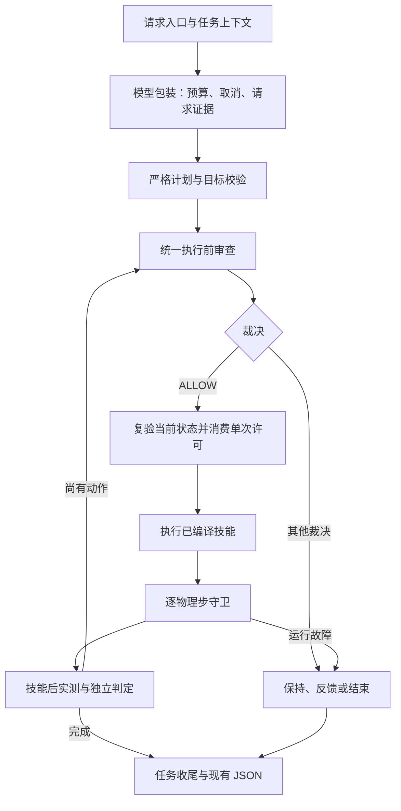

# Agent Hook 使用位置与稳定性调研
> 2026-10-07清理更新：本文中的旧语言/规划模块与M3执行器属于历史分析，现已删除，未保留兼容入口。当前实现与P0/P1/P2完成状态见[自然语言任务执行链路](自然语言任务执行链路.md)。


调研日期：2026-10-05，Asia/Shanghai。对象：`robot_agent` 的 22:50:47 工作树快照，包含 Panda/M3、Stretch 家居机器人及共用 Demo。调查期间另有业务文件更新，因此保留[源码快照](../task-records/20261005-221726-hook-stability-research/source-snapshot)作为分析依据；后续修改不纳入本报告结论。本文交付代码分析与设计建议；未实现 Hook、未运行机器人或调用真实模型，稳定性收益尚需实施后验证。代码定位见第 7 节，版本摘要见[源码核查记录](../task-records/20261005-221726-hook-stability-research/source-evidence.json)。

## 1. 结论与现状

最值得优先补充的是**统一执行前审查、与当前状态绑定的单次许可，以及覆盖异常和取消的任务收尾**。模型请求、任务记录和环境编辑也适合使用 Hook 的组织方式，但其中不少保护已实现，主要价值是统一职责和失败语义。

推荐一个执行前审查门面，内部复用契约、权限、前置条件和路径检查；逐物理步守卫、动作后实测、独立终态判定继续由执行器承担。本文列出的十个位置是职责与调用边界，不要求注册十个插件。当前项目自建运行时，依赖中没有 LangChain、ADK 或 Strands；可以借鉴接口设计，暂时无需引入完整框架。

本文的 Hook 指程序在 Agent 生命周期或调用边界自动执行的扩展逻辑，包括框架所称的 hooks、middleware、callbacks。须区分三种能力：

| 类型 | 作用 | 在本项目中的例子 |
| --- | --- | --- |
| 通知/观测 | 记录发生了什么，更新显示 | `before_tool` 事件、`on_frame`、模型 tracing |
| 强制拦截 | 明确允许后才进入有副作用的执行 | 建议新增的统一执行审查与许可消费 |
| 调用包装 | 包住调用及异常、取消、收尾 | 模型预算/有限重试包装、任务生命周期管理 |

**事件名叫 `before_tool` 不代表已经实现拦截。** 当前 `StretchDemoEpisode.run_plan()` 在 `_tool(action)` 前写事件和实测观察；动作权限与路径检查仍在 `_tool()` 内。记录失败会阻止继续执行，但事件中没有统一审查裁决或执行许可。`safety/home.py` 也明确说明目前是 A2/A3 守卫，完整 A4 Hook/许可和 A5 预演尚未实现。[代码 C3、C5](src/embodied_agent/simulation/robot_episode.py)

已有保护应作为接入基础：

- Panda：严格计划与 `base_obs_id`、技能前置条件、路径预检、技能预算、抓取后置条件及独立放置判定。`C2`（历史，已删除）
- 家居：自然语言编译器按当前物品、支撑和持物状态检查权限与有限动作链；模型不能替换主要动作、对象或目标；执行端重新校验有限技能参数，按当前状态编译导航路径。`C3、C4`（历史，已删除）
- 实时守卫：物理状态、机器人/家具/持物碰撞、持物漂移、风险区及步数预算持续检查；家居失败已有有界制动和持物保持。[C3、C5、C6](src/embodied_agent/simulation/stretch.py)
- 记录：任务级 JSON、并发编号、原子替换、任务独占证据、attempts、真实执行与检查分开；迟到模型回复不会写入完成任务或下一任务；请求/响应落盘失败保持 `RECORDING_FAILED` 及请求是否已发出的信息。[C7、C8、C11](src/embodied_agent/evaluation/task_writer.py)
- 环境编辑：有限可编辑字段、版本冲突、锁及原子保存；保存成功而显示刷新失败已经分别反馈。[C1、C9](src/embodied_agent/apps/demo/session.py)

因此，不能将“加 Hook”理解为补齐一个原本没有校验、日志或停止机制的系统，也不能把此前的任务 JSON 实施工作再次列为待开发。

### 1.1 精简建议：保留 3 个 Hook 边界，先做前 2 个

**2026-10-06 补充：** 针对“十个 Hook 点过多”的问题，建议只围绕下列三个边界组织新增工作。排序依据是对物理执行的影响、当前缺口、已有能力覆盖及实现成本；以下判断经当前源码静态核查，尚未通过新增实现验证。第 2 节保留十点的完整分析，第 5 节保留原调研的完整实施路线；本次精简采用本节的顺序与范围。

| 顺序 | 保留的 Hook | 对项目最直接的价值 | 最小范围 |
| --- | --- | --- | --- |
| 1 | **H04：执行前强制审查** | 让 Panda、Stretch、自由指令和注册用例遵循统一裁决，降低新增入口漏查的风险 | 复用计划契约、权限、当前前置条件、剩余计划的廉价规则及路径检查；明确允许后才调用技能 |
| 2 | **H07：失败、取消与任务收尾** | 发生故障后保留首错、完成停止/持物保持，并释放任务资源，便于继续下一任务 | 用任务生命周期包装覆盖开始、执行和收尾；最终观测、停止、记录、清理的二次错误分别保留 |
| 3 | **H02：模型调用预算与取消** | 多轮查询时约束整项任务的等待时间、调用次数和累计用量，取消后不再发起下一轮 | 在共用模型调用层接入任务总预算与取消状态，复用现有请求/响应记录；先保持不自动重试 |

**为什么 H04 排第一：** 当前 Panda 已在每条技能前读取观测、检查前置条件和路径；Stretch 的对应检查仍分布在 `_tool()` 内，`before_tool` 主要承担事件记录。缺口是统一且必经的审查边界，而不是缺少所有安全检查。H03 的计划提交校验作为该边界的准备步骤，H05 的状态/取消复验和一次性放行作为执行器内部步骤；不再把它们做成两个独立 Hook。计划在提交时规范化，每条技能前按当前实测重新审查。审查与执行应使用同一份已编译动作和路径。`当前 Panda 执行`（历史，已删除）、[当前 Stretch 执行](src/embodied_agent/simulation/robot_episode.py)

**为什么 H07 排第二：** 当前 Stretch 已有安全停止，但停止后的记录参数及最终结果仍直接调用 `observe()`；Demo 的前态读取在主要 `try` 前，最终快照与证据整理在 `finish_task()` 的异常保护前。二次读取失败可能遮盖首错或使正常收尾中断。这是有明确代码依据、范围相对集中的补强点。收尾需要覆盖成功、失败和取消；发生执行故障时优先停止/持物保持，再尽力收集观测和记录，清理按 `finally` 语义完成。[当前任务边界](src/embodied_agent/apps/demo/session.py)、[当前 Stretch 收尾](src/embodied_agent/simulation/robot_episode.py)

**为什么 H02 值得保留但可后做：** 当前真实家居规划已通过原生只读工具进行多轮模型交互，默认最多 8 轮、24 次工具查询，SDK 禁用自动重试。轮数、单次输出和单次超时已有约束，但 `run_tool_dialogue()` 尚未接入任务取消或总时间预算，返回的规划响应 usage 来自最终一轮；各轮 usage 已由传输层记录，仍需统一累计。UI 关闭会放弃等待与后续执行，却不等于后台对话立即停止发起下一轮。此时 H02 的实际价值在于任务总预算与取消传播，重试可以另行评估。取消无法保证撤回已发出的远程请求，应丢弃迟到结果并阻断新请求。[当前对话循环](src/embodied_agent/models/dialogue.py)、[请求记录](src/embodied_agent/models/deepseek.py)、[UI 等待](src/embodied_agent/visualization/demo_ui.py)

其他七点的去向如下，减少独立 Hook 数量时保留必要职责：

| 原编号 | 处理方式 | 取舍理由 |
| --- | --- | --- |
| H01 | 保留各入口现有输入限制、可信字段与查询能力约束；任务归属和取消状态供上述三个边界使用 | 当前无需为入口再增加一套扩展接口，新增 Agent 时再考虑统一上下文构建 |
| H03 | 合并到 H04 的计划提交准备步骤 | 严格解析与目标/动作契约已有实现，统一调用比新增独立 Hook 更有意义 |
| H05 | 合并到 H04 与执行器的许可消费步骤 | 它保证审查针对当前动作和状态生效；异步审查、等待预演或复用裁决时必须同时具备完整许可绑定与复验 |
| H06 | 保留执行器内的后置实测和独立任务判定 | 当前已有抓取证据、稳定放置与目标撤销检查；抽成 Hook 的新增价值有限 |
| H08 | 保留现有编辑版本检查、锁、原子保存及刷新反馈；场景切换资源问题按需单独修复 | 它主要服务环境编辑，优先级低于执行与任务收尾；生命周期缺口仍需处理，但无须为此先建独立 Hook |
| H09 | 作为上述三个边界的证据写入职责，复用现有任务 JSON 接口 | 审查原因必须可追溯，但项目已有记录系统，无需新增日志 Hook 或第二套主日志 |
| H10 | 暂缓，待统一审查和可靠隔离复制具备后再研究 | 当前 snapshot 不是可恢复检查点，预演的隔离、耗时和检出收益尚需验证，首期投入较大 |

**建议的落地顺序：** 先以固定的同步流程实现 H04（含 H03/H05）与 H07，并把裁决补入现有 JSON（H09）；保持逐物理步守卫和独立成功判定。再为 H02 增加整个任务共享的调用/token/时间预算，覆盖所有模型轮次；不得因新 attempt 重置总额。首期不扩展为通用插件系统，不默认增加远程审查、物理预演或自动重规划。

精简范围的验收重点是：拒绝或审查失败时技能调用数为零；状态/路径变化或取消后旧放行不能执行，同一次放行不能重复消费；技能失败后最终观测再失败仍保留首错与停止结果；记录失败不重放物理动作；取消或总预算耗尽后不发起新的模型轮次。正常搬运与独立放置判定应继续成立。

## 2. 现有项目中适合使用 Hook 的十个位置

优先级含义：P0 为实施统一 Hook 时优先完成的正确性保护；P1 为可靠性和可维护性改进；P2 为依赖前置能力的后续研究。P0 不表示已复现严重事故。以下“缺口/风险”均来自静态阅读，已有测试仅作为交叉依据。

| 编号 | 位置与推荐边界 | 优先级 | 主要收益 | 工作性质 |
| --- | --- | --- | --- | --- |
| H01 | 请求入口、模型上下文构建 | P1 | 统一任务类型、输入限额、可信字段与角色能力 | 复用并收敛现有规则 |
| H02 | 模型调用包装 | P1 | 总预算、可选有限重试、取消、请求证据一致 | 新增预算组织，保留单次调用基线 |
| H03 | 模型输出到计划提交 | P0 | 所有入口保留严格契约和目标一致性 | 统一现有校验 |
| H04 | 每次技能实际调用前 | P0 | 强制审查、完整剩余计划的廉价检查 | 新增统一门面，复用守卫 |
| H05 | 审查结果到执行之间 | P0 | 丢弃过期回复，避免重复许可和路径替换 | 新增许可与状态复验 |
| H06 | 技能返回和任务判定 | P1 | 区分返回成功、后置条件和实际任务完成 | 统一现有实测与反馈 |
| H07 | 失败、取消与最终收尾 | P0 | 二次异常不掩盖首错，停止与记录都有结果 | 加固现有生命周期 |
| H08 | 环境编辑提交及场景切换 | P1 | 地图与显示状态可追溯，失败不会重复提交 | 复用保存机制，补齐事务边界 |
| H09 | 裁决与任务证据持久化 | P1 | 审查可解释，记录异常不重放动作 | 在现有 JSON 中补充裁决 |
| H10 | 高风险动作的隔离预演 | P2 | 提前发现当前规则未覆盖的已建模后果 | 后续能力，先解决复制与成本 |

### H01：统一请求入口与上下文边界

**位置：** `DemoSession._execute_action()` L342；`resolve_home_instruction()` L102；`EnvironmentAgent.preview()` L280、`UnifiedEnvironmentAgent.preview()` L90；`HomeRobotPlanner.plan()` L270。[C1、C4、C9](src/embodied_agent/apps/demo/session.py)

**现状：** 会话检查非空字符串和 Agent 名；Panda、家居和环境编辑各有输入上限，分别为配置中的 240 字符、1000 字符、2000 字符。家居模型请求主动排除 `untrusted_descriptions` 和 `events`；家居环境编辑只允许初态位置、名称、描述，不能修改政策、状态和风险标签。

**建议：** 请求 Hook 创建不可变任务上下文，明确 `robot_task / environment_edit / registered_case`、地图类型、目标、角色能力、输入限额和版本；模型前只读取允许的状态字段。各类型保留自己的限额和工具集，不强行使用一个共同最小值。有限语言解析仍由原编译器完成；歧义返回补充信息请求，不能让 Hook 猜一个合法对象。

**稳定性价值与限制：** 新增 Agent 时可复用同一边界，减少上下文与权限漂移；文本中“这个药品允许搬运”不能覆盖可信政策。白名单是数据构建与执行授权的共同约束，单纯过滤关键词无法证明安全。对合法原始文本保留任务记录；不要让上下文过滤修改真实对象状态。

**验证：** 对三类入口分别验证限额边界；在物品描述中加入“忽略规则”，确认任务工具集与可信政策不变；注册新 Agent 后仍必须使用类型对应的输入和执行约束。

### H02：模型调用包装、预算与有限重试

**位置：** `create_client()` L30、`complete_json()` L37、`complete_chat()` L141；`run_tool_dialogue()` L126；`M3EpisodeRunner.run_episode()` 的解释/规划请求 L127、L179；家居规划 `HomeRobotPlanner.plan()` L270。[C2、C4、C7、C14](src/embodied_agent/models/deepseek.py)

**现状：** SDK 设置 `max_retries=0`，模型默认超时 30 秒，M3 规划请求限额为 1、重规划为 0；目标解释另行计数。共用传输层已经记录真实请求/响应，并区分认证、限流、超时、连接失败及记录失败。家居和环境角色共用配置但调用路径不同，现有预算不是统一的任务级调用/token/墙钟预算。

**新增查询对话链：** 最终快照包含环境 Agent 接入的 `run_tool_dialogue`、`QueryTools` 与共用 `complete_chat`。QueryTools 深拷贝快照、隔离字段并检查注册工具/参数和 inspect 操作权限；dialogue 已限制轮数、查询总次数、参数与结果字符数，默认最多 8 轮/24 次查询、每次输出 4096 token，整批工具调用通过校验后才执行 handler，调用 ID 不能重复。[C13](src/embodied_agent/agents/query_tools.py)、[C14](src/embodied_agent/models/dialogue.py) 这些是已存在的局部保护，不能列为全新开发；仍需把每轮输入/输出成本、取消和总墙钟时间接入任务账本。重复 observe 读取同一捕获快照，不代表重新测量现场；只读查询不获得地图保存或物理动作权限。本次未进行新链路的导入或运行验收。

**建议：** 使用模型 wrapper 管理一个任务预算账本，解释、规划、格式修正和未来重规划共享总额；每次真实请求前检查预算和取消状态，响应后记录已知实际用量。若启用重试，只对明确可重试的传输/服务故障配置小上限、退避和剩余时间检查；认证失败、非法配置、明确规则拒绝、记录失败直接返回。

**稳定性价值与限制：** 短暂网络故障可有限恢复，模型请求次数可审计。当前冻结基线继续单次调用；开启重试必须是另一个明确配置并重新评估预算。超时可能发生在服务端已处理之后，因此重试可能产生重复费用；无 usage 的失败请求记作“用量未知”，不能记成零成本。记录失败时保留当前 `request_issued`，禁止为了重新获取证据再发请求。规划仍失败时不能悄悄切换 stub 后声称真实模型完成。

**验证：** 用假的模型客户端注入限流、超时、认证失败和记录失败，检查实际请求次数；所有 attempt 的费用和调用累计不重置；取消后的重试次数为零；保持现有单次调用测试预期。[已有测试](tests/test_models.py)、[记录边界测试](tests/test_task_writer.py)

### H03：模型输出到计划提交的统一闸门

**位置：** Panda `parse_plan()` 与运行时 L207–218；家居 `validate_home_response()` L238、会话 L231–234；`validate_home_plan()` L31。[C1、C2、C4、C10](src/embodied_agent/execution/home_contracts.py)

**现状：** Panda 校验严格 JSON、观测编号、固定 pick/place 与目标；家居主要动作必须与根据用户指令编译的有限动作链一致，显式观察/等待/停止不能漏掉；执行端限制注册技能、准确字段、有限数值、1–32 个动作和 0–10 秒等待。真实家居模型与注册用例通过不同提交路径进入执行。

**建议：** 提交边界输出规范化的不可变计划及摘要，统一接收“可信目标＋候选计划＋当前观测＋能力配置”。复用已有解析器，不另建宽松解析。直接计划入口按其可信测试来源校验，不能伪装成已经通过自然语言目标一致性检查。完整剩余计划的对象、权限、依赖、终态规则检查作为统一审查的内部步骤；不要把已有家居语言编译器的状态推演误算成全新能力。

**稳定性价值与限制：** 更换规划器或增加入口时不会遗漏校验。家居通常需要多于两条动作，不能直接套用 Panda 的 `max_skill_calls=2`。格式修复可另计有限 attempt，不能“修复”成用户没有要求的任务，或把截断 JSON 的半截内容投入执行。

**验证：** 重复 JSON 键、额外字段、NaN、目标偏移、漏掉显式 stop、伪造故障注入参数都不能进入物理技能。家居正常搬运序列仍通过其能力配置。`已有语言测试`（历史，已删除）、[契约测试](tests/test_home_contracts.py)

### H04：技能调用前的强制审查入口

**位置：** 家居 `run_plan()` L330–342 的 `_tool(action)` 之前；Panda 运行时 L221–274 的技能调用之前。[C2、C3](src/embodied_agent/simulation/robot_episode.py)

**现状：** 家居 `_tool()` 依据实际持物、位置、停靠姿态和规则检查 pick/carry/place，导航路径由可信 Navigator 编译后执行；Panda 在每条技能前重读观测、查前置条件和路径。缺的是跨两类执行器、所有受支持入口都强制经过的同一裁决契约。

**建议：** 定义一个 `review_next_action(context, current_state, remaining_plan, index, budget)` 门面。内部顺序为来源/权限 → 契约/目标/剩余计划的规则检查 → 当前前置条件 → 编译路径及几何检查 → 可选风险预演 → 当前状态复验。每次只授权下一条技能；拒绝/未完成裁决不能调用执行 handler。

只读模型工具另有 `run_tool_dialogue()` 中 L273–276 的记录/handler 边界，复用其整批契约与调用数检查，再补任务归属、取消、读取权限和上下文限额；只读工具不经过物理预演或消费机器人动作许可，但同样不能脱离可信预算与能力边界。

导航路径现位于 `_tool()` 内。接入时先把“编译动作”与“执行已编译动作”分开，使审查和实执行使用同一条路径、携物模式及控制配置。既有底层检查暂时保留，防止集成遗漏；它们不再被误称为另一个独立授权来源。

**稳定性价值与限制：** 降低新入口漏查风险，也能在抓起物品前发现后续放置规则无解。只看下一技能终态，无法证明整条运动轨迹安全。技能调用由可信执行器调度；Hook 开关不能由模型参数或描述文本控制。封装面向受支持入口的强制通路，不等于在同一 Python 进程内建立不可突破的安全隔离。

**验证：** 自由指令、注册用例、批量和未来恢复入口全部调用审查；DENY 时 handler 次数为零；审查故障时保持/终止，不默认放行；审查后的路径修改必须使许可失效。

### H05：状态复验、旧回复失效与一次性许可

**位置：** 家居 `run_plan()` L333–342、`_after_step()` L135、`observe()` L93；UI `_wait_language()` L357；`TaskRunWriter.model_recorder()` L127。[C3、C8、C12](src/embodied_agent/visualization/demo_ui.py)

**现状：** `world_version` 会随机器人/物品超过变化阈值、技能完成等递增；当前 home plan 没有执行许可或基础状态引用。UI `busy` 禁止重复操作，关闭窗口会中断等待；迟到回复已有记录归属隔离。这些保护降低当前串行 UI 的风险，但不能等同于未来异步预演/重规划的状态复验。Panda 的 `base_obs_id` 校验也不替代许可。

**建议：** 审查结果绑定 `task_id、attempt_id、decision_generation、action_index、plan_hash、compiled_action_hash、map_revision、policy_version、state_fingerprint`，由执行器保存并消费一次。消费前读取相关实际状态，检查任务是否取消、episode 是否切换、参数/路径/政策是否变化。模型只提交计划，不能自行提交可信 ALLOW。

**稳定性价值与限制：** 长模型请求或预演期间状态发生变化后，旧回复不能继续驱动机器人；重复回调不能再次搬运。不能只比较全局版本相等：正常导航、前一条技能和持物变化就是合法进展。应以技能边界的当前观测重新审查相关对象/风险；状态指纹包含满足该动作需要的实际状态，不能只依赖有阈值的粗粒度版本。当前串行路径未证明存在旧回复执行事故，此项主要是新增异步能力的前置条件。

**验证：** 规划后切换地图、移动目标、改变风险或取消任务，旧结果 handler 为零；同一许可第二次消费失败；正常任务从导航到抓取到携物仍可在各边界得到新许可。

### H06：技能后实测与任务成功判定

**位置：** Panda 运行时 L280–327；家居 `_tool(place)` L263–277、`_after_step()` L165–170、`run_plan()` L343–351 与 L391–405；任务记录 `finish_task()` L193–211。[C2、C3、C8](src/embodied_agent/evaluation/task_writer.py)

**现状：** Panda 实测抓取、独立校验放置；家居放置持续稳定窗口，目标被扰动会撤销，搬运成功要求新目标有效且实际搬运。只读 query 或 stop 正常返回不算搬运完成。任务 JSON 的 `verified` 已区分这些结果。

**建议：** 动作 wrapper 在成功、失败、中断三种出口都整理后置观测、实际步数、局部进展与证据；已有独立判定器决定物理成功。未来恢复/重规划只接收当前实测和已执行前缀，不能从原初态盲目重放。

**稳定性价值与限制：** Agent 能依据实际结果决定下一步，末条技能也不会漏验。后置 Hook 可以检测偏差并阻止后续技能，但已经发生的物理动作不能靠改写返回值撤销。保持原始观测和指标，展示摘要或反馈转换另存；Hook 的 ALLOW、模型声称成功和技能函数返回都不能替代终态判定。

**验证：** 空抓、放置后不稳、目标在后续动作中失效、纯观察计划均正确分类；技能中途失败保留部分步数与当前持物状态；最后一条动作后仍进行独立判定。[已有执行事件测试](tests/test_execution_record_events.py)

### H07：异常、取消与任务收尾

**位置：** `DemoSession._execute_action()` L342–417；家居 `run_plan()` L352–407；UI `_execute()` L334、`_wait_language()` L357、`_close()` L417；Panda 失败后结果构建 L364 起。[C1、C2、C3、C12](src/embodied_agent/apps/demo/session.py)

**现状：** 家居失败路径先抓取失败状态，再做有界安全停止，记录失败不会跳过停止；UI `finally` 恢复控件/关闭资源。静态可见的补强点是：会话的前态读取和 `begin_task()` 位于主要 `try` 外，处理结果后的 final snapshot/证据整理又在 `finish_task()` 的异常保护外；家居在停止记录参数及最终结果处仍有未保护的 `observe()`。这些读取若再次抛错，可能遮盖原始故障或绕过正常收尾。`begin_task()` 自身已能在开始写入失败时释放记录归属，不能误报为必然卡住后续请求。

**建议：** 使用任务生命周期管理器覆盖开始、执行和最终收尾；动作 wrapper 的失败出口先进入可信停止/保持，再尽力获取最终观测，最后记录与释放任务资源。保留首错，另外列出 `observation_error、stop_error、recording_error、cleanup_error`；不能读取的字段显式 unavailable，不拿旧观察充当终态。取消使用独立 token/代次，同时阻断新模型请求和新技能。

**稳定性价值与限制：** 提升故障结果的可获得性和下一任务的可用性。不要假定框架 `after_agent` 在所有异常/进程退出时等价于 `finally`；突然终止只能保留最后已落盘的 RUNNING 记录，后续按中断恢复核对，不能补写“已完成”。家居当前应急停止会临时移除 episode 回调，并使用专用 emergency 物理步进；它有制动/持物检查，但不能直接宣称为持续在线保持机制，未来等待控制需单独验收。

**验证：** 首次技能故障后让最终 observe 再故障，仍返回首错和二次错误；连续落盘失败仍尝试安全停止；关闭窗口后迟到回复不执行；清理重复调用不会重复停止或写终态；不松开正在持有的物品。

### H08：环境编辑提交与场景切换

**位置：** `EnvironmentAgent.apply()` L314、`UnifiedEnvironmentAgent.preview()` L90；`HomeMapStore.save()` L58；`DemoSession._edit_environment()` L295 与 `_show_world()` L189。[C1、C9](src/embodied_agent/maps/home_store.py)

**现状：** 已有显示版本核对、计划基础版本核对、保存时再核对、锁及原子替换。保存后重置失败已报告 `REFRESH_FAILED`，没有把文件回滚伪装成失败前状态。`_show_world()` 的顺序是创建新 episode、关闭旧 episode、prepare 新 episode、再替换 session 引用。

**建议：** 编辑提交前 Hook 统一角色/字段与版本检查，提交后 Hook 明确记录 `committed_revision` 和显示刷新状态，并撤销旧地图的执行许可。场景切换采用 prepare 成功后再发布新 episode 的生命周期；若允许显示不安全初态，继续保持当前展示用途的 prepare 模式，执行初始化和实时守卫仍必须生效。

**稳定性价值与限制：** prepare/渲染失败时可清理候选资源、明确 session 是否可继续，避免停留在已关闭的旧 episode。文件保存原子性与场景发布原子性是两个边界，Hook 不能替代文件锁/`os.replace`。保存已完成而刷新失败时只重试刷新；重新运行“x 调高一点”会造成第二次编辑，不可自动重发原指令。

**验证：** 并发改图仍返回版本冲突；提交后刷新失败保持真实已提交版本；新 episode prepare 失败不发布不可用引用；编辑后旧许可失效。[已有地图测试](tests/test_worlds.py)、[任务集成测试](tests/test_task_record_integration.py)

### H09：Hook 裁决进入已有任务 JSON

**位置：** `TaskRecord.append_check()` L451、`append_tool_event()` L454；`TaskRunWriter.record_event()` L88、`finish_task()` L173；`DemoSession._task_execution()` L274。[C1、C8、C11](src/embodied_agent/evaluation/task_records.py)

**现状：** `attempts[].checks` 已有契约，正常运行中的正式 Hook 检查目前为空；真实动作和任务反馈已有记录接口。任务证据按本次事件/轨迹范围取切片，记录完成后不可变。模型请求在 SDK 调用前同步落盘；必要技能边界记录失败会中止，最终落盘失败会显式反馈，不能触发物理重跑。

**建议：** 同一 JSON 的 checks 写入裁决、阶段、原因码、规则版本、相关状态、计划/动作摘要、检查完成度、耗时与证据引用；tool_events 保留真实执行，物理预演放到检查的独立证据区域。复用 UUID、attempt 链和原子更新，不另开一套主日志。对外统计分开报告任务成功、正确拒绝、停止、检查未完成和记录失败。

**稳定性价值与限制：** 可复现“为什么没执行/为什么需要重规划”，防止预测与真实执行混淆。安全裁决和执行前必须记录的边界不能因观测处理异常而默认放行；停止和反馈写入使用尽力模式，首要动作仍是停止。可选遥测异常另记，不能升级为物理故障。每次 append 当前会复制、校验并重写整份任务，故不建议逐物理步同步写全 JSON；先保留动作边界证据，测试实际文件大小与写入延迟后再决定是否合并写入。

**验证：** 检查拒绝只有 checks 和反馈，没有虚构实际技能；预测与实际证据明确分开；A 任务取消后迟到回复不进入 B；记录失败不会增加技能调用次数；记录延迟单独统计。[已有任务记录测试](tests/test_task_records.py)、[归属测试](tests/test_task_writer.py)

### H10：隔离物理预演作为可选审查步骤

**位置：** H04 门面的风险升级层；家居 `snapshot()` L64、仿真/技能控制状态；路线图第 8 节。[C3](src/embodied_agent/simulation/robot_episode.py)、[路线图](CAREER_ROADMAP_2026.md)

**现状：** snapshot 是声明仿真观测，不是可恢复的 MuJoCo 检查点；尚无任意当前状态的可靠隔离复制/恢复契约。已有 [2026-10-05 性能评估](../task-records/20261005-211935-unified-hook-review/evaluation.md) 在有限正常运输样本中测得完整运输约 132–146 秒，首个导航前缀约 28–31 秒；该报告未实现正式预演，也未测安全检出率。

**建议：** 先在统一入口检查全剩余计划的廉价规则与下一动作完整几何路径；物理预演延后。后续复制物理积分状态、控制目标、持物/抓取偏移、技能阶段、对象状态、损伤/风险及目标跟踪等必要状态，在独立实例中运行同一技能与守卫。风险和预算由可信程序决定；只有验证过的停止/保持边界才能作为预演截断点。

**稳定性价值与限制：** 可发现已建模的空抓、滑落、碰撞和放置不稳，但结果只对声明的模型、状态与扰动有效。超时、预算耗尽或复制失败应标为 `STOP + INCOMPLETE` 或转入明确的补充观测流程，不能用“截至截断没事故”放行。h 是前缀长度，K×S 是候选与情景数，二者不能互相替代。当前成本证据不足以决定最佳 h，也不支持把每条技能都物理预演作为默认。

**验证：** 预演前后 live 数据、地图文件和任务实际事件不变；分支重现当前持物/接触与控制状态；预演未完成不发许可；分别评测漏检、误拒、提前量、正常任务完成率和端到端 p50/p95。

## 3. 网络资料：其他实现如何使用 Hook

以下均为一手资料，查阅于 2026-10-05。这些资料说明机制及官方示例；除明确标注的应用外，不据此推断某团队生产效果。接口按 Python 语义比较，语言/版本差异须在真正引入框架时再次核对。

### 3.1 LangChain 维护者文章：把横切职责放在调用包装中

Sydney Runkle 的文章 *How Middleware Lets You Customize Your Agent Harness*（2026-03-26）展示：`ModelRetryMiddleware` 用 `wrap_model_call` 管理重试与退避；`SummarizationMiddleware` 在模型前处理上下文；`ShellToolMiddleware` 在 Agent 开始/结束管理资源；Deep Agents 以 middleware 组合文件系统、上下文和技能能力。[原文](https://www.langchain.com/blog/how-middleware-lets-you-customize-your-agent-harness)

**本项目提炼：** H02 可用 wrapper 收敛模型预算与故障处理，H07 用生命周期组织资源；H01 优先控制实际送入模型的字段。它们应各自聚焦，统一执行审查门面内部也拆成小检查函数。当前项目上下文有限，自动摘要与动态工具选择的额外模型调用收益不明确，暂不照搬；物理技能重试需单独约束。

官方 custom middleware 文档进一步区分顺序节点 Hook 与包裹调用的 Hook；wrapper 可不调用 handler，也可调用多次，前置按注册顺序、后置反序、wrapper 嵌套。[接口说明](https://docs.langchain.com/oss/python/langchain/middleware/custom)

**本项目提炼：** H04 使用不放行就不调用的语义，H02 才允许预算内多次调用；首版固定调用顺序，避免多插件任意修改参数。框架提供控制能力并不自动保证每个物理入口均受审查。

### 3.2 AWS Strands 官方实践：模型边界外也要检查工具

AWS Security Blog 的 *Extend Amazon Bedrock Guardrails to Tool Interactions Using the Strands Agents SDK* 用一个 `GuardrailHook` 注册三个生命周期回调：入站检查、工具参数检查、工具输出检查，并按 `tool_names` 选择范围。工具前回调设置 `event.cancel_tool`；工具后回调可替换结果。文中也允许工具边界使用本地 schema/白名单等便宜检查。[原文与实现](https://aws.amazon.com/blogs/security/extend-amazon-bedrock-guardrails-to-tool-interactions-using-the-strands-agents-sdk/)

**本项目提炼：** H01/H04 分别控制信息与动作权限；一个公开 Hook 可复用多个内部检查。抓取/携物/放置用可信物理规则，查询使用其能力约束，不给每次控制循环加远程内容审核。特别注意，文章入站示例改写消息，不等于取消整次调用；输出替换也不能撤销已执行动作。机器人原始物理证据必须保留，不能照搬“替换工具结果”来隐藏故障。

### 3.3 Google ADK 官方指南：返回值必须具有明确短路语义

ADK 的 Python `before_tool_callback` 返回 `None` 表示继续，返回字典表示跳过真实工具并使用该结果；模型前也可返回替代响应。其模式指南展示权限、配额、状态、缓存和日志，并强调内联回调性能、精确状态字段和副作用幂等。[回调类型](https://adk.dev/callbacks/types-of-callbacks/)、[设计模式与实践](https://adk.dev/callbacks/design-patterns-and-best-practices/)

**本项目提炼：** H04 应返回明确裁决，不使用容易误解的空字典/None 表示“安全通过”；拒绝结果标明未执行。H05/H09 的重复回调需防重，状态字段按任务/attempt 归属管理。仅缓存地图结构、契约等静态数据；当前物品状态与执行许可必须复验。后台运算仍需在动作前等待其裁决，`async def` 本身不意味着安全检查可以晚到。

### 3.4 Claude Code 官方指南：工具前阻断与工具后通知不同

Claude Code 指南用工具前 Hook 保护文件、工具后 Hook 格式化/记录，并用 matcher 限定触发工具；明确指出 `PostToolUse` 无法撤销已经执行的动作。reference 还说明后台 `async` Hook 无法控制已继续的行为。[使用指南](https://code.claude.com/docs/en/hooks-guide)、[参考：后台 Hook](https://code.claude.com/docs/en/hooks#run-hooks-in-the-background)

**本项目提炼：** H04 的裁决必须在物理动作前完成，H06 的后验负责事实与后续控制。H09 的可选遥测可异步，必要审查不能变成后台通知；H07 不能把“后台线程还在跑”误当作已取消网络请求。这是编码助手机制，只借鉴边界与失败语义，不能将 Claude Code 配置文件直接用作本项目机器人执行 Hook。

### 3.5 对本项目有意义的共性

| 提炼 | 对应位置 | 本项目取舍 |
| --- | --- | --- |
| 程序强制执行规则，模型只提议 | H03–H05 | 一个审查门面，动作端消费许可 |
| 包装调用可以控制次数与异常 | H02、H07 | 模型可配置有限重试；物理动作禁止盲目重放 |
| 输入、参数、输出是不同边界 | H01、H04、H06 | 字段白名单、可信规则、独立实测各司其职 |
| 回调顺序、副作用和归属要明确 | H05、H08、H09 | 固定顺序、一次性许可、真实提交版本和 attempt 链 |
| 内联扩展会增加延迟 | H02、H09、H10 | 边界同步，低频记录；远程检查和物理预演另管预算 |

上述取舍是基于项目代码的工程建议，不是外部文章已验证本项目的结论。

## 4. 最小接入设计

### 4.1 一个审查门面，保留执行器职责



建议先定义少量纯 Python 契约与固定流程，具体文件名可在实施时决定：

- `TaskContext`：任务/attempt/目标/能力类型、取消 token、版本、预算账本。
- `CompiledAction`：规范化技能参数、已编译路径、携物模式、控制配置及摘要。
- `ReviewDecision`：裁决、原因、规则、检查完成度、耗时、状态与证据引用。
- `ExecutionPermit`：仅由执行器持有的下一技能单次许可，执行开始即消费。

模型 wrapper 与生命周期管理器可以使用 Hook 风格组织，首版无需通用插件发现、动态优先级、签名服务或配置任意 shell 命令。现有安全判断无需为了名称一致而改写成回调。

### 4.2 裁决与失败处理

| 裁决 | 条件 | 执行器行为 |
| --- | --- | --- |
| ALLOW | 必须检查完成，当前动作证据和状态有效 | 执行前复验，只执行当前已编译技能 |
| REJECT | 明确越权、非法工具/目标，无允许方案 | 结束并记录规则；不重试相同非法请求 |
| CLARIFY | 对象歧义、必要信息缺失 | 等待补充信息/可信观察，禁止猜测后执行 |
| REPLAN | 目标允许，候选路径/顺序可修正且有预算 | 传回当前状态和已执行前缀，新增 attempt |
| STOP | 取消、控制故障、状态失效或必要审查未完成 | 进入已验证的停止/保持，记录原因与次生错误 |

检查完成度独立记录为 `COMPLETE / INCOMPLETE`。明确危险与未查完是不同证据；二者都可能阻止执行，但统计、用户反馈和后续处理不能合并。状态变化是否可重规划由可信执行器决定，不能统一无条件打回模型。

同一审查入口必须允许可信停止优先执行：日志服务故障或审查失败不能阻塞应急停止，也不能允许 stop 变成模型绕过动作权限的别名。停止由当前模式决定，携物时不自动松爪。不要仅为记录失败重试 pick/carry/place；文件未写成不代表动作未发生。

### 4.3 与任务 JSON 对齐

下面是建议的单条 checks 记录，不是当前运行已生成的证据；`task_id` 等字段取自外层任务/attempt，并复用现有 `append_check()` 分配的 `event_id`。

```json
{
  "stage": "before_action",
  "action_index": 2,
  "decision_generation": 1,
  "decision": "STOP",
  "completion": "INCOMPLETE",
  "reason_code": "REVIEW_TIMEOUT",
  "rule_ids": [],
  "plan_hash": "sha256:...",
  "compiled_action_hash": "sha256:...",
  "state_ref": {"world_version": 12, "map_revision": 3, "policy_version": "home-v1"},
  "checks_performed": ["schema", "permissions", "geometry"],
  "prediction": {"status": "INCOMPLETE", "actual_execution": false},
  "duration_ms": 80,
  "permit_id": null
}
```

`duration_ms` 仅为格式示意，非实测值。物理预测记录与 `attempts[].actual_execution` 独立；必要检查为空时不声称已经过完整 Hook。重规划用 parent/trigger 关联，所有成本累计到同一任务，预算不会因新 attempt 重置。

## 5. 实施顺序与完成判据

| 阶段 | 内容 | 完成判据 |
| --- | --- | --- |
| 第一阶段 | H03/H04 的统一执行审查、H07 的异常收尾、H09 的裁决记录 | 所有受支持执行入口经过闸门；拒绝/审查异常不调用物理 handler；首错与收尾证据可获得；既有正常/拒绝用例语义不变 |
| 第二阶段 | H05 许可与复验、H01 上下文、H02 总预算；H06/H08 生命周期整理 | 状态/参数/地图变化撤销旧许可；一次性消费；取消后无新动作；模型与重规划总额可核对；地图提交与刷新各有状态 |
| 第三阶段 | H10 隔离状态与风险预演 | 复制/恢复契约验证、live 状态不污染、未完成不放行；成本及安全效果经风险集测试 |

H05 排在第二阶段表示先保持当前串行执行方式；一旦第一阶段加入异步审查、复用裁决或预演，许可与代次复验必须一起前移，不能留下竞争窗口。暂不启用自动重规划、物理技能重试或每技能默认完整物理预演。

建议评测覆盖以下触发场景，而不是只证明 Hook 函数被调用：

| 场景 | 必须观察的结果 |
| --- | --- |
| 新入口/直接计划遗漏授权、规则明确拒绝 | 未执行物理动作，检查与原因可追溯 |
| 审查后目标/路径/风险变化，同一许可重复提交 | 旧许可失效，重复动作调用数为零 |
| 末条技能返回但放置不稳、前目标被扰动 | 独立判定失败/撤销，不能标任务已完成 |
| 携物中失败、最终观测再次失败、记录持续失败 | 制动/保持有实际结果，原始故障保留，二次错误分列 |
| 模型超时重试、取消后迟到、重规划循环 | 调用和成本符合总预算，不执行旧结果、不混入下一任务 |
| 地图已提交但刷新失败、新场景 prepare 失败 | 明确文件版本与显示状态，不自动再做相对编辑 |
| 预演超时或隔离失败 | INCOMPLETE，无许可，预测证据不进入实际执行 |
| 原正常任务、合法只读任务、预登记拒绝任务 | 分别保留完成/正常返回/正确拒绝，统计口径清晰 |

成本同时记录审查耗时、模型次数/token、额外物理步数、保持耗时和记录延迟；比较正常任务保留率、漏检、误拒、干预提前量及端到端 p50/p95。任何延迟阈值、重试数和预测窗口都应作为待实测配置，不在本文宣布最优值。

## 6. 保留在原控制链中的逻辑

逐物理步安全检查、真实控制、持物证据、独立放置判定继续使用现有实现；通用 Hook 注册器、网络审核、模型请求和全 JSON 持久化不能进入高频步进。UI `on_frame/on_status` 是显示接口，必要渲染失败按当前可视流程处理；可选统计回调的失败可以另记，不能吞掉安全守卫异常。

地图锁/原子保存、任务 JSON 的并发与原子写入继续保留。Hook 负责调用时机和结果语义，不能取代这些存储保证。物理故障注入仍使用可信测试协议和真实控制链路；不得由模型选择取消守卫或伪造风险事件。

本文与[路线图第 7/8 节](CAREER_ROADMAP_2026.md)及[此前统一 Hook 评估](../task-records/20261005-211935-unified-hook-review/evaluation.md)兼容：收敛公开入口，保留各生命周期职责，廉价规则看剩余计划，物理预演按风险和预算升级。本次仅补充调研文档，没有改变路线图或实现状态。

## 7. 代码依据索引与核查范围

行号对应本次核查工作树；文件后续改动请优先按函数名定位。为便于仓库内阅读，链接指向文件，行号单独列出。

| 索引 | 文件 | 关键函数/行号 |
| --- | --- | --- |
| C1 | [apps/demo/session.py](src/embodied_agent/apps/demo/session.py) | `_show_world` L189；`_run_m3` L222；`_run_robot_plan` L254；`_task_execution` L274；`_edit_environment` L295；`_execute_action` L342 |
| C2 | `execution/runtime.py`（历史，已删除） | `M3EpisodeRunner.run_episode` L36；计划 L207–218；技能前 L221–274；技能后/终态 L280–327；失败后构建 L364 起 |
| C3 | [simulation/robot_episode.py](src/embodied_agent/simulation/robot_episode.py) | `snapshot` L64；`observe` L93；`_after_step` L135；`_tool` L179；`run_plan` L284；停止/收尾 L365–407 |
| C4 | `agents/home_language.py`（历史，已删除） | `resolve_home_instruction` L102；`validate_home_response` L238；`HomeRobotPlanner.plan` L270 |
| C5 | [safety/home.py](src/embodied_agent/safety/home.py) | `object_action` L20；`navigator` L30；`during_motion` L61；`during_geometry` L77；完整 Hook 未实施的说明 L1–5 |
| C6 | [simulation/stretch.py](src/embodied_agent/simulation/stretch.py)、[simulation/episode.py](src/embodied_agent/simulation/episode.py) | Stretch `step` L151、`check_physics` L255、`stop` L307；Panda `_step` L303 |
| C7 | [models/deepseek.py](src/embodied_agent/models/deepseek.py)、[models/tracing.py](src/embodied_agent/models/tracing.py) | `create_client` L30；`complete_json` L37；请求/响应记录 L84–95；记录错误转换 L97–100；`complete_chat` L141；tracing `ModelRecordingError` L14 |
| C8 | [evaluation/task_writer.py](src/embodied_agent/evaluation/task_writer.py) | `begin_task` L54；`record_event` L88；`model_recorder` L127；`finish_task` L173 |
| C9 | [agents/environment.py](src/embodied_agent/agents/environment.py)、[agents/map_environment.py](src/embodied_agent/agents/map_environment.py)、[maps/home_store.py](src/embodied_agent/maps/home_store.py)、[maps/store.py](src/embodied_agent/maps/store.py) | `EnvironmentAgent.preview` L280、`apply` L314；`UnifiedEnvironmentAgent.preview` L90；家居 `save` L58；桌面 `save` L66 |
| C10 | [execution/home_contracts.py](src/embodied_agent/execution/home_contracts.py)、[contracts.py](src/embodied_agent/contracts.py) | `validate_home_plan` L31；Panda 语言限额 L81、计划/观测编号 L132–149 |
| C11 | [evaluation/task_records.py](src/embodied_agent/evaluation/task_records.py) | `_atomic_write` L101；`_commit` L369；attempt 容器 L384–400；`append_event` L431；`append_check` L451 |
| C12 | [visualization/demo_ui.py](src/embodied_agent/visualization/demo_ui.py) | `_execute` L334；`_wait_language` L357；`on_frame` L382；`request_close` L410；`_close` L417 |
| C13 | [agents/query_tools.py](src/embodied_agent/agents/query_tools.py) | `QueryTools.__init__` L25；`call` L45；`capabilities` L87；查询读取捕获快照，不执行物理步进或地图保存 |
| C14 | [models/dialogue.py](src/embodied_agent/models/dialogue.py) | `run_tool_dialogue` L126；局部预算 L154 起；整批协议/schema 检查 L240 起；查询调用 L273–276 |

核查还包含当前`预算配置`（历史，已删除）、[模块说明](MODULES.md)、[任务记录说明](TASK_RECORDS.md)及上述相关测试源码。本次没有运行这些测试；“已有测试”表示仓库中可复用的回归场景，不代表本次重新验收通过。

网络来源已在第 3 节逐项链接。Strands 文档直接访问失败，采用可完整读取的 AWS 官方实践作为依据；搜索摘要仅用于发现来源，没有作为接口行为的最终依据。
