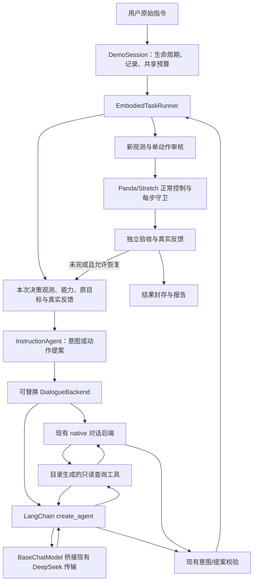

# robot_agent 的 LangChain 实践技术方案

制定日期：2026-10-09（Asia/Shanghai）。代码调查基线：`aecb3d1`。

本文是下一阶段实施设计。文中的新增模块、配置、CLI 参数和验收指标均为建议，尚未实现；本次只交付方案。

## 1. 推荐路线与实践目标

建议按“模型接口接入 → 查询与提案编排 → 双机器人验收 → 记忆/检索扩展 → 持久化研究”推进。首个交付目标是在原可视 Demo 中，用 LangChain 完成“查询真实状态、解释用户目标、生成动作段、接收实际执行反馈并继续规划”，复用现有机器人控制和任务记录。

LangChain 当前推荐使用 `langchain.agents.create_agent`，其 Agent 运行在 LangGraph 上；本项目先用它管理一次决策内部的模型/查询循环，由现有 `EmbodiedTaskRunner` 管理动作执行、验收和恢复。[官方 Agent 概览](https://docs.langchain.com/oss/python/langchain/overview)、[v1 变更说明](https://docs.langchain.com/oss/python/releases/langchain-v1)。

首期重点学习 `BaseChatModel`、消息转换、工具绑定、`create_agent`、middleware 和结构化提案。后续再实践 retriever 与 checkpointer；复杂显式状态图、向量数据库、云端服务和训练器不属于首期交付。

| 本阶段目标 | 可观察的结果 |
| --- | --- |
| 学习框架标准接口 | 同一个规划入口可显式选择现有后端或 LangChain 后端，记录实际选择 |
| 完成原项目任务 | Panda 桌面搬运、Stretch 家居搬运、只读查询、歧义与能力拒绝继续成立 |
| 保持执行约束 | 动作经实时审核、正常控制、逐步守卫和独立目标验收 |
| 获得可比较证据 | 模型输入/原始输出、工具、预算、动作、评价进入原 v2 记录 |
| 控制改造范围 | 依赖、编排、CLI 和测试改造有阶段闸门，可显式切回原后端 |

## 2. 现状与可复用部分

项目已经有完整 Agent 闭环，接入点集中在模型协议与对话编排层。

| 现有模块 | 实际职责 | 接入策略 |
| --- | --- | --- |
| [InstructionAgent](src/embodied_agent/agents/instruction.py) | 首次意图解释、冻结目标、动作提案、`last_goals/last_decision/last_proposal/last_dialogue` | 保留语义与状态输出，注入可替换的对话后端 |
| [模型传输](src/embodied_agent/models/deepseek.py) | OpenAI SDK 调用 DeepSeek；请求前记录、预算、超时、错误与响应证据 | 首期桥接；官方模型集成通过一致性闸门后再评估直连 |
| [工具对话](src/embodied_agent/models/dialogue.py) | 有界多轮查询、严格原始 JSON 参数检查、整批预校验、提案修正 | 提炼共同协议检查，作为新旧后端的行为基准 |
| [QueryToolCatalog](src/embodied_agent/tools/registry.py) / [QueryTools](src/embodied_agent/tools/query.py) | 四个只读工具，同一目录供给 schema 和 handler | 从目录构建 LangChain 工具包装，不复制定义 |
| [PromptCatalog](src/embodied_agent/prompts/catalog.py) | 实际提示词正文、版本与 hash | 保留为提示词事实源，必要时适配 ChatPromptTemplate |
| [AgentContext](src/embodied_agent/context.py) | 角色隔离的辅助记忆/知识，默认禁用 | 保留，后续为检索实现增加可替换适配 |
| [EmbodiedTaskRunner](src/embodied_agent/execution/supervisor.py) | 原目标、逐动作监督、实际反馈、多 attempt 与独立验收 | 继续拥有外层物理闭环 |
| [TaskBudget](src/embodied_agent/models/budget.py) | 整任务共享预算、取消与时限 | 继续作为预算权威，恢复不重置额度 |
| [DemoSession](src/embodied_agent/apps/demo/session.py) | 机器人/环境 Agent 组装、物理生命周期、记录与收尾 | 统一选择后端并传播同一运行上下文 |
| [EnvironmentAgent](src/embodied_agent/agents/environment.py) / [UnifiedEnvironmentAgent](src/embodied_agent/agents/map_environment.py) | 桌面/家居地图编辑提案、revision 校验、preview/apply | 使用同一对话后端；地图提交继续在原 apply 链路 |
| [recording](src/embodied_agent/recording/) / [evaluation](src/embodied_agent/evaluation/) | 追加事实日志、内容地址工件、封存、独立评价与导出 | 补充框架版本/关联信息，保持原事实源和资格规则 |

环境调查：项目虚拟环境为 Python 3.13.9，已安装 `openai==3.19.2`、`pydantic==2.13.5`、`mujoco==3.14.0`；LangChain/LangGraph 未安装。官方目前要求 Python 3.10+，但满足 Python 下限不代表现有 SDK、Pydantic、HTTP 依赖组合已兼容。[安装说明](https://docs.langchain.com/oss/python/langchain/install)。

实际运行配置是 `planner.reasoning_effort=low`、`planner.thinking=disabled`，默认模型名由 `DEEPSEEK_MODEL` 读取并回退到 `deepseek-flash`。README 中的环境变量示例不能替代已传入运行配置。改造时保留此优先关系，显式记录最终有效参数。

## 3. 架构与职责



存在两层循环：LangChain 的内层循环只处理模型、只读查询和提案；`EmbodiedTaskRunner` 的外层循环处理物理进展与有限恢复。不要把恢复再复制到 LangChain 内层，否则会出现嵌套重规划、重复预算和不同目标。

规划期间保持项目现有线程安排：语言线程处理网络，主线程管理 Tk、物理 HOLD 和渲染；通过 `copy_context()` 或等价机制传递同一 TaskBudget 和 trace 上下文。LangChain 工具读取本次捕获快照，不能从工作线程访问可变 `MjData`。提案完成后，执行器用新观测逐动作重新审核。

`navigate/pick/carry/place/stop/wait` 保持为动作提案；地图编辑保持为编辑提案。LangChain 的工具列表只包含已注册只读查询和后续明确启用的提案返回机制。任务成功仍由真实执行证据与独立验收决定。

## 4. 依赖与模型接入选型

### 4.1 依赖管理

沿用现有 pip 与 requirements 文件。建议以 LangChain v1 API 为目标，实施时选取经过验证的稳定版本并精确锁定；本文不把尚未解析的版本组合写成可直接安装的锁文件。

| 依赖 | 使用阶段 | 用途 |
| --- | --- | --- |
| `langchain-core` | LC1 | BaseChatModel、消息、工具与 Runnable 接口 |
| `langchain` | LC2 | create_agent 与 middleware |
| `langgraph` | LC2，显式图在 LC5 | create_agent 的运行基础；代码直接使用时列为直接依赖 |
| `langchain-deepseek` | LC1 兼容性评估后选用 | 官方 ChatDeepSeek 集成 |
| `langgraph-checkpoint-sqlite` | LC5 选用 | 本地持久化的独立数据库 |

LC0 在临时、隔离虚拟环境中核对包元数据与依赖解析，再做实际安装、`pip check` 和最小导入。特别检查现有 `openai`、Pydantic 和 HTTP 依赖的交集；不得用全量升级绕过冲突。必要时先记录兼容组合和迁移影响，更新直接依赖与 lock 后复跑原项目回归。修改前留存原 lock；离线后端和记录查询模块继续支持缺少 LangChain 的环境。

### 4.2 首期采用 BaseChatModel 桥接

首期实现 `NativeDeepSeekChatModel(BaseChatModel)`：实现项目所需 `_generate` 与 `bind_tools`，把 LangChain 消息/工具转换为原生协议，调用已有 `complete_chat`，再把结果转换为 LangChain 消息。这使 create_agent 接入标准模型接口，同时保留已经存在的请求前留证、错误码、预算和供应商字段。

桥接不是长期禁止官方集成。`ChatDeepSeek` 作为后续候选，以同一组能力探针证明兼容后，才允许配置选择。LangChain 集成文档提供 tool calling、结构化输出和 usage 接口，但部分模型说明仍列 `deepseek-chat/deepseek-reasoner`；不能据此推断当前 `deepseek-flash` 的能力。[ChatDeepSeek 集成](https://docs.langchain.com/oss/python/integrations/chat/deepseek)。

DeepSeek 当前官方文档明确说明 thinking 模式支持工具调用，并要求携带 tools 的后续请求完整回传相关 `reasoning_content`。桥接必须保持此协议；不能因框架只读取 `.content` 而丢失这些字段。[DeepSeek thinking mode](https://api-docs.deepseek.com/guides/thinking_mode/)。

| 能力探针 | LC1 完成证据 |
| --- | --- |
| 当前模型基础请求 | 有效模型名、实际请求参数、响应模型、finish_reason 与错误映射 |
| 两轮以上只读工具 | 原生 call ID、工具名、原始参数、实际工具结果和回传链完整 |
| thinking disabled/enabled | 参数按运行配置发送；enabled 时 reasoning_content 正确保留与回传 |
| 截断和非法输出 | length、空响应、无效工具协议不能形成可执行提案 |
| metadata 与 usage | 响应 ID、usage、latency、缺字段 availability 被准确记录 |
| 失败与取消 | 无隐式 SDK 重试；超时与迟到响应不触发动作 |

官方集成直连还必须证明：在实际请求前持久化最终有效输入，保留尚未标准化的原始工具 arguments，且每次实际请求只计一次预算。普通 LangChain callback 可以补充框架 trace，不能独自证明底层 wire 参数完整；若锁定版本不能满足这些条件，继续使用桥接。

## 5. 接口与文件改造

### 5.1 注入对话后端

给两个 Agent 增加可注入 `dialogue_backend`；保留现有 `kind=llm/stub` 和环境 `mode=llm/rules`。后端接收目前 `run_tool_dialogue` 的信息：stage、instruction、prompt、payload、tools、handler、config、errors、model、final_validator，返回既有 `DialogueResult` 或等价的无框架契约。

两个后端共用意图/目标/动作/编辑校验。`InstructionAgent.plan()` 继续返回 `PlannerResponse`，并维持执行器消费的 `last_*` 字段；不能只换成 `agent.invoke()` 的最终字符串而丢失目标、decision 和对话证据。环境后端保持 preview 无地图提交、apply 有 revision 检查和真实提交记录。

建议把原始工具批次检查从 `dialogue.py` 提炼成无框架协议函数，native 后端和模型桥接复用。新增结构化输出类型只负责格式校验，动态 ID、能力、权限、方法、来源、目标冻结和动作前提继续使用现有领域校验。

| 文件建议 | 改造内容 |
| --- | --- |
| `models/backend.py`（新增） | DialogueBackend 协议与后端工厂；使用项目契约，不导入 LangChain |
| `models/tool_protocol.py`（新增） | 原始 arguments、call ID、批次、schema 与大小上限检查 |
| `models/langchain_bridge.py`（新增） | BaseChatModel 桥接、消息转换、bind_tools、原始协议预检查 |
| `models/langchain_backend.py`（新增） | create_agent 调用、现有 DialogueResult/PlannerResponse 转换 |
| `models/langchain_middleware.py`（新增） | 单对话轮数/工具数、提案修正、工具审计与统一异常传播 |
| `tools/langchain.py`（新增） | 从 QueryToolCatalog 构造工具，转发到本轮 QueryTools.call |
| `agents/schemas.py`（按需新增） | 意图/动作/地图提案格式；来源于现有契约 |
| `agents/instruction.py`、`agents/environment.py` | 注入后端；保持公开行为、组件事件与 last_* |
| `apps/demo/session.py`、`apps/demo/cli.py`、`apps/demo/instruction.py` | 后端配置、CLI、一致组装和版本留证 |
| `configs/agent_runtime.json` | 后端选择，默认先保持 native |
| `tests/test_langchain_*.py`（新增） | 协议、记录、预算、生命周期和物理隔离验收 |

LangChain 依赖仅在其专用模块/工厂分支内加载。`execution/simulation/skills/safety/recording` 不因本次接入直接依赖 LangChain，现有纯标准库记录读取与评价能力继续成立。

### 5.2 工具包装与严格协议

工具仍为 `observe`、`query_world`、`inspect`、`get_capabilities`。其中 `query_world` 和 `inspect` 使用当前 schema 的 `object_id`；不要从别的示例引入 `entity_id` 或任意工具名。

从目录生成 StructuredTool/BaseTool 包装，复用名称、description、parameters、version 与 fingerprint；执行时只转发到当前 QueryTools 上下文。若框架转换 schema，需要同时留存目录原 schema 和实际发送 schema，并验证闭合字段、类型和 required 等约束没有放宽。

必须先在原始响应层检查整批调用，然后才转换成 `AIMessage.tool_calls` 并交给框架：重复 JSON 键、NaN/Infinity、未知工具、额外参数、重复或无效 call ID、参数大小、批次工具数全部拒绝。仅检查已经解析成 dict 的 arguments 无法发现被覆盖的重复 JSON 键；`wrap_tool_call` 逐项检查也无法保证整批通过前没有 handler 执行。

首期只读工具顺序执行，避免框架默认并发改变审计顺序或上下文行为。每个 handler 的输入使用复制数据，输出执行 JSON/大小检查；领域查询失败可成为真实工具反馈，协议损坏、预算耗尽和记录失败则终止本次决策。

### 5.3 提案与结构化输出

LC2 首先保持现有最终 JSON 文本协议：`create_agent(response_format=None)` 配合版本化提示词，取得完整最终文本后执行原 `final_validator`。校验失败用同一内层对话追加真实错误，最多修正 2 次，并计入轮数、请求与 token 预算；保留本次消息和查询，不能把修正当成新的无预算任务。

意图阶段返回 actions 为空的目标解释，第一次确认后冻结 original_goals。动作阶段可返回部分相关动作段，并保持 `decision=plan/clarify/capability_gap`。重规划必须使用真实反馈和同一原目标。

LC3 通过行为一致性后，可实验 `ToolStrategy(..., handle_errors=False)`，由项目管理有界修正。框架虚拟提案工具单独列入返回协议，不能变成机器人动作工具；明确区分查询次数、虚拟输出次数与实际请求。若不能保留原始参数和语义闸门，继续使用 LC2 文本方案。只有实际验证当前模型支持 provider-native schema 后才选择 ProviderStrategy；JSON mode 和供应商 schema enforcement 分别验证。[结构化输出说明](https://docs.langchain.com/oss/python/langchain/structured-output)。

## 6. 预算、错误与记录

| 限制 | 当前配置 | 接入要求 |
| --- | --- | --- |
| 单请求输出 | 4096 tokens | 取本限制与任务剩余额度的较小值 |
| 单对话模型轮数 | 8 | 包括工具后续请求和修正请求；图节点步数不能代替它 |
| 单对话查询调用 | 24 | 整批执行前检查，不允许先执行部分再发现超限 |
| 单对话提案修正 | 2 | 不重置原对话计数 |
| 单请求超时 | 30 秒 | 与整任务剩余时间取较小值 |
| 整任务 | 24 请求、131072 tokens、128 动作、4 恢复、300 秒 | 意图、动作规划、恢复共用 TaskBudget |
| 执行决策轮数 | 8 | 保持现有外层执行限制 |

桥接阶段，请求次数、usage、请求前留证和实际派发边界仍由 `complete_chat` 管理；middleware 只管理单对话约束、取消检查和编排信息。不要再在 on_llm_start/on_llm_end 重复扣预算。SDK `max_retries=0`，首期不添加自动 ModelRetry/ToolRetry；提案修正与真实网络重试分开记录。

LangChain 的 recursion_limit 仅作为额外防循环闸门，不替代项目预算。各层异常转换为既有 PlannerError，并保留 request_issued、模型/决策 ID、原始响应和 recording_errors。记录失败、取消、危险状态和预算耗尽不可被包装成可继续执行的普通 ToolMessage。

任务 token 上限目前按实际已报告 usage 管理；供应商缺失 usage 时未知消耗无法得到严格总量保证。框架估算不能伪装成实际 usage。继续区分未知总量与 known_reported_subtotal，以请求数、单次输出限制和总时限补充约束；若后续要求严格成本上限，需要另行设计保守输入计费/预留策略。

v2 记录至少保留原始 messages、有效 tools/参数、原始响应、reasoning_content、工具原始与模型可见结果、最终文本与校验结果、真实执行、预算和独立评价。缺 request_id/usage/logprobs 时记录 availability，不能填假值。LangChain 消息内容可能是 content blocks，适配器只在明确支持的格式下抽取文本，无法转换时返回明确协议错误。

在行为 bundle/run manifest 中补充 backend、LangChain/核心/provider/LangGraph 精确版本、适配器版本、有效配置 hash 和框架调用 ID；本地 model_call_id、原生 tool_call_id 与框架 ID 分开映射。trace/callback 作为附加信息，原 journal/artifacts/seal 继续为事实源。LangSmith 默认关闭；如后续选择启用，仍保留本地记录。

项目已有 `models/tracing.py` 的旧事件入口与 recording 的规范 dotted 事件转换。新后端接入同一映射，避免重复记同一事实。真实任务结束后的迟到回复仅写 run 的 `late.*` 审计，标记 consumed=false，不改已封存任务、不触发动作。

middleware 适合管理模型与工具边界，不能替代每个物理步的守卫。[自定义 middleware](https://docs.langchain.com/oss/python/langchain/middleware/custom)。

## 7. 配置、演示与回退

建议新增配置（尚未实现）：

```json
{
  "orchestration": {
    "backend": "native",
    "langchain": {
      "model_adapter": "native_bridge",
      "structured_output": "final_json",
      "checkpoint": "disabled"
    }
  }
}
```

`backend` 与 planner_kind 分开：`llm/stub` 说明是真实模型还是离线规则，`native/langchain` 说明真实模型如何编排。`stub/rules` 不经 LangChain，模型失败不隐式回退。未知配置显式报错；缺 LangChain 依赖时选 native 可以运行，选 langchain 返回明确依赖错误。

建议两个自然语言入口增加 `--agent-backend native|langchain`，CLI 高于配置，Session 将有效选择传给两个 Agent 并留证。该参数目前不存在，以下是实现后的验收命令设计。

首选可视自由模式：

```powershell
.\.venv\Scripts\python.exe .\scripts\demo.py --mode free --agent-backend langchain --planner llm --environment-planner llm
```

在默认家居地图运行“把遥控器送到餐桌”，切到 `classic` 再运行方块搬运，并在同一 Demo 验证环境编辑。Viewer/WorldView 必须与真实执行共用同一 MjModel/MjData，等待模型时刷新并持续监督；安全故障演示经正常控制与守卫触发，终态保留至用户关闭。

专用自动化批量可以显式 headless，输出与主记录根分别隔离；以下路径中的 `lc3-run-001` 每次替换成全新运行 ID：

```powershell
.\.venv\Scripts\python.exe .\scripts\demo.py --mode batch --headless --agent-backend langchain --planner llm --environment-planner llm --cases .\configs\demo_language_cases.json --output .\results\langchain\lc3-run-001\report --records-dir .\results\langchain\lc3-run-001\records
```

显式回退使用同一入口的 `--agent-backend native`；升级后端只作用于新任务，不在运行中途重放或切换。保留现有 stub/rules 回归与原锁文件版本，直至 LC3 完成。已改变物理状态的失败任务应真实停止并重新建立验证起点，不能声称切回后端撤销了动作。

## 8. 分阶段实施与验收

以下工作量是单人熟悉现有项目时的初步估计，不是固定工期。依赖或模型协议不兼容时按闸门结果调整。

| 阶段 | 预计工作量 | 实施内容 | 完成闸门 |
| --- | --- | --- | --- |
| LC0：冻结基线 | 半天至1天 | 全量 unittest、冻结用例与起点、检查当前记录；隔离环境验证依赖；登记真实模型评测清单 | 基线结果/skip/版本可追溯；依赖组合明确，异常先解释 |
| LC1：标准模型接口 | 1至2天 | 提炼工具协议；BaseChatModel 桥接；消息/工具/metadata 转换；DeepSeek 能力探针 | 模型、工具、thinking、usage、取消和记录边界通过；不执行机器人动作 |
| LC2：Agent 编排 | 2至3天 | 注入 DialogueBackend；create_agent；目录工具；两阶段提案、有界修正、环境编辑；CLI | 离线脚本模型覆盖关键分支；新旧后端领域语义、预算和记录一致 |
| LC3：机器人验收 | 1至2天 | Panda/Stretch 可视正例、拒绝与故障；真实模型预登记批量；独立评价和导出回归 | 安全/生命周期无退化，真实效果符合预登记目标，证据完整；之后决定默认后端 |
| LC4：记忆与检索实践 | 1至2天，选做 | adapter 接入现有本地 KnowledgeBase；比较启用/禁用记忆；必要时再评估 embeddings | 辅助上下文不覆盖真值/目标/权限；角色与实验隔离，真实结果才写入记忆 |
| LC5：持久化与显式图研究 | 按实验拆分，选做 | 只对规划状态使用 checkpointer；研究 StateGraph 编排与恢复协议 | 图恢复不重放物理动作/地图提交；重观测、预算/日志对账与未知动作处理通过 |

LC1 用 BaseChatModel 接口验证 LangChain 可以读取现有模型能力；LC2 才让 create_agent 接管多轮查询。LC3 才评估是否把 LangChain 设为默认，因此前一阶段出现问题不会扩大到现有机器人入口。

### 8.1 必须覆盖的验收矩阵

| 类别 | 场景 | 验收要点 |
| --- | --- | --- |
| 协议 | 未知工具、重复 call ID、重复 JSON 键、NaN、额外字段、过大参数、同批一项非法 | 整批 handler 零执行；错误与原始输出可追溯 |
| 提案 | 歧义、能力不足、换目标/方法/来源、非法动作、截断、修正耗尽 | 无未授权物理动作；原目标和错误码保持；修正有界 |
| 预算 | 意图后接规划、工具多轮、恢复、多次修正、超时、usage 缺失 | 实际请求只计一次；恢复不刷新；未知 usage 正确表示 |
| 生命周期 | 等待时取消、关窗、安全异常、迟到回复、日志写入失败 | 受监控停止；late 回复不消费；日志失败不重做副作用 |
| Panda/Stretch | 正常搬运、连续指令、查询、危险目标/权限拒绝、动态受阻和实际碰撞故障 | 正常动作经过原适配器；独立验收、可恢复/终止策略符合原行为 |
| 地图编辑 | preview、apply、过期 revision、非法权限变更、提交成功但重载失败 | preview 不提交；apply 单次提交；persisted 和重载错误分别保留 |
| 组件/记录 | 缺 LangChain、memory 关闭/开启、角色隔离、工件/封存校验、标准导出 | 纯模块导入可用；seal/hash 有效；缺证据不会取得训练资格 |

协议和生命周期检查使用可控脚本模型/BaseChatModel fixture 与 spy handler；机器人效果使用真实 MuJoCo 和既有任务数据。复用现有 `test_tool_dialogue`、`test_task_budget`、`test_dynamic_execution`、`test_execution_record_events`、`test_unified_recording_integration` 和 `test_module_boundaries` 的行为要求，新增测试重点验证跨后端约束。

实现后的全量自动化检查沿用：

```powershell
.\.venv\Scripts\python.exe -m unittest discover -s tests -v
```

### 8.2 新旧后端比较方法

冻结同一用例输入、地图/初态、可信任务规格、模型、有效 thinking 参数、提示词版本、工具目录、总预算和记忆状态。native 与 langchain 在独立记录目录、相同起点运行；不要求随机 LLM 逐 token 或动作序列完全一致。

离线受控 fixture 的预期结果、错误码、关键事件关联和预算计数应全部通过。真实模型首轮先按预登记清单跑一遍；发现随机波动或有意更改行为时，再按预先写明的复跑规则比较，保留全部失败，不能只选择成功结果。

报告同时给出提案合法率、用户意图正确率、真实搬运成功率、预期拒绝通过率、恢复效果、平均请求/token/工具次数、规划耗时与 HOLD 异常。`success_count` 和 `passed_count` 分开：按预期拒绝不是成功搬运。默认切换要求安全、取消、预算和记录测试全部通过，且关键任务效果达到登记标准；耗时/成本退化由数据解释后决定。

## 9. 记忆、检索与持久化边界

LC4 先把现有本地词面 KnowledgeBase 包成检索适配器，并把检索结果继续放进 `auxiliary_context`。首期保持默认关闭；如引入模型查询改写/总结，这些请求也属于总预算并记录。只有本地词面检索无法满足明确问题时才引入 embeddings/向量库，再定义离线建库、文档版本、检索评测和数据隔离。

短期消息状态、经验 MemoryStore、长期知识检索和任务事实日志各有职责。LangChain thread/checkpointer 不自动代替现有真实结果记忆，也不代表模型已经学会技能。现有训练导出仍要求独立可信规格和评价，LangChain/LangSmith trace 不补足 token IDs、行为 logprobs 或可恢复仿真状态。

LC5 初步 `thread_id` 建议包含 `run_id/task_id/role/decision_id/stage`，每次决策工具绑定自己的捕获快照，避免复用旧对话和旧 handler。`InMemorySaver` 只支持本进程内实验；需要跨进程保留规划状态时使用独立 SQLite 文件，不能复用 `records/index.sqlite3`。[短期记忆](https://docs.langchain.com/oss/python/langchain/short-term-memory)、[LangGraph 持久化](https://docs.langchain.com/oss/python/langgraph/persistence)。

checkpointer 保存的是图状态。本项目观测当前 `restorable=false`，因此无法从 graph checkpoint 宣称恢复了 MuJoCo。后续恢复须核对事实日志、已执行动作与地图 revision，重新观测和审核，并恢复预算已消耗量及实际截止状态。对“已发出动作但未记录完成”的不确定状态，不重放；先安全停止、检查实际世界并形成显式恢复决定。副作用恢复涉及的动作台账/幂等边界是新增工程任务，不能由框架自动保证。

## 10. 主要风险与处理

| 风险 | 处理与判定 |
| --- | --- |
| 包依赖与现有 SDK 不兼容 | LC0 隔离验证并锁版本；原环境保留至回归通过 |
| 标准化丢失 reasoning 或原始工具 JSON | 传输层先检查、保留原始响应后转换；能力探针未通过不切直连 |
| 两层循环抢占恢复职责 | LangChain 只管单决策；真实恢复保持在 TaskRunner |
| 框架并发、callback 或自动重试改变行为 | 顺序查询；记录/预算单一计数位置；首期关闭自动重试 |
| 等待模型时状态改变 | 保持 HOLD；动作执行前刷新观测和一次性许可 |
| 知识、记忆或地图描述改变权限 | 保持辅助数据字段和原可信校验，权限由确定性模块决定 |
| 环境编辑被模型工具直接提交 | 只产生提案，preview/apply 与 revision 检查继续在原链路 |
| checkpoint 重复动作或伪造恢复能力 | 首期禁用，LC5 先做纯规划；物理恢复单独验证 |
| 框架 trace 与日志相互矛盾 | 本地 v2 日志为事实源；框架 ID 仅作关联，缺字段显式标记 |

## 11. 建议的下一次实际开发任务

下一次先实施 LC0 和 LC1：冻结现有回归与记录，确认兼容依赖组合，提炼原始工具协议，交付 BaseChatModel 桥接和脚本模型测试，再做当前 DeepSeek 协议探针。通过后，在单独提交中实施 LC2 的 create_agent 对话后端。

首个可演示里程碑是：原 Demo 中显式选择 langchain，Panda/Stretch 能查询、解释目标、生成并执行动作段，失败反馈触发同目标再规划；全部过程进入原任务记录。达到该里程碑后，再决定官方 ChatDeepSeek 直连、ToolStrategy 和检索实验的优先级。

相关现有设计：[模块说明](MODULES.md)、[Agent 组件](AGENT_COMPONENTS.md)、[自然语言执行链路](自然语言任务执行链路.md)、[任务记录与训练资格](TASK_RECORDS.md)、[项目可视示例规则](AGENTS.md)。
