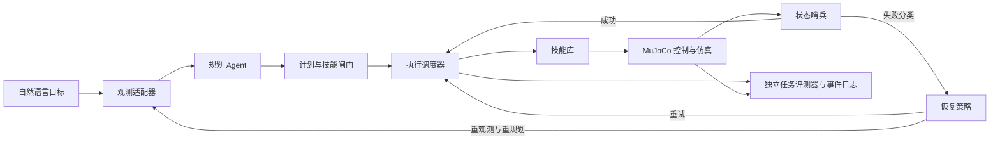

# 基于 MuJoCo 的机器人操作 Agent 可靠执行与失败恢复系统：从 0 到 1 实施方案

> 状态：项目方案，尚未声称代码或实验结果已经完成。  
> 目标周期：约 14 天；按验收门槛推进，日期可以调整。  
> 选定路线：MuJoCo + Franka Panda 模型 + 方案 A（mocap 目标辅助末端控制）。  
> 核心问题：在同一机器人操作任务中，执行反馈、失败检测和有限预算的恢复机制能否提高任务成功率？

## 1. 项目到底做什么

用户输入“把方块放到目标区域”一类自然语言指令。规划 Agent 根据当前场景状态生成受约束的高层技能计划；执行器调用技能，在 MuJoCo 中驱动机械臂；系统读取真实仿真状态，判断每一步是否达到后置条件。失败后，系统重新观察并选择局部重试或重规划剩余步骤，直至完成任务或预算耗尽。

**第一版的可验证场景**：一台 Franka Panda、一个可抓取方块、两个候选桌面目标区域；每个 episode 只搬运一个方块，指令指定其中一个区域。目标区域可先做成桌面上的标记区，不必一开始实现有侧壁的容器。这样目标选择确实来自自然语言，同时物理操作仍保持单任务范围。

**要交付的证据**：可复现代码、失败与恢复轨迹、三组对照实验、成功率与成本统计、演示视频和设计记录。不能仅凭“机械臂动了”或 Agent 输出“完成”宣称任务成功。

### 1.1 与既有经历的连接

| 既有研发 Agent 经验 | 本项目中的具体对应物 |
| --- | --- |
| 主调度 Agent、Skill 调用 | 高层任务规划、技能选择与执行状态机 |
| 闸门、Hook | `pre_plan`、`pre_skill`、`post_skill`、`on_failure` 事件；在调用前后执行确定性检查 |
| 哨兵脚本 | 从末端、夹爪和物体状态判断动作是否真的完成 |
| 失败恢复 | 重观测、有限重试、剩余任务重规划、预算耗尽时明确终止 |
| 对抗校验 | 第一版由规则闸门完成；独立审查 Agent 仅作为后续扩展并单独评测 |

### 1.2 如实表述能力边界

- 第一版是**一个规划 Agent + 确定性执行系统**。规则模块或技能函数不算独立 Agent；只有实现独立审查角色并证明其收益后，才称为多 Agent 系统。
- Agent 使用由仿真器提供的结构化状态，不处理摄像头图像；因此项目不证明视觉感知能力。
- 方案 A 简化了末端控制，不训练 VLA/RL 策略，不证明真实机器人的控制精度或迁移能力。
- 项目评估的是限定仿真任务里的**闭环执行可靠性**，不能外推为开放世界、长程任务的普遍可靠性。

## 2. 任务、输入与成功条件

### 2.1 单次任务（episode）

1. 评测器用固定 `scenario_id + seed` 初始化机械臂、方块、目标区域和物理参数。
2. Agent 收到用户目标及允许公开的场景观测，输出高层计划，例如 `pick(cube)`、`place(target_a)`。
3. 闸门检查计划；技能层把实体 ID 转成当前观测下的实际运动目标，执行接近、闭合夹爪、抬升、移动、释放等动作。
4. 每次技能执行后，哨兵用仿真状态验证后置条件。失败时记录错误、重新观察并按恢复策略处理。
5. 独立评测器在任务结束时判定成败并保存完整轨迹。

### 2.2 可观测状态与真值边界

Agent 可见：仿真时间、实际末端位姿、夹爪开度、方块位姿、目标区域位置、已完成步骤和历史错误摘要。第一版使用 MuJoCo 真值位姿来建立闭环，后续接视觉感知时保持相同的 `Observation` 接口。

评测器可读完整仿真真值；故障注入脚本知道的触发时刻、真值标签等**不能**直接回填给规划 Agent。Agent 只能通过项目定义的观测接口发现变化。每份计划带 `base_obs_id`；执行前若观测已更新，必须重观测或重新校验，避免按旧物体坐标抓取。

### 2.3 成功与终止判据

独立于 Agent 和技能返回值判断任务成功：夹爪已张开；方块的水平投影完整落在目标区域内并保留边界余量；方块落在支撑面上，速度低于标定阈值且连续稳定至少约 0.5 秒；方块与夹爪无持续接触。具体边界余量、速度阈值和仿真步数在开发集标定，并在测试前冻结。

达到成功条件记为 `SUCCESS`；预算耗尽、不可恢复错误或安全边界触发记为 `FAILED`，必须附原因。`reset()` 只能由评测器在 episode 开始时调用，不能作为 Agent 失败后的“恢复技能”。

## 3. 系统架构与数据流



**组件职责**：

| 组件 | 自己要实现的关键逻辑 | 不应承担的职责 |
| --- | --- | --- |
| 规划 Agent | 将目标和最新观测映射成有限技能计划；失败后规划剩余任务 | 直接写关节控制、任意执行代码或自报任务成功 |
| 计划闸门 | 检查 JSON 格式、技能与实体枚举、参数范围、前置条件、观测版本和预算 | 相信提示词可以代替运行时检查 |
| 执行调度器 | 维护状态机、触发 Hook、限定调用与重规划次数、写事件日志 | 悄悄重置场景或无限循环 |
| 技能库 | 提供 `pick`、`place` 等高层接口，封装轨迹与夹爪动作 | 将目标到位等同于真实执行成功 |
| 状态哨兵 | 用实际末端、物体和夹爪状态验收每一步并分类失败 | 使用模型文本作为物理真值 |
| 独立评测器 | 判定 episode 终态、生成统计、确保组间条件一致 | 将注入真值泄露给 Agent |

### 3.1 最小数据契约

以下字段是接口设计，不要求照抄为同名类；关键是边界一致、日志可重放。

```text
Observation:
  obs_id, sim_time, ee_pose_actual, gripper_opening,
  object_poses, target_regions, held_estimate

Plan:
  base_obs_id, steps: list[PlanStep]

PlanStep:
  skill ∈ {pick, place}, object_id?, target_id?,
  approach_mode ∈ {top, offset_left, offset_right}

SkillResult:
  status ∈ {success, failed, timeout}, error_code,
  sim_steps_used, obs_before_id, obs_after_id, measured_metrics

TrialLog:
  scenario_id, seed, group, model_version, prompt_version,
  config_hash, ordered_events, final_outcome, termination_reason
```

规划输出示例：

```json
{
  "base_obs_id": 17,
  "steps": [
    {"skill": "pick", "object_id": "cube", "approach_mode": "top"},
    {"skill": "place", "target_id": "target_a"}
  ]
}
```

LLM 只选技能、场景实体和有限枚举参数。实际三维坐标由技能层根据**最新**观测计算。每步执行前重查前置条件；即使计划最初基于旧观测，后续步骤也必须用新观测计算目标，必要时重新规划。内部低层动作可以是 `move_ee`、`set_gripper`；高层 Agent 不直接访问 `reset` 或任意坐标写入。

### 3.2 执行状态机

`INIT → OBSERVE → PLAN → VALIDATE → EXECUTE → VERIFY → NEXT/GOAL_CHECK → SUCCESS`。

- `VALIDATE` 未通过：返回结构化错误，可在有限次数内要求规划 Agent 修正；仍无效则 `FAILED(INVALID_PLAN)`。
- `EXECUTE/VERIFY` 未通过：产生失败事件，进入 `RECOVER`；恢复策略决定重试、重观测后重规划或终止。
- `GOAL_CHECK` 由独立判定器执行；即使最后一个技能报告成功，目标判据不成立也不能记为成功。
- 所有路径受单技能重试、重规划、技能调用、仿真步数和 LLM 调用上限约束。

## 4. 方案 A：仿真与末端控制落地

### 4.1 技术选择

| 位置 | 选择 | 原因与边界 |
| --- | --- | --- |
| 仿真 | MuJoCo Python 绑定 | 支持轻量本地开发、读写仿真状态与批量 headless 评测 |
| 机械臂 | MuJoCo Menagerie 的 Franka Emika Panda | 使用现成模型和夹爪；保留模型来源、版本及许可证 |
| 末端目标 | 方案 A：mocap body + 约束/跟踪机制 | 将末端目标转换为实际机械臂动作；必须实测关节与末端是否跟随 |
| 夹爪 | 模型已有 actuator | 根据模型中的 actuator 定义和 `ctrlrange` 控制，不能把手指关节位移当成 `data.ctrl` 数值 |
| Agent | 可用的 LLM API + 结构化输出 | 只在计划和恢复决策点调用，不参与每个物理步的控制 |
| 编排 | Python 轻量状态机 | 第一版逻辑较小，便于展示闸门、预算和故障链路 |

**重要技术事实**：设置 `data.mocap_pos` 改变的是 mocap body，不会自动把 Panda 的真实末端移动到目标点。当前 Menagerie Panda 模型含 7 个机械臂位置伺服和 1 个夹爪 actuator；若直接把 mocap 目标 weld 到机械臂末端，原有位置伺服可能与 weld 争夺控制。第一版计划在固定版本的本地模型副本中，将机械臂与夹爪 actuator 分组，禁用机械臂伺服、保留夹爪控制，再验证 mocap-weld 跟踪；模型变更及许可证随仓库记录。当前 Panda 模型的夹爪 actuator 控制范围是 **0–255**，`home` keyframe 使用 255 表示张开；实际值仍以锁定模型文件为准。

具体做法是在本地模型副本里给 7 个机械臂 actuator 与夹爪 actuator 分别指定不同 `group`，在**已有的** `<option>` 节点上用 `actuatorgroupdisable` 禁用机械臂组，随后断言夹爪 actuator 仍可产生动作。先确认编译后的模型行为，再决定是否调整约束参数；不把“给 `data.ctrl` 反复写当前关节角”当作可靠的禁用方法。

为避免默认参考姿态与 `home` 姿态不一致造成 weld 偏移，优先在 mocap 目标和 Panda `hand` 上各定义一个对齐 site，使用基于 `site1/site2` 的 weld；从 `home` 初始化后运行 `mj_forward`，把 mocap 初始目标设为实际末端 site 位姿，再逐步移动。MuJoCo 官方文档说明，mocap body 在动力学中有特殊地位，weld 约束会受到软硬参数与接触冲突影响。因此，方案 A 的第一道里程碑是**实际末端跟踪验证**，不是“目标小球移动了”。

### 4.2 模型与场景构建顺序

1. 安装 MuJoCo，加载 Menagerie 的 Panda 场景，记录 MuJoCo、模型包和 Python 版本；从模型文件确认末端 site/body、机械臂 actuator 和夹爪 actuator 的名字及控制范围。
2. 在自有场景文件中添加桌面、带 `freejoint` 的方块、两个目标区域和 mocap 目标；mocap 标记若带 geom，关闭它的碰撞，由 Panda 手指真实碰撞体与方块接触。保留 Menagerie 模型来源。本地模型副本中只做有记录的 actuator 分组及末端 site 等必要修改，不静默改写上游文件。
3. 用 Panda `home` keyframe 初始化，设置 mocap 初始位姿与实际末端 site 对齐；小步插值移动 mocap 目标并逐步运行仿真，记录“目标位姿、真实末端位姿、关节状态、约束误差”。
4. 处理控制冲突：确认机械臂位置伺服已按设计禁用、夹爪仍可独立开合；检查越界、穿桌、碰撞和数值不稳定。只在定义好的安全工作空间内接受目标。
5. 单独验证夹爪：张开、闭合、接触方块、抬升后方块随末端移动、释放后方块能稳定落下。
6. 上述链路连续通过后，再封装 `move_ee`、`set_gripper`、`pick`、`place`。未通过时暂停上层 Agent 开发，先修仿真或控制连接。

**串行技术闸门**：G0 能加载固定模型，`home`、末端 site、mocap 与 actuator 名称/范围断言通过；G1 在没有方块时到达 3 个已知可达的短距离目标，真实末端误差进入开发阶段标定的容差，并保持若干步，无明显穿透、抖动或求解异常；G2 在至少 10 个简单初始位置中，纯脚本动作能完成抓取、抬升、移动与放置。G2 通过前不接入 LLM。容差应由方块尺寸、目标区域和实测控制误差确定，不预先写死“8 cm”等任意值。即使这一步通过，也只说明简化仿真控制可用于本项目，不能把 mocap-weld 等同于真实机械臂的速度、加速度和冗余关节控制。

## 5. 闸门、哨兵与恢复策略

### 5.1 Hook 位置

| 事件 | 检查内容 | 结果 |
| --- | --- | --- |
| `pre_plan` | 裁剪观测，附技能说明与剩余预算 | 限定规划上下文 |
| `pre_skill` | schema、技能白名单、实体存在、当前前置条件、工作空间、安全与预算 | 拒绝非法调用并给原因码 |
| `post_skill` | 根据**真实后置状态**核对末端、抓取和放置条件 | 生成可审计的成功/失败事件 |
| `on_failure` | 分类错误，查询剩余预算与重复签名 | 重试、重规划或终止 |

### 5.2 至少覆盖的失败类型

| 错误码 | 判据示例 | 首选处理 |
| --- | --- | --- |
| `INVALID_PLAN` / `PRECONDITION_FAIL` | 非法技能、无效实体、未抓取先放置、观测过期 | 阻断；带原因码重新规划，次数有限 |
| `POSE_NOT_REACHED` | 实际末端到目标距离超出标定容差 | 重观测；安全范围内调整路径或有限重试 |
| `GRASP_EMPTY` | 夹爪闭合后，方块未随末端抬升 | 更新方块位置，改变接近方式后再抓 |
| `OBJECT_SLIP` | 搬运时物体与末端相对位置异常、物体掉落 | 停止放置，重新定位并抓取 |
| `TIMEOUT` | 单技能超过仿真步数上限 | 停止该技能，按状态判断能否重规划 |
| `GOAL_NOT_MET` | 方块未在目标区稳定停留 | 重新观察；预算内进行必要的调整 |
| `SIM_ERROR` / 安全越界 | 仿真异常、非法目标、严重穿透或失稳 | 立即终止并保留现场日志 |

阈值从方块尺寸、场景几何、控制误差分布和开发样本中标定，测试前写入固定配置。对不确定状态先重观测，不把所有异常都交给 LLM 猜测。

### 5.3 恢复与防循环

恢复路径必须在日志中区分：`RETRY` 是在有限范围内再执行原技能；`REPLAN` 是读取更新后的观测和失败原因，生成新的剩余步骤或改变 `approach_mode`。如果只是反复调用同一个 `pick`，结论只能是“重试有用”。

开发阶段先采用保守预算，例如单技能额外重试不超过 1 次、一次 episode 重规划不超过 2 次、总技能调用不超过 12 次；全局仿真步数上限由脚本任务的实际用量加裕量确定。记录 `(状态摘要, 技能, 错误码)`；相同签名连续出现且没有可观测进展时提前终止。正式评测前冻结所有预算，组间使用相同上限。

“改用推”只有在任务目标确实允许推动、且 `push` 技能已独立验证时才能作为恢复动作；第一版不把它写成默认后备方案。

## 6. 评测设计：用数据回答项目问题

### 6.1 三组主对照

| 组别 | 遇到失败后的行为 | 可以回答的问题 |
| --- | --- | --- |
| B0：无恢复 | 保留相同规划、技能、闸门和检测，失败后终止 | 恢复整体是否有收益 |
| B1：固定重试 | 只在预算内重试原技能，不基于新状态改计划 | 额外尝试本身能带来多少收益 |
| B2：完整恢复 | 失败分类、重观测、必要时改变接近方式或重规划剩余任务 | 状态驱动恢复是否优于固定重试 |

三组共享相同控制器、技能实现、初始计划、观测接口、阈值、安全边界和预算上限。初始 LLM 计划可缓存复用；B2 的后续重规划单独记录调用次数和成本。若工期只能完成 B0/B2，两组结论只能写为“恢复机制整体收益”，不能单独归因于“重规划”。

### 6.2 场景与故障

先有**干净场景**：随机化方块和两个互不重叠的候选目标区在可达范围内的位置，初始方块不得已经位于被选目标区；指令选定其中一个，验证系统基础能力及误报率。再增加受控扰动，例如首次抓取前方块发生小范围位置变化，或搬运时发生一次可恢复滑落。扰动幅度和触发逻辑在开发集确定；不同组使用相同 `scenario_id + seed`、保存的初始物理状态和相同逻辑事件触发。故障只注入一次，原始意图、触发情况及参数写入日志。

若用 MuJoCo 的 `xfrc_applied` 施加短时外力，施力窗口结束后要明确清零。真实测试时，不因为某组提前失败而删去“故障未触发”的 episode；仍按原定场景计入，并单独标注 `triggered=false`。自然随机失败与人工扰动结果分开呈现，不能混称真实世界鲁棒性。

### 6.3 样本、指标与分析

- **开发集**：用于调控制、阈值、扰动幅度和恢复规则；不进入最终指标。
- **测试集**：预先固定至少 50 个成对场景实例，覆盖干净和扰动条件；每个实例在 B0/B1/B2 各跑一次，共至少 150 个 episode。若计算与 API 预算允许，扩展到每种条件至少 30 个成对实例。测试种子与配置在正式运行前冻结。
- **主指标**：扰动条件下各组的任务成功数/总数、成功率，以及 B2−B0、B2−B1 的绝对百分点差。按条件分别报告，再给出预先定义的汇总值。
- **辅助指标**：干净场景成功率、失败检测误报/漏报、真正触发恢复后的成功数、重试与重规划次数、仿真步数、墙钟时间、LLM 调用/token/费用、安全事件和错误类型分布。
- **不确定性**：列出成对结果（两组都成功、都失败、仅 B0 成功、仅 B2 成功）；样本足够时可给成对 bootstrap 置信区间。50 个成对实例仍是小规模实验，避免把偶然差异表述成普遍结论。

完整保存 MuJoCo 版本、模型及自有 XML、控制频率、配置哈希、模型/提示词版本和运行环境。相同随机种子不意味着跨 MuJoCo 版本或机器的接触轨迹逐帧一致。测试后不得只保留成功视频、修改阈值再重跑同一测试集，或根据结果剔除“不好看”的种子。

**完成标准**是实验可复现、对照公平、失败轨迹可解释；成功率是否提升是实验结果，不提前填写或伪造。若 B2 没有优于 B1，应分析重规划何时无效，而不是把“多 Agent/重规划提升鲁棒性”写进简历。

## 7. 从 0 到 1 的实施顺序与里程碑

| 阶段 | 预计时间 | 工作 | 进入下一阶段的验收门槛 |
| --- | --- | --- | --- |
| M0：建立基线 | 第 1 天 | 建仓库、记录环境、确定场景坐标系与成功条件；建立 `NOTES.md` | 能描述任务边界、目录、依赖和评测协议 |
| M1：仿真跑通 | 第 2–3 天 | 加载 Panda；搭桌面/方块/目标区；完成 mocap 与真实末端跟踪验证 | 真实末端可控、夹爪可独立开合；无明显穿透或失稳 |
| M2：脚本任务 | 第 4–5 天 | 编写确定性 `pick/place`；逐项验收与重置场景 | 不使用 LLM，10 个简单种子能完成可复现搬运；记录失败样本 |
| M3：Agent 闭环 | 第 6–7 天 | 结构化规划、闸门、状态机、技能调度、事件日志 | 自然语言目标能触发完整任务；非法计划被拦截 |
| M4：失败检测 | 第 8–9 天 | 后置条件、错误分类、阈值标定；先观察失败，不自动恢复 | 能从日志说明每次失败为何被判定 |
| M5：恢复机制 | 第 10–11 天 | B1 重试、B2 重观测和重规划；统一预算、防循环 | 至少一条受控失败轨迹发生“检测→恢复→目标完成”，另有预算耗尽终止轨迹 |
| M6：对照评测 | 第 12–13 天 | 冻结配置与测试种子；运行三组；生成表格与失败案例 | 原始日志、脚本和汇总结果一致，可按 seed 重跑 |
| M7：交付 | 第 14 天 | README、架构图、局限、短视频、简历表述 | 他人按文档能运行 demo 和评测；所有数字有日志依据 |

**硬性停点**：若 M1 的真实末端跟踪和 M2 的脚本搬运未通过，不应继续堆 Agent 功能。先定位模型、坐标系、夹爪接触或控制约束问题，并记录方案 A 的实际限制。

M2 的分步实施、成功判据和证据清单见 [M2_实施计划.md](M2_实施计划.md)。

截至 2026-09-27，M2 冻结场景已完成 `10/10`，相同清单完整复跑也为 `10/10`；逐条状态、步数和最终方块位置一致。已知 `link4`/桌面接触例外及原始证据见 `NOTES.md` 与 `results/m2/acceptance/`。M3 尚未开始。

### 7.1 主要风险与处理

| 风险 | 最早发现方式 | 处理原则 |
| --- | --- | --- |
| mocap 目标在动，实际末端不跟随 | G1 比较两者位姿时序 | 核查 weld site、初始位姿、actuator 分组与关节限位；M1 结束仍不稳定则记录证据，重新评估控制路线 |
| 能夹住方块但搬运时滑落 | G2 观察方块与末端相对位姿 | 检查真实接触、指尖碰撞体、摩擦与夹持力；只在开发集调整 |
| LLM 输出不可执行计划 | M3 用非法技能和错误顺序做契约验证 | 结构化输出加运行时闸门；必要时用确定性规划 stub 继续测试仿真与调度 |
| 恢复成功率上升但资源暴涨 | M6 同时统计成功与成本 | 保留三组预算和成本数据，不只报告成功率 |
| 测试集效果不如开发集 | 冻结后一次性运行保留种子 | 保留失败轨迹，分析过拟合；不得按测试结果继续调阈值并复用原测试集 |

## 8. 仓库结构与运行入口

建议结构（是将要创建的目录，不表示目前已有实现）：

```text
robot_agent/
├─ README.md                 # 快速开始、架构、真实实验结果与局限
├─ PROJECT_PLAN.md           # 本方案
├─ NOTES.md                  # 设计取舍、失败与阈值调整记录
├─ requirements.txt          # 烟测通过后固定精确版本
├─ .env.example              # API 环境变量名，不包含密钥
├─ configs/                  # 场景、预算、阈值与冻结评测配置
├─ assets/scene/             # 自有 MJCF 场景文件；注明 Panda 模型来源
├─ src/embodied_agent/
│  ├─ sim/                   # 模型加载、观测、控制与 reset
│  ├─ skills/                # 基础动作与 pick/place
│  ├─ planner/               # LLM 适配、结构化输出、计划校验
│  ├─ runtime/               # 状态机、Hook、恢复预算
│  └─ eval/                  # 注入、独立判定器、批量评测和统计
├─ scripts/                  # smoke、demo、eval 的入口
├─ tests/                    # 控制与契约的必要验证
└─ results/                  # 原始 JSONL、汇总表和图；记录配置哈希
```

推荐先在 Windows PowerShell 中建虚拟环境并验证依赖：

```powershell
python -m venv .venv
.\.venv\Scripts\python.exe -m pip install --upgrade pip
.\.venv\Scripts\python.exe -m pip install mujoco mujoco-menagerie numpy pydantic
.\.venv\Scripts\python.exe -c "import mujoco; print(mujoco.__version__)"
```

LLM SDK 由实际服务提供方确定；只通过环境变量读取密钥，不提交 `.env`。模型和依赖在 M1 烟测通过后锁定精确版本。项目最终应提供三类入口：**无 LLM 的仿真/技能烟测**、**单次可视化 demo**、**无界面的批量评测**；README 给出它们的实际命令及预期产物。

## 9. 必须留下的工程证据

- 每次关键改动都有 Git 提交；`NOTES.md` 记录问题、备选方案、选择理由、失败证据与后续结论。例如阈值为什么调整，要写观察到的误报与漏报，不写虚构的成功故事。
- 单元验证覆盖计划 schema/闸门、预算终止、错误分类；仿真集成验证覆盖真实末端跟踪、抓取、释放和独立成功判据。关键信号可视化或记录成时序数据，便于定位坐标系和接触问题。
- 每条 episode 日志保存输入指令、初始状态、种子、计划、Hook 判定、技能参数、实际观测、错误码、恢复决策与最终结果。原始日志和汇总脚本一起提交，结果表由脚本生成。
- 视频展示同一种子下的失败检测及恢复过程，并注明它是演示案例；统计结论以完整测试集为准。
- README 明确列出：mocap 控制的物理近似、无视觉输入、单物体场景、受控扰动和未来扩展。简历中的百分比只填最终可复现的真实数字。

## 10. 可选扩展：真正的多 Agent 对抗审查

在 M0–M7 完成后，可增加一个独立审查 Agent：它只读取目标、计划和允许公开的观测，提出计划中的前置条件缺口、危险动作或可能失败的假设；主调度仍必须通过确定性闸门才能执行。扩展评测需要在相同测试集上增加“有/无审查 Agent”的消融，并记录额外延迟、token 成本及误拦截。只有角色独立、职责清楚、收益有证据时，才在项目名称或简历中使用“多 Agent 对抗”描述。

## 11. 参考资料与核对顺序

1. [MuJoCo Python bindings](https://mujoco.readthedocs.io/en/stable/python.html)：安装、`MjModel`/`MjData`、viewer 与脚本运行。
2. [MuJoCo mocap 建模说明](https://mujoco.readthedocs.io/en/stable/modeling.html#mocap-bodies)、[weld 约束定义](https://mujoco.readthedocs.io/en/stable/XMLreference.html#equality-weld)和 [actuator group 选项](https://mujoco.readthedocs.io/en/stable/XMLreference.html#option-actuatorgroupdisable)：核对方案 A 的控制连接、执行器分组和接触限制。
3. [MuJoCo Menagerie](https://github.com/google-deepmind/mujoco_menagerie)的 [Panda 模型](https://github.com/google-deepmind/mujoco_menagerie/blob/main/franka_emika_panda/panda.xml)与 [Panda 示例场景](https://github.com/google-deepmind/mujoco_menagerie/blob/main/franka_emika_panda/scene.xml)：确认末端、actuator、资源路径和许可证。
4. [MuJoCo simulation 编程文档](https://mujoco.readthedocs.io/en/stable/programming/simulation.html)：核对状态重置、仿真推进与外力施加。
5. [SciPy bootstrap 文档](https://docs.scipy.org/doc/scipy/reference/generated/scipy.stats.bootstrap.html)：结果样本足够时计算置信区间；先保留每个成对 episode 的原始结果。

技术文档和模型可能更新。实施时以锁定版本的官方文档及本机烟测结果为准，把版本写入 `requirements.txt` 和实验日志。
