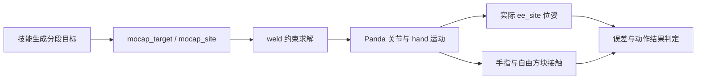
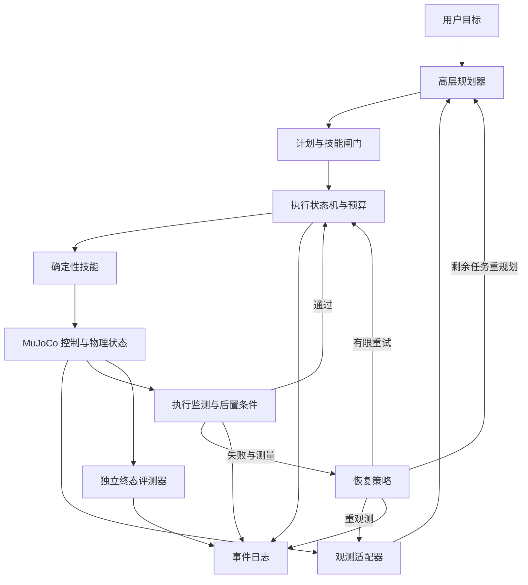

# Robot Agent 技术方案：机器人操作中的执行验证与失败恢复

> 本文解释项目的问题定义、选型依据、工作原理和验证方法。阶段安排见 [PROJECT_PLAN.md](PROJECT_PLAN.md)，分步操作见 [M0/M1 实施规划](M0_M1_实施规划.md)和 [M2 实施计划](M2_实施计划.md)。
> 技术路线：MuJoCo + Franka Panda + mocap-weld 末端控制 + 确定性技能 + 高层规划 Agent。
> 当前状态（2026-09-27）：M0/M1 已通过；M2 确定性单方块 pick/place 在 10 个冻结场景及完整复跑中均为 10/10。仍待实现与验收的是 Agent 闭环、失败恢复、对照评测、视觉和真实硬件验证。下文这些接口与实验协议仍属设计，不代表已有实现。

## 1. 要解决什么问题，为什么值得做

### 1.1 核心问题：计划与物理结果之间存在缺口

用户说“把方块放到绿色目标区”，生成 `pick(cube) → place(target_a)` 并不困难。困难在于：调用 `pick` 后是否真的抓住了方块；移动途中是否滑落；释放后是否稳定停在指定区域；如果没有，下一步应该做什么。

机器人操作涉及连续运动和接触。物体位置、接触姿态、摩擦和轨迹的变化，会让相同高层动作产生不同结果。接口返回、控制意图和物理结果是三个不同层次的事实：

| 层次 | 示例 | 能说明什么 |
| --- | --- | --- |
| 调用结果 | `pick` 函数执行完毕 | 程序走完了一条执行路径 |
| 控制意图 | 夹爪收到闭合命令、末端目标被抬高 | 系统要求机器人做什么 |
| 物理结果 | 方块离开桌面，并在搬运窗口内相对末端稳定 | 抓取发生，并在观察期间持续有效 |

若把前两层当作第三层，系统会空抓后继续放置，甚至报告“完成”。若失败后从头播放原动作序列，已经变化的物理状态又可能让下一次尝试继续失败。

**本项目建立一条可以检查的执行链：语言目标 → 可执行技能 → 物理状态验证 → 失败分类 → 有预算的恢复 → 独立终态判定。** 主要价值是实现并评测这条链。

### 1.2 工程目标与待验证假设

工程上要回答三个问题：

1. 怎样把语言目标限定成可以执行、可以拒绝的技能调用？
2. 怎样从实际状态判断动作成功，并区分空抓、滑落、未到位和目标未完成？
3. 怎样根据失败后的状态继续执行，同时限制资源消耗和重复失败？

实验检验的假设是：**在相同技能、控制器、初始条件和资源上限下，状态驱动恢复能否提高任务成功率；收益是否超过固定重试，代价是多少？**

这是待验证的假设。反馈误报、错误分类和不合适的重规划都可能降低成功率，不能提前把“可靠性提升”写成结论。

### 1.3 为什么从单方块、两个目标区开始

第一版使用一台 Franka Panda、一个自由方块和两个桌面标记区，每次任务由指令选定 A 或 B：

- 一个物体已包含接近、接触、夹持、抬升、搬运和释放，可暴露本项目关心的执行失败。
- 两个区域让语言输入具有实际选择作用，避免所有指令都触发同一段固定动作。
- 标记区减少容器侧壁碰撞、狭窄空间规划等额外变量，使失败原因更容易定位。

这个任务的规划复杂度很低。把“绿色区域”映射到 A 并执行固定技能，可以由规则程序完成。因此第一版首先是执行可靠性的实验平台；LLM 的额外价值必须与规则规划、规则恢复比较后才能确认。

### 1.4 项目贡献与边界

自己实现的重点是技能契约、状态机、失败判定、恢复策略和对照评测。物理引擎、Panda 模型和语言模型是复用组件；不声称提出新动力学算法或基础模型。

第一版是一个高层规划 Agent 与确定性执行系统。观测使用仿真真值，控制使用辅助约束；不证明视觉识别、端到端策略学习、真实机器人控制或 Sim2Real 能力。规则闸门、技能和判定器不是独立 Agent。

## 2. 为什么需要仿真，为什么选择 MuJoCo

### 2.1 物理反馈是实验成立的前提

如果直接让方块跟随夹爪移动，就不会出现真实的空抓或滑落，也无法研究接触失败后的恢复。方块必须作为动态物体，由重力、接触、摩擦和支撑决定运动。

多体动力学可以概括为：

$$
M(q)\dot v+c(q,v)=\tau_{act}+\tau_{passive}+\tau_{ext}+J(q)^T f_{constraint}.
$$

`q`、`v` 是广义位置和速度；`M` 是惯性矩阵；`c` 包含重力等偏置项；右侧包含执行器力、被动力、外力及约束力。约束包括接触、关节限位和 equality。设置动作目标之后，机械臂和物体如何运动仍需计算，而不是把目标坐标直接复制给物体。[MuJoCo 动力学框架](https://mujoco.readthedocs.io/en/stable/computation/index.html#general-framework)

自由物体的位置表示包含四元数，广义位置与速度的维数可以不同；实现时通过名称和坐标变换读取状态，不能假定 `qpos` 与 `qvel` 逐项对应。

仿真还允许保存初始条件、施加受控扰动并复跑，把执行机制与真实设备调试暂时分开。所得结论只适用于所采用的模型和条件。

### 2.2 按项目需求选型

| 项目需求 | MuJoCo 提供的基础 | 在本项目中的用途 |
| --- | --- | --- |
| 方块与夹爪物理交互 | 多体动力学、接触与摩擦 | 观察抓取是否发生、搬运是否滑落 |
| 验证实际结果 | 关节、末端、物体和接触状态 | 用可测状态验收动作 |
| 控制变量做对照 | 模型参数、状态初始化、显式步进 | 相同初始条件比较恢复策略 |
| 本地开发及批量实验 | Python 绑定，物理步进与显示可以分开 | viewer 调试与无界面评测共享执行逻辑 |
| 尽早建立机械臂基线 | Menagerie 现成机器人模型 | 复用 Panda 模型、夹爪和碰撞几何 |

基础能力见 [MuJoCo 概述](https://mujoco.readthedocs.io/en/stable/overview.html)、[Python 接口](https://mujoco.readthedocs.io/en/stable/python.html)及 [Menagerie 模型库](https://github.com/google-deepmind/mujoco_menagerie)。其与本项目需求的对应关系是本方案的设计判断。

**选择 MuJoCo，是因为它可以同时承担接触实验环境、状态真值来源和批量评测运行时，而且本项目已建立可用的 Panda 跟踪基线。** 项目没有做跨引擎测评，不以“它始终更快、更准”为选型依据。

### 2.3 替代方案与取舍

| 方案 | 能承担的工作 | 当前取舍 |
| --- | --- | --- |
| PyBullet | Python 机器人仿真与接触实验 | 可行替代；切换需重做模型、接触与控制标定，目前没有已证实的收益 |
| Isaac Sim | 机器人、传感器和视觉场景工作流 | 首版使用结构化真值，暂不需要视觉工作流；安装和显卡要求是额外约束，视觉阶段再评估 |
| Gazebo | 机器人系统、世界与传感器仿真 | 若重心转向 ROS 系统集成再评估；当前是单机械臂 Python 实验 |
| 真实 Panda | 验证硬件执行与真实接触 | 同时引入驱动、标定、设备和现场条件；硬件阶段需要独立控制与验收方案 |
| 几何动画 | 展示动作顺序 | 可做界面演示，无法替代接触结果评测 |

替代平台的基础能力与要求见 [Bullet/PyBullet 官方仓库](https://github.com/bulletphysics/bullet3)、[Isaac Sim 官方要求](https://docs.isaacsim.omniverse.nvidia.com/latest/installation/requirements.html)和 [Gazebo 入门](https://gazebosim.org/docs/latest/getstarted/)。选型结论是基于当前范围和已有基线的工程判断。

### 2.4 仿真精度不等于硬件真实性

MuJoCo 使用数值积分和软约束接触模型；摩擦、碰撞几何、步长和求解参数会改变结果。[MuJoCo 接触模型](https://mujoco.readthedocs.io/en/stable/computation/index.html#contact)

本项目锁定依赖、模型和 XML，在开发场景标定阈值，测试前冻结配置，并记录警告和实际轨迹。固定 seed 不保证跨版本或机器逐帧一致。viewer 和视频用于诊断，统计依据是完整状态日志。

## 3. 为什么分成规划、技能和控制三层

### 3.1 不同层处理不同时间尺度

| 层次 | 输入 → 输出 | 负责的问题 | 调用时机 |
| --- | --- | --- | --- |
| 高层规划 | 指令、观测、错误摘要 → 技能计划 | 目标选择与剩余步骤安排 | 初始规划、必要的失败重规划 |
| 技能执行 | 实体 ID、当前状态 → 分段轨迹与夹爪动作 | 可重复的 `pick/place` 及阶段验证 | 技能持续执行期间 |
| 仿真控制 | 目标位姿、夹爪命令 → 物理状态 | 动力学步进与异常监测 | 每个物理步或冻结监测周期 |

当前 `0.002 s` 步长意味着每仿真秒 500 个物理步。LLM 请求的延迟和输出形式不适合逐步控制；它只在高层决策点调用。500 是仿真步数，不是已经验证的硬件频率或墙钟运行速度。

确定性技能统一坐标换算、轨迹和夹爪动作，使不同规划/恢复策略共用执行底座。否则更换 Agent 时同时更换控制器，就无法归因成功率变化。

### 3.2 技能必须有前置和后置条件

| 技能 | 前置条件 | 执行过程 | 后置条件 |
| --- | --- | --- | --- |
| `pick(cube)` | 可定位方块、未持物、抓取位姿通过范围检查 | 预接近、下降、闭爪、停留、抬升验证 | 方块离桌并在窗口内跟随末端 |
| `place(target_a)` | 稳定持物估计、区域有效、路径通过开发约束 | 移动、下降、张爪、等待、撤离 | 方块获支撑、与夹爪分离且在目标区稳定 |

技能用最新观测把实体 ID 转为坐标。LLM 不输出任意关节力矩，不改 XML，不直接改方块位姿，不调用 `reset`。首版可以只允许 `approach_mode=top`；偏移接近方式只有独立验证后才加入白名单。

### 3.3 为什么提示词之外还需要闸门

格式正确不等于可执行：空夹爪状态下的 `place(target_a)`，即使 JSON 合法也违反前置条件。运行时检查 schema、技能白名单、实体、顺序、持物状态、观测版本及预算，拒绝时返回明确原因。

这些可直接计算的条件适合确定性程序；LLM 在约束内选择计划。工作空间检查和异常监测属于工程限制，不构成形式化的全程无碰撞保证。

### 3.4 为什么暂不训练 RL/VLA 或增加审查 Agent

策略训练引入数据、奖励和训练稳定性，视觉动作模型还引入感知误差。它们会增加失败来源，使执行恢复机制更难独立评估。第一版先固定观测与控制。

可直接验证的前置条件也不需要第二个 LLM 投票。独立审查 Agent 留作扩展，通过有/无审查的对照评估收益、误拦截与成本。

## 4. 方案 A：mocap 怎样驱动机械臂

### 4.1 mocap 是目标位姿载体

`mocap body` 是用户在仿真步之间设置位姿的特殊 body。名称来自 motion capture，本项目由程序生成目标，不需要动作捕捉设备。

写入 `data.mocap_pos` 和 `data.mocap_quat` 只更新目标 body；Panda 不会自动运动。本项目用 weld equality 连接目标 site 与末端 site，约束求解产生作用于机械臂的力，使末端跟随。[MuJoCo mocap 建模说明](https://mujoco.readthedocs.io/en/stable/modeling.html#mocap-bodies)



### 4.2 约束连接末端与目标，方块仍自由运动

当前派生模型定义：

```xml
<weld name="mocap_weld" site1="ee_site" site2="mocap_site"/>
```

site-based weld 让两个 site 的位置和姿态趋于对齐。它是软约束，可能与碰撞、限位冲突，实际末端会偏离目标。[MuJoCo weld 定义](https://mujoco.readthedocs.io/en/stable/XMLreference.html#equality-weld)

方块保留 `freejoint`，与机械臂之间没有持物 weld。抓取依赖手指碰撞、夹持和摩擦，释放后依赖重力和桌面支撑。这样才能观察空抓与滑落。mocap 标记和目标区仅表示目标，不负责支撑物体。

### 4.3 为什么禁用机械臂位置伺服

上游 Panda 有 7 个机械臂位置伺服 actuator 和 1 个夹爪 actuator。如果伺服要求维持原关节角，weld 同时要求末端移动，两条控制来源可能相互竞争。

派生 XML 将机械臂 actuator 归入 group 0 并禁用，夹爪归入 group 1 并保留：

```xml
<option integrator="implicitfast" timestep="0.002" actuatorgroupdisable="0"/>
```

XML 的 `0` 表示禁用**组 0**。编译后的 `model.opt.disableactuator` 是位掩码，当前值为 `1`。机械臂 actuator 不产生力，夹爪继续由 `data.ctrl` 驱动。[actuatorgroupdisable 定义](https://mujoco.readthedocs.io/en/stable/XMLreference.html#option-actuatorgroupdisable)

### 4.4 夹爪的 0–255 命令表示什么

本地锁定模型由 `actuator8` 驱动双指 tendon，0 用作闭合命令，255 用作张开命令。这不是 255 米，也不是直接指定 255 牛的夹持力。

按本地增益和偏置，静态目标 tendon 长度可近似写为 `0.04 × u / 255` 米，`u` 为控制命令。实际运动受阻尼、力限和接触影响；夹住方块时，两指不必到达空载闭合位置。抓取判定不能只检查命令，也不能要求两指完全闭合。依据见 [本地 actuator 定义](assets/third_party/franka_emika_panda/panda_mocap.xml)。

### 4.5 初始对齐、坐标和轨迹为什么重要

初始化顺序为：加载场景 → `home_scene` 完整重置 → `mj_forward` → 读取真实末端位姿 → 对齐 mocap → 分段运动。两个 site 初始未对齐会造成约束突变。

当前 TCP（工具中心点）位于 `hand` 局部 `(0,0,0.1034) m`，不是 hand 原点。坐标关系为：

$$
T_{world,TCP}=T_{world,hand}T_{hand,TCP}.
$$

抓取高度必须结合 TCP、手指碰撞体和方块尺寸标定；TCP 到达方块中心不必然表示两指正确夹持。项目采用世界坐标、米、弧度、Z 向上，MuJoCo 四元数顺序为 WXYZ。

M1 固定末端姿态，用 `p(α)=(1−α)p_start+αp_goal` 插值位置，减少目标跳变。这不等于实现了速度、加速度连续的硬件轨迹规划。改变姿态时需单独验证旋转插值。

### 4.6 为什么先采用辅助约束，何时更换

IK（逆运动学）求关节目标，再用伺服控制，也是可行路线，但需要处理解连续性、奇异位形、限位、冗余及接触控制。当前先用 weld 建立可观察的动作底座，集中开发技能验收与恢复机制。

代价是约束驱动没有复现真实 Panda 的完整驱动链，可能产生真实电机无法提供的等效力。因此不能评价硬件力矩限制、能耗或控制精度。weld 与接触的相对软硬影响跟踪和穿透，不能无限加强约束。

若 M2 接触抓取不稳定，保留轨迹，排查几何、初始化、可达性、夹爪和约束冲突；若证据指向辅助控制本身，再切换到 IK + 伺服等控制方案并重新验收。目标转向真实硬件时，控制路线必须重新设计。

## 5. 怎样验证动作真的完成

### 5.1 运动闭环与任务闭环

运动层检查末端是否跟随目标；任务层检查方块是否完成操作。末端跟踪很好，也可能空抓。任务决策需要基于 `goal + 最新观测 + 错误历史 + 剩余预算`，执行后重新观察。

无恢复基线仍保留底层控制与失败检测；它缺少的是失败后继续完成任务的机制，不能把它误称为整个机器人都开环运行。

### 5.2 三种关键判定

| 判定 | 状态证据 | 单一替代信号的问题 |
| --- | --- | --- |
| 末端到位 | 实际 TCP 的位置误差，必要时姿态误差，并保持一个窗口 | mocap 到位只说明目标更新 |
| 稳定抓取 | 方块离桌、合理夹持接触、抬升/搬运时相对末端稳定 | 接触可能只是碰到；闭爪命令可能是空抓 |
| 完成放置 | 完整投影入区、有支撑、低速度、与张开夹爪分离并稳定 | 中心入区时仍可能压线、悬空或被夹住 |

持物检查使用 `T_TCP,cube = inverse(T_world,TCP) × T_world,cube`。已验证持物后，持续相对漂移、接触丢失与高度变化可以提供滑落证据；一个接触对或单个采样点不足以定性。

搬运期间按冻结周期监测持物，才能及时发现滑落；不能仅在 `place` 结束后检查。仿真异常和非有限状态需要更严格的步进检查。日志采样可低于监测频率，但应保存触发判定的证据。

### 5.3 为什么需要独立终态判定

技能结果供调度器决定下一步，episode 评测器判断用户目标是否成立。两者可以共用几何工具，但终态判定重新读取当前物理状态，不相信 `SkillResult.success` 或 Agent 总结。

将方块 8 个局部角点按实际姿态变换为 `w_i=R_cube v_i+p_cube`。目标区中心为 `(c_x,c_y)`、半尺寸 `(h_x,h_y)`、边界余量 `m` 时，所有角点投影均需满足：

$$
|w_{i,x}-c_x|\le h_x-m,\qquad |w_{i,y}-c_y|\le h_y-m.
$$

同时检查桌面支撑、夹爪分离和速度，连续成立约 `0.5 s` 才成功。当前步长下等于 250 个物理步，改变步长后应按时长换算。

M2 已将 `10 mm` 边界余量、`0.01 m/s` 线速度和 `0.1 rad/s` 角速度写入冻结配置。接触穿透一般上限为 `5 mm`，已知 Panda `link4` 与桌面的单一接触对单独允许至 `6.5 mm`，验收最深实测 `5.986 mm`。M1 的 `20 mm` 跟踪门槛仍不是抓取/放置容差。

### 5.4 为什么先用真值，为什么还要限制可见信息

真值观测使首版失败主要来自执行与恢复，避免同时引入“看错位置”的问题。后续可替换观测适配器，但必须增加感知误差评测。

规划器只接收公开状态和由公开状态计算的持物估计；故障注入时刻、真实故障标签及评测答案只归评测系统。否则恢复可能依赖实验脚本泄露的答案。

观测带 `obs_id`，计划带 `base_obs_id`。执行前重新验证，技能使用最新状态计算坐标。版本变化不一定调用 LLM：目标、实体和前置条件仍成立时可确定性复核；原计划不再适用时才重规划。

## 6. 失败后为什么不能只重试

### 6.1 恢复取决于当前状态

“把方块放到 A”执行到搬运阶段时，方块滑落到桌面。此时原计划的下一步是 `place(A)`，但它的持物前置条件已失效。合理的剩余任务变成“定位方块 → 重新抓取 → 放到 A”，而不是继续发送释放命令。

恢复是重新建立可执行前置条件，并根据已经发生的物理变化安排剩余步骤：

| 失败情形 | 需要核实的状态 | 预算内的处理 | 终止条件 |
| --- | --- | --- | --- |
| 非法计划/前置条件失败 | 技能、实体、持物状态、观测版本 | 拒绝执行；允许有限计划修正 | 多次无效或无可执行技能 |
| 末端未到位 | 实际误差、目标范围、接触和限位 | 停止当前运动；可用时选择已验证路径或有限重试 | 越界、严重穿透、持续失稳 |
| 空抓 | 方块现位姿、夹爪状态、是否离桌 | 按最新位置重新接近；可用时换接近方式 | 不可达或重复失败无进展 |
| 搬运滑落 | 方块落点、稳定性、当前持物估计 | 中断放置，必要时等待方块稳定，再规划抓取与放置 | 掉出工作区或无恢复路径 |
| 目标未满足 | 已释放还是仍持物、方块偏移和速度 | 仍持物则修正放置；已释放且可抓则重新搬运 | 预算耗尽或状态不满足技能前置条件 |
| 仿真异常 | NaN、warning、严重穿透、状态失稳 | 保存现场，失败终止 | 不交给 LLM 猜测修复 |

错误码沿用 M2 的语义，例如 `PRECONDITION_FAILED`、`EE_TRACKING_ERROR`、`GRASP_EMPTY`、`OBJECT_SLIPPED`、`OBJECT_DROPPED`、`DANGER_ZONE_VIOLATION`、`GOAL_NOT_MET`、`BUDGET_EXHAUSTED`、`SIMULATION_ERROR`。上层统一命名，保留底层测量，不仅记录一句“抓取失败”。

具体停止动作也依赖现场：持物时不能无条件张爪；夹爪已空时不能按持物逻辑放置。先执行经过验证的有限停止/等待过程，再决定是否继续。严重仿真异常直接结束 episode。

### 6.2 重观测、重试、重规划的区别

- **重观测（OBSERVE）**：刷新状态，尚未改变动作方案。
- **重试（RETRY）**：再次执行原技能及相同策略，坐标仍由技能层根据最新观测计算。
- **重规划（REPLAN）**：改变剩余技能序列，或选择另一种已验证策略，例如滑落后由 `place` 改成 `pick → place`。

重试也可以受益于最新坐标，所以“抓取前方块移动后再次抓住”并不足以证明高层重规划有用。真正的重规划应在日志中展示计划或策略变化。

对可直接判断的恢复用规则执行；只有规则无法决定剩余步骤或需要选择允许策略时，才请求 LLM。简单任务中规则恢复可能与 LLM 同样有效，这是需要测量的结果。

第一版没有独立验证的 `push`，就不能把“改用推”写成可执行后备动作。也不能把场景 reset 当作恢复；reset 会抹除已经发生的失败。

### 6.3 为什么需要预算和进展判定

如果相同动作一直空抓，无限重试既不能完成任务，也无法比较成本。开发阶段的候选预算为：每个逻辑技能额外重试至多 1 次，episode 重规划至多 2 次，总技能调用至多 12 次。仿真步数与 LLM 调用/墙钟超时上限依据脚本基线用量标定后冻结。

非法计划修正、LLM 请求重发和重新排入的技能都必须消耗相应全局预算，不能通过新计划清空计数器。每条终止路径保存原因。

用 `(状态摘要, 技能, 策略, 错误码)` 标识重复失败，结合物体位置、持物状态或阶段推进检查是否有进展；连续重复且无进展则提前终止。摘要容差在开发集确定，避免把接触中的数值抖动当作有效进展。

预算提供明确的运行边界，不保证一定恢复成功。统计同时报告成功率、实际消耗和预算耗尽比例。

## 7. 系统结构、数据契约与一次完整执行

### 7.1 架构与责任



MuJoCo 负责物理状态，不负责理解用户目标；LLM 负责受限规划，不负责宣判物理成功；技能负责操作过程，不负责生成最终实验统计；评测器独立读取状态并汇总。确定性闸门与预算位于所有执行路径上。

接口约束使未来可以替换规划模型、观测适配器或控制器，但替换后仍需重新验证对应层。模块可替换不等于无需标定就能接真实机器人。

### 7.2 最小数据契约（拟实现）

```text
Observation:
  obs_id, sim_time, ee_pose_actual, gripper_opening,
  object_poses, object_velocities, target_regions,
  held_estimate, public_contact_summary

Plan:
  base_obs_id, steps: list[PlanStep]

PlanStep:
  skill ∈ {pick, place}, object_id?, target_id?,
  approach_mode ∈ 已独立验证的枚举

SkillResult:
  status ∈ {success, failed, timeout}, error_code,
  obs_before_id, obs_after_id, sim_steps_used,
  measured_metrics, postcondition_checks

RecoveryDecision:
  action ∈ {observe, retry, replan, terminate},
  reason, plan_before?, plan_after?, budget_remaining

TrialLog:
  scenario_id, seed, group, instruction,
  initial_state_reference, dependency_and_model_versions,
  prompt_version, config_hash, ordered_events,
  final_outcome, termination_reason, resource_usage
```

规划输出只包含实体与允许参数：

```json
{
  "base_obs_id": 17,
  "steps": [
    {"skill": "pick", "object_id": "cube", "approach_mode": "top"},
    {"skill": "place", "target_id": "target_a"}
  ]
}
```

`held_estimate` 是由公开状态计算的估计，不是隐藏的“抓取成功答案”。日志可同时记录规划器可见的观测和仅评测器可见的真值，但必须标注边界。

### 7.3 状态机与 Hook

正常路径：`INIT → OBSERVE → PLAN → VALIDATE → EXECUTE → VERIFY → NEXT/GOAL_CHECK → SUCCESS`。校验或执行失败进入 `RECOVER`，之后返回观测、执行或规划，或者进入带原因的 `FAILED`。所有路径受同一全局预算约束。

| Hook | 要做的工作 | 设计理由 |
| --- | --- | --- |
| `pre_plan` | 组装公开观测、技能契约与剩余预算 | 让规划器看到当前可执行边界 |
| `pre_skill` | 复核 schema、实体、前置条件、版本与预算 | 阻止失效计划进入物理执行 |
| `post_skill` | 基于实际状态检查后置条件 | 避免把函数完成等同于动作成功 |
| `on_failure` | 分类、检查进展与预算、选择恢复路径 | 限制盲目重试与循环 |

Hook 是程序事件接口，本身不是 Agent。监测器还会在技能执行期间观察关键状态，不能把全部检查推迟到 `post_skill`。

### 7.4 示例：搬运滑落后的剩余任务

以下是期望执行轨迹，不是已实现演示：

1. 观测到方块在桌面，用户选择 A；计划通过校验。
2. `pick` 执行后，离桌与相对位姿检查通过，形成持物估计。
3. `place` 的搬运阶段监测到滑落，停止继续放置并产生 `OBJECT_SLIPPED`。
4. 重观测发现方块稳定落在可抓范围内，持物估计为 false。
5. 恢复策略依据预算将剩余计划由 `place(A)` 改为 `pick(cube) → place(A)`。
6. 再抓、放置，独立评测器检查目标区、支撑、分离和稳定窗口。
7. 全部通过才记录 `SUCCESS`；再失败且无预算则记录失败和完整轨迹。

这条轨迹展示“状态改变 → 前置条件失效 → 计划改变”。只展示末端运动视频，无法证明恢复逻辑有效。

## 8. 如何证明设计有用：对照实验与归因

### 8.1 三组主对照

| 组别 | 失败后的行为 | 用于回答的问题 |
| --- | --- | --- |
| B0：无恢复 | 使用同样的规划、技能、闸门和检测，确认失败后终止 | 恢复机制整体是否有收益 |
| B1：固定重试 | 预算内重复原技能和策略，技能仍使用最新观测计算坐标 | 额外尝试及技能自身反馈能带来多少收益 |
| B2：状态驱动恢复 | 分类、重观测，必要时改变剩余步骤或已验证策略 | 高层根据失败状态改变执行方案是否超过固定重试 |

三组共享控制器、技能、初始化、初始计划、观测接口、阈值、安全边界和资源上限。初始 LLM 计划可缓存复用，保证组间差异从恢复阶段开始；缓存规则与实际部署成本分别记录。B2 后续 LLM 请求单独计费和统计。

相同资源上限不意味着实际消耗相同。B0 会提前结束，B2 可能用更多步骤，应同时报告消耗和成功率；需要比较资源效率时，再画预先设定预算下的成功率曲线。

### 8.2 怎样判断 LLM 是否必要

B2 相对 B1 的提升，只支持“状态驱动恢复有收益”，不能单独归因于 LLM。B2 中规则恢复同样改变了行为。

若要声称 LLM 重规划提供额外价值，增加以下对照：用相同技能、观测和预算，对比确定性规则恢复与 LLM 恢复；正常流程另用“目标映射 + 固定技能序列”的规则规划基线核实简单任务是否需要 LLM。LLM 只能选择相同的已验证动作空间。

若规则系统达到相近成功率且成本更低，应将结论写为规则足够，LLM 的价值尚未证实。若只完成 B0/B2，结论限于恢复整体收益；若只发生相同技能重试，就不能称为重规划效果。

### 8.3 场景与故障注入

先验证干净场景，再加入受控扰动。开发集用于确定可达范围、故障幅度、监测阈值和恢复规则，不进入正式指标。

| 条件 | 做法与控制变量 | 观察重点 |
| --- | --- | --- |
| 干净场景 | 在验证范围内改变方块起始位置、目标选择；正式阶段可增加目标区位置变化 | 基础任务能力、误报与正常成本 |
| 抓取前位移 | 第一次抓取的约定事件处施加一次受控外力，让方块位置变化 | 观测过期处理、技能更新坐标、重试的作用 |
| 搬运扰动 | 首次确认持物后的约定搬运事件施加一次短时外力 | 滑落检测、前置条件变化、剩余任务恢复 |

优先用短时外力使状态自然变化，外力窗口后清零 `xfrc_applied`。任务中不直接改方块位姿，不改变物体为夹爪附属物。幅度在开发集标定，不能根据测试结果挑出刚好有利于 B2 的故障。[MuJoCo 状态与步进说明](https://mujoco.readthedocs.io/en/stable/programming/simulation.html)

触发采用各组共享的逻辑事件定义，如“第一次持物验证通过后的某一搬运阶段”，不用 LLM 墙钟延迟触发。故障每 episode 至多一次，触发参数只归评测器。某组提前终止导致未触发，仍保留该 episode，并记录 `triggered=false`。

可恢复范围预先定义，不在测试后依据 B2 是否成功筛选。滑落到桌外的样本可按协议归不可恢复条件，不能悄悄删除。

第一版在 LLM 规划等待期间暂停物理步进，持物静置等必要过程用显式有界步骤执行。这样 API 延迟影响墙钟成本，不改变物理初始条件。各组共享此约定；真实硬件等待中的持续控制不在本版范围内。

### 8.4 测试样本与统计

正式评测至少 50 个成对实例，三个主组共至少 150 个 episode。建议预登记为 20 个干净、15 个抓取前位移和 15 个搬运扰动实例；若预算允许增加样本，则在运行前登记新的总数与分配。每条清单包含 `scenario_id + seed + target + 初始状态 + 故障配置`。

主指标按条件报告成功数/总数与成功率，并报告 B2−B0、B2−B1 的绝对百分点差。恢复成功率的分母限定为确实启动恢复的 episode，不能与全体成功率混用。

辅助指标包括：检测误报/漏报、重试/重规划次数、技能调用、仿真步数、仿真时间、墙钟时间、LLM token/费用、预算终止和异常分布。误报/漏报依据评测器定义的事件真值判定；“施加了外力”并不等于一定发生了滑落。标签只用于评测。

成对结果记录“都成功、都失败、仅第一组成功、仅第二组成功”；计算置信区间时以场景实例为重采样单位，保持组间配对。不要把逐帧采样点当成独立任务样本。小规模实验不能外推为普遍鲁棒性。

人工扰动与自然失败分别呈现。测试前冻结场景、模型、控制参数、阈值、提示词和预算；保留所有失败与未触发样本。改参数后重新定义评测版本，不能复用同一测试集反复调参再宣称独立验证。

### 8.5 什么结果可以说明什么

| 观察结果 | 可支持的结论 |
| --- | --- |
| B2 优于 B0，但与 B1 相近 | 恢复/额外尝试有收益，未证明改变计划额外有效 |
| B2 优于 B1，轨迹显示状态和剩余步骤改变 | 状态驱动恢复在这些条件下优于固定重试 |
| LLM 恢复优于规则恢复，且动作空间与预算一致 | LLM 在所测条件下提供额外收益，仍需同时报告成本 |
| 干净场景下降，扰动场景提升 | 存在误报或保守策略的代价，需要按条件报告 |
| 无显著提升，或成本大幅增加 | 当前恢复策略的适用性/效率不足，应分析失败样本 |

项目完成标准是实现可运行、对照公平、日志和统计一致、失败可解释。成功率提高与否由数据决定，负结果同样应交付。

## 9. 当前实现已经证明什么

### 9.1 证据与状态分开

| 部分 | 当前证据 | 可说明的范围 |
| --- | --- | --- |
| 环境与模型 | [依赖锁文件](requirements-lock.txt)、[模型来源记录](assets/third_party/README.md) | 存在可追溯的本地基线 |
| 末端跟踪与空载夹爪 | [M1 脚本](scripts/m1_track_mocap.py)、[摘要](results/m1/model_info.json)、[轨迹](results/m1/tracking.csv) | 短距离跟踪、空载开合及场景静置验收通过 |
| 语言模型调用 | [API smoke](scripts/deepseek_smoke.py)与 README 连通性记录 | 单次 API 请求可用，不代表规划器已集成 |
| 确定性抓取与放置 | [M2 脚本](scripts/m2_pick_place.py)、[冻结阈值](configs/m2_thresholds.json)、[10 场景摘要](results/m2/acceptance/summary.json)、[M2 执行记录](NOTES.md) | 当前 10 个场景及同配置完整复跑均 10/10；只覆盖固定 MuJoCo 场景 |
| 闭环 Agent、恢复、对照实验 | 本文与 PROJECT_PLAN 的设计 | 待实现与验证 |

### 9.2 当前几何与 M1 数据

以下来自本地 XML 和已保存的 M1 摘要，不是本次文档重写重新运行的实验：

- MuJoCo `3.14.0`；Menagerie 包 `2026.9.2`；Panda 源版本和派生修改见来源记录。
- 桌面顶面 `z=0.4 m`；方块边长 `0.05 m`、质量 `0.08 kg`；目标区边长 `0.15 m`。
- A/B 中心分别为 `(0.58,-0.12,0.401)` 与 `(0.58,0.12,0.401) m`。标记 z 坐标用于显示，支撑面仍是桌面。
- 方块轴对齐且居中时，区域边界到方块边界的名义距离为 `(0.15−0.05)/2=0.05 m`；旋转与边界余量会缩小可接受位置范围。
- home TCP 世界位置约 `(0.5545,0,0.5211) m`。三个短距离目标的最大停留误差约 `0.134/0.131/0.186 mm`，回 home 为 `0.188 mm`；M1 验收上限 `20 mm`。
- 空载闭/开时两指平均关节位置约 `0.00135/0.03866 m`；场景静置后方块由桌面支撑，保存的 warning 为空，未记录非有限状态。

M1 目标在 home 附近，验证的是空载短距离运动。其亚毫米停留误差不能推广到完整工作区、带物搬运、任务成功率或硬件精度。后续 M2 应单独验证姿态、接触和完整轨迹。

### 9.3 已发现的问题为什么与本方案有关

M1 曾直接用上游 `home` 重置扩展场景，新增方块被重置到世界原点。现在用 `home_scene` 显式设置完整状态。这说明可复现 episode 需要重置机器人与任务物体，而不只是机械臂关节。

Windows 中文绝对 XML 路径和离屏 framebuffer 尺寸问题已有绕行/修正记录。它们属于环境和显示问题，不能当作 Agent 操作失败。详情见 [NOTES.md](NOTES.md)。

## 10. 实施顺序为什么这样安排

先验证控制，再验证技能，再引入 Agent，最后做扰动与恢复。每一步减少一个未知因素，避免把仿真接线错误、抓取几何错误和规划错误混在一起。

| 阶段 | 要回答的问题 | 验收门槛与当前状态 |
| --- | --- | --- |
| M0：基线 | 任务、坐标、版本和证据是否明确 | 已有基线记录 |
| M1：仿真控制 | 实际末端是否跟踪，夹爪是否独立开合 | G0/G1/G1b 已有 PASS 记录；不等于抓取成功 |
| M2：确定性技能 | 不使用 LLM 能否完成真实接触搬运 | 冻结 10 个简单种子，A/B 各 5 个；正式运行与完整复跑均 10/10；已完成，保留已知 link4/桌面接触例外 |
| M3：Agent 执行 | 语言目标能否转成受约束的完整任务 | 20 条预登记语言案例的 stub 与实际 DeepSeek 执行均 20/20；计划闸门、技能前置/后置检查、预算和独立终态判定已接入；Viewer 已启动并等待关闭，但锁屏环境下未独立核对窗口像素；完成 |
| M4：失败检测 | 扰动下何时、为何失败，检测误差多少 | 扩充执行中监测、错误分类和阈值标定，保留失败轨迹；待完成 |
| M5：恢复 | 能否按新状态继续或有界终止 | 恢复成功案例和预算耗尽案例均有日志；待完成 |
| M6：评测 | 收益是否超过固定重试，成本多少 | 冻结配置，完成成对实验和可追溯统计；待完成 |
| M7：交付 | 别人能否复现结论 | 实际命令、原始记录、演示与局限一致；待完成 |

14 天仅作为原计划的排期参考。M1 跟踪或 M2 接触搬运未通过，就先修底座，不以增加 Agent 功能替代验收。10 个简单种子是技能工程门槛，不是正式恢复实验样本。

M3 必须已有基本前置/后置检查；M4 是在扰动下增强检测和标定，而不是此前一直相信技能返回值。

## 11. 代码组织与交付证据

建议在当前场景、模型与 smoke 脚本上增加以下模块，目录属于后续规划：

```text
src/embodied_agent/
  sim/       # 加载、坐标与观测、步进控制、episode 起始 reset
  skills/    # 分段运动、夹爪、pick/place 及阶段契约
  planner/   # 规则/LLM 适配、结构化计划
  runtime/   # 状态机、闸门、监测、恢复与预算
  eval/      # 场景清单、故障注入、独立判定与统计
configs/     # 冻结场景、阈值、预算和版本
results/     # 原始事件、状态轨迹、汇总与图表
```

后续提供三类入口：无 LLM 的技能验证、单次可视化 demo、无界面成对评测。尚未实现的入口不列为可执行命令。

当前可运行的 M1 命令，从 `robot_agent` 目录执行：

```powershell
.\.venv\Scripts\python.exe .\scripts\m1_track_mocap.py
.\.venv\Scripts\python.exe .\scripts\m1_track_mocap.py --headless
```

API key 通过本地环境配置读取；版本、提示词标识和非敏感配置进入日志，密钥不进入日志或仓库。

每个 episode 至少留下指令、初始状态、计划、实际观测、技能阶段、后置判定、错误证据、恢复前后计划、预算和最终结果。结果表由原始记录生成；视频注明演示种子，不能代替完整统计。

必要验证覆盖非法计划拒绝、预算终止、空抓/滑落识别、reset 完整性、真实接触搬运和终态误判。测试验证外部行为与物理结果，不只是检查函数返回值。

## 12. 主要决策及后续演进条件

| 当前决策 | 原因 | 代价 | 重新评估条件 |
| --- | --- | --- | --- |
| MuJoCo + Panda | 接触状态可测，已有模型与跟踪基线 | 仿真近似及模型依赖 | 工作重点转向视觉/ROS，或接触实验显示平台限制 |
| mocap-weld | 尽早建立末端动作底座 | 控制约束提供辅助力，不能代表硬件 | M2 因控制机制无法通过，或开始硬件研究 |
| 真值结构化观测 | 隔离执行和恢复问题 | 无感知能力结论 | 基线冻结后独立引入感知误差 |
| 确定性技能 | 可复现并便于比较规划策略 | 动作范围受技能库限制 | 有证据表明技能表达不足，再扩展并验收 |
| 单规划 Agent + 规则检查 | 已知约束可直接验证 | 无多 Agent 结论 | 有独立审查需求且有/无审查评测支持 |
| 有限恢复与独立评测 | 限制资源，避免假成功 | 不保证每次完成 | 增加任务规模后重新标定预算与判据 |

后续先比较规则与 LLM 恢复，再按研究问题选择扩展：加入视觉测试观测误差，加入障碍或多物体测试更复杂计划，替换控制器研究硬件约束。每次扩展都保留当前基线，并单独标定新增变量。

## 13. 文档与参考资料的使用方式

本技术方案解释设计依据；[PROJECT_PLAN.md](PROJECT_PLAN.md)用于阶段安排；[M0/M1 规划](M0_M1_实施规划.md)和 [M2 计划](M2_实施计划.md)用于实际操作；[NOTES.md](NOTES.md)记录决策与真实实验；[README.md](README.md)只列当前可用入口和能力。

技术原理的官方来源已在相关段落附链接。官方 stable 文档可能更新，实现以本地锁定版本的 API、XML 和实测为准。项目数据的依据是本地模型及结果文件，未来计划的依据是本文的设计，不将二者混写为已完成能力。
