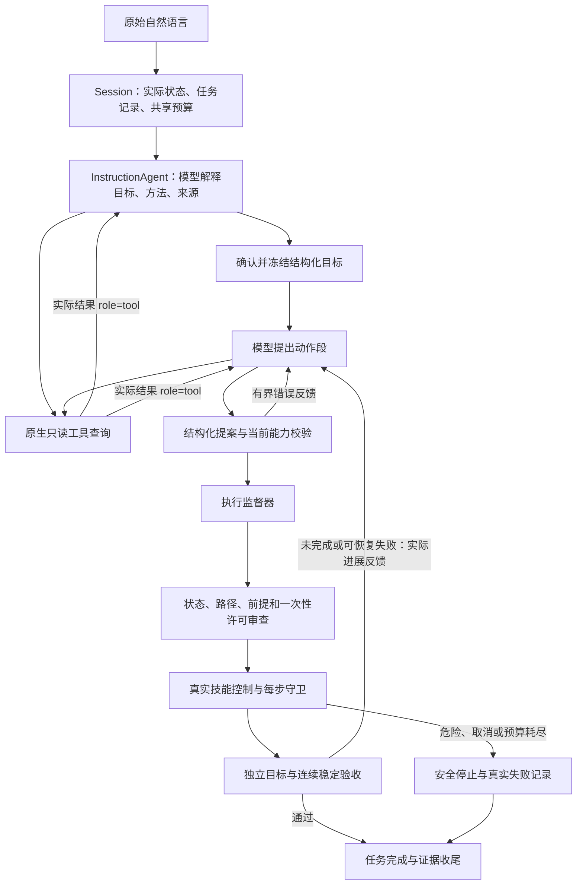

# 指令Agent原理

更新：2026-10-07。P0/P1/P2改造与旧版清理已完成。机器人自然语言处理仅使用 [InstructionAgent](src/embodied_agent/agents/instruction.py)，Panda与Stretch通过各自物理适配器执行。详细流程、阶段状态与证据见[自然语言任务执行链路](自然语言任务执行链路.md)。

提示词、工具、记忆与知识库已拆为可配置、可注入的独立包，接口与示例见 [AGENT_COMPONENTS.md](AGENT_COMPONENTS.md)。记忆和知识默认关闭；开启后是辅助数据，不能改变已确认目标、实时状态或权限。

## 从自然语言到任务完成

默认LLM路径先确认语义，再规划动作；两个阶段均可多轮查询。最终提案包含通用 `goals` 与真实 `actions`，没有固定目的地或固定两步计划模板。执行监督器可以先执行相关动作段，再将实际状态、完成前缀和失败原因交给模型继续规划。恢复必须保留原目标、方法、来源、次序和禁忌约束。

## 节点、文件与职责

| 节点 | 文件 | 处理 |
| --- | --- | --- |
| 入口 | [demo/cli.py](src/embodied_agent/apps/demo/cli.py)、[demo_ui.py](src/embodied_agent/visualization/demo_ui.py)、[demo/instruction.py](src/embodied_agent/apps/demo/instruction.py) | 自由界面、用例/批量与单任务命令均调用当前Session |
| 会话 | [session.py](src/embodied_agent/apps/demo/session.py) | 选择地图、保持实际物理状态、构造适配器、创建记录和任务预算、结果收尾；注册robot/environment |
| 语言核心 | [instruction.py](src/embodied_agent/agents/instruction.py) | 原话交给模型，确认目标、查询并规划或恢复；stub只用于显式离线测试 |
| 观测与能力 | [observation.py](src/embodied_agent/agents/observation.py)、[tools/capabilities.py](src/embodied_agent/tools/capabilities.py)、[manipulation.py](src/embodied_agent/maps/manipulation.py) | 实际快照、当前实体与关系、动作schema、几何抓放候选 |
| 提示词与辅助内容 | [prompts/catalog.py](src/embodied_agent/prompts/catalog.py)、[context.py](src/embodied_agent/context.py)、[memory/](src/embodied_agent/memory/__init__.py)、[knowledge/](src/embodied_agent/knowledge/__init__.py) | 版本化完整提示词；有预算的历史条目和词面文档检索；Session按角色保存实际任务结果，提案不等于成功 |
| 查询 | [tools/query.py](src/embodied_agent/tools/query.py)、[tools/registry.py](src/embodied_agent/tools/registry.py) | 同一catalog发布schema与分发observe/query_world/inspect/get_capabilities；读取捕获快照与能力，无物理执行或地图保存权限 |
| 模型对话 | [dialogue.py](src/embodied_agent/models/dialogue.py)、[deepseek.py](src/embodied_agent/models/deepseek.py)、[tracing.py](src/embodied_agent/models/tracing.py) | 校验tool_calls，执行查询，返回role=tool并再次请求模型；记录实际请求/响应，最终提案有界修正 |
| 目标与提案 | [goals.py](src/embodied_agent/agents/goals.py)、[instruction.py](src/embodied_agent/agents/instruction.py) | 结构化类型、动态实体引用、方法/来源/次序/禁忌，以及动作段与冻结目标的一致性 |
| 执行监督 | [supervisor.py](src/embodied_agent/execution/supervisor.py) | 多段决策、逐动作执行、独立验收、进展复验、反馈恢复、取消与收尾 |
| 物理适配 | [panda_adapter.py](src/embodied_agent/execution/panda_adapter.py)、[robot_episode.py](src/embodied_agent/simulation/robot_episode.py) | 新观测、实时动作/路径审查、一次性许可、真实控制、HOLD/停止与实测证据 |
| 技能 | [panda.py](src/embodied_agent/skills/panda.py)、[stretch.py](src/embodied_agent/skills/stretch.py)、[navigation.py](src/embodied_agent/skills/navigation.py) | 导航、抓取、携带和释放；动态路线变化触发制动、复验和绕行 |
| 安全与验收 | [guards.py](src/embodied_agent/safety/guards.py)、[safety/home.py](src/embodied_agent/safety/home.py)、[placement.py](src/embodied_agent/evaluation/placement.py)、[evaluation/home.py](src/embodied_agent/evaluation/home.py)、[goals.py](src/embodied_agent/agents/goals.py) | 每步检测实际风险；独立检查接触、支撑、释放、位置与连续稳定，不采用模型成功宣称 |
| 预算与记录 | [budget.py](src/embodied_agent/models/budget.py)、[task_writer.py](src/embodied_agent/evaluation/task_writer.py)、[task_records.py](src/embodied_agent/evaluation/task_records.py) | 全任务计数、时限、取消、原子JSON、关联attempt、真实前后态与首错/收尾错误 |

## 查询工具与真实动作

查询结果作为 `role=tool` 进入下一轮LLM交互。模型真实 `actions` 使用当前机器人支持的navigate、pick、carry、place、stop、wait等动作，不能混入查询。直接结构化物理测试仍可调用底层查询技能，检查控制与记录接口。

目标谓词包括supported_on、inside、near、robot_at、held、released、stable、state_equals和action_completed。它们表达结果与约束，不将自然语言重新编译成唯一动作列表。“扔到地板”必须保留requested_method:throw；当前没有投掷技能时报告能力缺口，不能替换成普通放置后宣布成功。

## 环境修改Agent

[UnifiedEnvironmentAgent](src/embodied_agent/agents/map_environment.py)按地图类型使用当前编辑实现，桌面编辑器 [environment.py](src/embodied_agent/agents/environment.py)仍在实际使用。模型解析原始指令，可调用同一只读工具协议，最终输出地图operations；结构化编辑校验后由地图存储原子保存，Session刷新显示。保存成功但刷新失败分别记录。环境编辑不会通过重置地图冒充机器人动态恢复。

## 配置、清理与能力边界

[agent_runtime.json](configs/agent_runtime.json)限制每次输出4096 tokens、每个查询对话8轮/24次工具调用/2次提案修正；整个任务共用24次请求、131072 tokens、128次动作、4次恢复和300秒。恢复不重置额度，达到上限或取消后安全收尾。

旧agents/home_language.py、language.py、planning.py、execution/runtime.py及其契约、提示词、配置和兼容入口已删除。二十个原Panda场景保留为数据，全部由通用Agent执行。单任务入口为 [instruction_agent.py](scripts/instruction_agent.py)，自由界面为 [demo.py](scripts/demo.py)。当前实现依赖已知仿真地图和实际仿真状态；歧义、安全风险与能力缺口仍可能导致失败，模型训练、视觉感知和实机迁移尚未完成。
