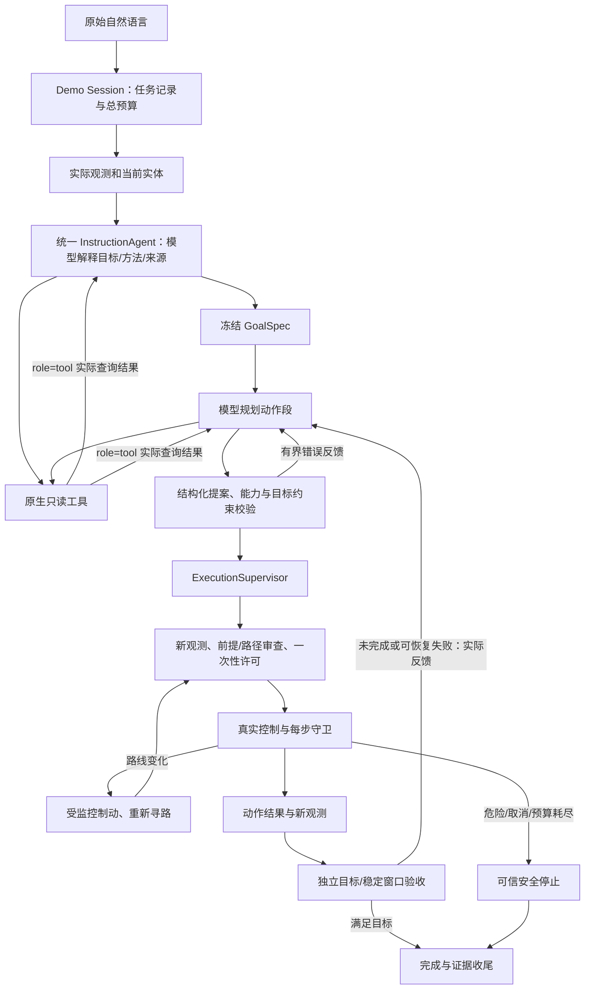

# 自然语言任务执行链路与指令 Agent 原理

更新日期：2026-10-07。本文件描述 P0、P1、P2 改造后的实际自由指令链路，阶段定义来自[通用具身 Agent 改造方案第 9 节](通用具身Agent差距与改造方案.md)。旧版语言 Agent 与 M3 执行链路已删除。原场景输入数据保留并全部改走通用 Agent；旧主记录和旧运行派生产物已在记录 v2 整理中清理，历史执行分析与验收结论保留。可信 `robot_plan` 仅用于结构化物理测试。

提示词、工具、记忆和知识库已从 Agent 实现拆到独立包，通过构造器或 `components` 配置组装；配置和注入示例见 [AGENT_COMPONENTS.md](AGENT_COMPONENTS.md)。默认辅助记忆与知识检索关闭，不改变原实测反馈和目标约束。

## 1. 阶段实施状态

| 阶段 | 状态 | 本轮实际交付 |
| --- | --- | --- |
| P0：统一语义与接口 | **已完成** | 一个 InstructionAgent；通用 Observation、GoalSpec、动态能力；模型解释原话并保留方法/来源；取消固定完整动作列表相等；有界提案修正；Panda/Stretch 适配与独立验收 |
| P1：动态执行与恢复 | **已完成** | 单动作审核和执行；每步安全守卫；受监控 HOLD；动态路线中断、制动、复验和绕行；执行反馈进入下一模型决策；目标冻结与进展复验；多 attempt、共享预算、取消与可靠收尾 |
| P2：环境与技能覆盖 | **已完成** | 几何生成停靠/抓放候选；地板、沙发座面、新平台和桌面；开放家居实体 ID/类别与动态桌面区域；程序化布局/真实扰动；原控制模型下双向地板搬运 |

P3 的训练管线、高层模型训练和 P4 的视觉感知、复杂物体/容器/门/液体操作、实机迁移未在本轮实现。当前使用已知仿真地图与实际仿真状态，阶段完成不等于“已训练出任意环境、任意任务均可完成的 Agent”。

## 2. 主链路与模型交互次数



默认真实模型路径先用模型确认目标和方法，再用模型规划。两种对话均允许原生工具调用和有界修正；恢复时保留已确认目标，不重复解释成别的任务。查询类操作是 tool，navigate/pick/carry/place/stop/wait 等实际操作是 action。

执行器逐动作刷新状态、审核和验收。仍有有效动作段时继续执行；段结束但目标未完成、或出现可恢复中断时，把真实反馈交给模型规划下一段。不是只在最开始交互，也不是每个成功动作后无条件再请求模型。快速安全监督独立于模型决策。

## 3. 每个节点对应的文件与处理

| 节点 | 对应文件 | 处理 |
| --- | --- | --- |
| 启动参数 | [scripts/demo.py](scripts/demo.py)、[apps/demo/cli.py](src/embodied_agent/apps/demo/cli.py) | 加载配置、地图与用例；自由 Demo 默认可视。llm 调用实际模型；stub 是显式离线规则，不是模型失败后的自动回退。 |
| 原话提交与窗口 | [visualization/demo_ui.py](src/embodied_agent/visualization/demo_ui.py) | 原话交给 session.run_agent；语言工作线程执行网络交互，主线程管理 Tk、物理和渲染；等待时受监控 HOLD、刷新画面、处理取消/关闭。 |
| 生命周期与组装 | [apps/demo/session.py](src/embodied_agent/apps/demo/session.py) | robot → _run_instruction；组装同一个 InstructionAgent 和机器人适配器、建立预算、初态、恢复 attempt、结果及收尾。自由指令复用实际场景，选地图/重置才重建。 |
| 整体预算 | [models/budget.py](src/embodied_agent/models/budget.py)、[configs/agent_runtime.json](configs/agent_runtime.json) | TaskBudget 跨所有请求、动作段和恢复共享计数、时限与取消；语言线程复制上下文，使用同一预算对象。 |
| 实际世界观测 | [agents/observation.py](src/embodied_agent/agents/observation.py)、[simulation/robot_episode.py](src/embodied_agent/simulation/robot_episode.py)、[execution/panda_adapter.py](src/embodied_agent/execution/panda_adapter.py) | 统一对象、表面/区域、支撑、机器人位置/抓持与版本；来自声明地图和实际仿真测量，Panda 抓持需双指接触/抬升。 |
| 动态能力 | [tools/capabilities.py](src/embodied_agent/tools/capabilities.py) | 从当前世界和机器人生成实体 ID、动作 schema、方法、合法表面、抓放候选和限制；不把目的地写死为茶几/餐桌。 |
| 几何求解 | [maps/manipulation.py](src/embodied_agent/maps/manipulation.py)、[maps/home_schema.py](src/embodied_agent/maps/home_schema.py) | 解析实际地板/家具表面、高度、包络和余量；自动停靠、抓放候选；沙发使用座面；操作点可省略。 |
| 模型解释原话 | [agents/instruction.py](src/embodied_agent/agents/instruction.py) | 默认先由模型输出意图 GoalSpec，显式保留 requested_method/source_support_id/order/must_not；不经原话关键词契约解析。歧义返回 clarify，能力缺口返回 capability_gap。 |
| 版本化提示词 | [prompts/catalog.py](src/embodied_agent/prompts/catalog.py)、[prompts/resources/](src/embodied_agent/prompts/resources/) | 加载意图/规划和桌面/家居编辑提示词，记录实际版本和文本摘要；配置覆盖替换完整文本。 |
| 原生只读查询 | [tools/query.py](src/embodied_agent/tools/query.py)、[tools/registry.py](src/embodied_agent/tools/registry.py) | observe/query_world/inspect/get_capabilities，同一目录供给模型 schema 和执行分发；结果是本决策捕获的数据。查询本身不步进仿真、控制机器人或保存地图。 |
| 辅助记忆与知识 | [context.py](src/embodied_agent/context.py)、[memory/store.py](src/embodied_agent/memory/store.py)、[knowledge/base.py](src/embodied_agent/knowledge/base.py) | 默认禁用；开启后检索有预算的历史条目/文档，独立放入辅助字段并记录实际内容。Session 按 run_id/role 隔离记忆，在真实任务收尾后保存结果摘要；模型提案不代表任务成功。 |
| 多轮传输与修正 | [models/dialogue.py](src/embodied_agent/models/dialogue.py)、[models/deepseek.py](src/embodied_agent/models/deepseek.py)、[models/tracing.py](src/embodied_agent/models/tracing.py) | 原生 tool_calls → 查询 → role=tool；最终完整文本由 final_validator 审核，错误回传模型有界修正；记录每次请求/响应。timeout 不超过任务剩余时间，取消后的迟到结果不执行。 |
| 动作段提案 | [agents/instruction.py](src/embodied_agent/agents/instruction.py)、[agents/goals.py](src/embodied_agent/agents/goals.py) | 模型根据被冻结目标、当前能力和反馈生成完整或相关部分段；校验结构化 ID、方法、禁忌、次序、参数与前提；不要求等于唯一固定动作列表。 |
| 动态执行监督 | [execution/supervisor.py](src/embodied_agent/execution/supervisor.py) | 保留原目标；逐动作执行并独立验收，构造真实反馈；当前效果仍成立的已完成前缀才可跳过；多 attempt、有限恢复、首错与收尾错误保留。 |
| 动作前审查 | [simulation/robot_episode.py](src/embodied_agent/simulation/robot_episode.py)、[execution/panda_adapter.py](src/embodied_agent/execution/panda_adapter.py)、[safety/path_precheck.py](src/embodied_agent/safety/path_precheck.py) | 用新观测检查抓持、权限、候选、几何和路径；发放状态绑定的一次性许可。记录回调之后、实际技能之前再验状态，失效许可不执行。 |
| 动态导航与本地恢复 | [skills/navigation.py](src/embodied_agent/skills/navigation.py)、[safety/home.py](src/embodied_agent/safety/home.py)、[simulation/robot_episode.py](src/embodied_agent/simulation/robot_episode.py) | 周期性检查实际剩余路线和包络；受阻时有守卫地制动、更新障碍、复验并寻路；次数受限，仍失败则交回高层监督。 |
| 实际机器人控制 | [skills/stretch.py](src/embodied_agent/skills/stretch.py)、[simulation/stretch.py](src/embodied_agent/simulation/stretch.py)、[skills/panda.py](src/embodied_agent/skills/panda.py) | 正常底盘、升降、伸臂、夹爪/末端控制驱动物理；地板先伸臂再降低、先抬升再收臂；闭手负载下位置反馈修正偏差。没有传送物体或焊接抓持。 |
| 每步守卫与 HOLD | [simulation/robot_episode.py](src/embodied_agent/simulation/robot_episode.py)、[simulation/stretch.py](src/embodied_agent/simulation/stretch.py)、[simulation/episode.py](src/embodied_agent/simulation/episode.py)、[safety/guards.py](src/embodied_agent/safety/guards.py) | 物理每步检查有限值、warning、接触/碰撞、危险区、稳定、抓持漂移/丢失、预算。HOLD 持续物理监督；异常制动保留触发原因和停止证据。 |
| 独立目标验收 | [agents/goals.py](src/embodied_agent/agents/goals.py)、[evaluation/home.py](src/embodied_agent/evaluation/home.py)、[evaluation/placement.py](src/embodied_agent/evaluation/placement.py) | 实际接触、独立支撑、释放、机器人脱离、区域投影/余量、连续稳定窗口，以及来源/方法/禁忌/次序。模型或技能的成功声明不能代替验收。 |
| 结果与证据 | [evaluation/task_writer.py](src/embodied_agent/evaluation/task_writer.py)、[recording/store.py](src/embodied_agent/recording/store.py)、[apps/demo/session.py](src/embodied_agent/apps/demo/session.py) | 记录 v2 保存原话/原目标、模型/工具、动作前后态、关联恢复 attempt、计数、独立验收与收尾失败；任务 manifest、日志和工件为事实源，报告只含摘要引用，只读成功不当作物理训练样本。 |

指令和环境修改 Agent 的默认记录主根均为项目 `records/`，任务按上海开始日期和 UUID 写入 `tasks/<YYYYMMDD>/<task_uuid>/`，会话审计进入 `runs/`。`--records-dir` 可覆盖主根；`--output` 只指定报告目录，其中保存 manifest、摘要和任务引用，批量另保留私有 `maps/` 副本。封存、工件校验、重建、独立评价与训练导出见 [TASK_RECORDS.md](TASK_RECORDS.md)，训练器尚未接入。

## 4. 数据协议与语义约束

默认配置 agent.interpret_goals_first=true：先让模型看原话、实体和方法能力，输出 actions:[] 的目标解释；每个目标必须带 requested_method。确认后目标冻结，第二个规划对话不得换目标、省略方法或改变来源。恢复不重新解释原话。

动作规划输入包含原话、当前 world、capabilities、feedback 与 task_context.original_goals/预算/完成摘要。完整物理记录仍保存，但模型恢复输入不重复嵌套全部快照、轨迹和动作结果，避免上下文随恢复迅速膨胀。

最终模型动作提案例如：

```json
{
  "schema_version": 1,
  "decision": "plan",
  "goals": [{"predicate": "supported_on", "object_id": "remote", "target_id": "floor", "source_support_id": "tea_table", "requested_method": "transfer"}],
  "actions": [{"skill": "navigate", "target": "能力目录中的实际抓取操作点ID"}, {"skill": "pick", "object_id": "remote"}]
}
```

这是一段尚未完成的相关动作；操作点必须从实际目录选择。后续当前已持物时可只规划 carry/place。Home place 参数为 support_id/target_xy，Panda 为 target_id，均来自各自 action_schemas，使用同一个高层 Agent。

GoalSpec 谓词为 supported_on、inside、near、robot_at、held、state_equals、released、stable、action_completed。这些是可独立检查的结果类型，不能用任意名字代替真实完成判据。Home 没有容器内部控制技能，箱顶支撑不能证明 inside；Panda 区域 inside 表示物体投影完整位于平面区域。

歧义返回 decision=clarify、question、空 actions；能力缺口返回 decision=capability_gap、reason/missing_capabilities、空 actions。已知目标和方法保留。“扔到沙发”不能改成普通放置报成功；查询任务必须实际调用只读工具。

## 5. 快照、动态状态与错误恢复

同一模型决策的工具读取捕获快照，主线程等待时可能经 HOLD 推进真实物理，因此提案不会直接获得执行权限。每个动作执行前都用实时状态重新审查；中断后的下一决策重新捕获观测。旧动作即使以前合法，也不能跳过当前前提和路径检查。

动态路线检查处理阻挡，每步碰撞/风险守卫处理实际危险，LLM 不能替代快速守卫。碰撞、损坏、非有限状态、停止失败、取消和总预算耗尽终止任务。非脆弱物体滑落仅在停止成功、无机器人接触、真实稳定独立支撑且无损坏的证据成立时可恢复，其他落物不靠重复尝试解除。

恢复反馈包含原目标、实际完成动作摘要、失败代码/消息、当前观测和独立验收。动作前缀只有曾实际成功且当前效果仍成立才跳过；已在目的地也要通过真实稳定窗口验收，避免冗余抓取。

## 6. 预算和完成判定

通用 Agent 每次输出最多4096 tokens，每次工具对话最多8轮、24次工具调用、2次提案修正；最多8个执行决策段。整体任务跨意图、规划、查询和恢复共享24次模型请求、131072 tokens、128个动作、4次恢复、300秒墙钟时限。

token 用量以 SDK 返回的实际 usage 累计；发送前可限制剩余输出，但未知输入用量可能使一次响应后总量越界，越界后禁止继续请求/动作。已经发送的服务端请求不保证即时取消，迟到结果计费信息保留但不执行。必要制动和安全收尾继续。

Panda 保留实际桌面接触、完整区域投影和原250物理步连续稳定窗口；Home 验证真实支撑接触、释放、机器人脱离和持续稳定。来源读取任务初态；次序保留真实动作里程碑；终局关系需当前仍成立。技能返回 SUCCESS 与模型声明完成均不能直接把任务标为 verified。

## 7. 新地图和新增表面的实现与运行

[maps/schema.py](src/embodied_agent/maps/schema.py)、[simulation/model.py](src/embodied_agent/simulation/model.py)、[maps/scene.py](src/embodied_agent/maps/scene.py) 按实际桌面地图创建动态命名的区域 marker，不要求只有 target_a/target_b；Panda 仍使用现有单方块顶部抓取机械能力。

[maps/home_schema.py](src/embodied_agent/maps/home_schema.py)、[maps/home_scene.py](src/embodied_agent/maps/home_scene.py) 允许新实体 ID/类别与缺省操作点。几何、尺寸、质量、操作权限仍需声明并校验；自动候选受原夹爪开度、载荷、伸臂/升降、房间/碰撞和支撑余量限制。地板有效、沙发使用座面、新同类支撑面无需修改 Agent 代码。

[maps/procedural.py](src/embodied_agent/maps/procedural.py) 生成同类布局/尺寸/高度变化；[maps/geometry_acceptance.py](src/embodied_agent/maps/geometry_acceptance.py) 用可信几何计划检验实际控制。[scripts/geometry_demo.py](scripts/geometry_demo.py) 默认复用 MuJoCo WorldView 渲染同一 model/data，末态保持至关闭。可信几何计划通过证明物理覆盖，不单独证明模型规划泛化。

从项目根运行，首选可视命令：

```powershell
.\.venv\Scripts\python.exe .\scripts\demo.py --map home_living_room
.\.venv\Scripts\python.exe .\scripts\geometry_demo.py --seed 0 --target floor
.\.venv\Scripts\python.exe .\scripts\geometry_demo.py --seed 3 --source floor --target table
```

专门自动化批量可给 geometry 显式追加 --headless；Demo 无界面只适用于 --mode batch。floor/sofa/platform/table 是几何验收入口的场景选项，Agent 的目的地目录由实际地图生成。

## 8. 环境修改 Agent

原窗口环境指令进入 [agents/map_environment.py](src/embodied_agent/agents/map_environment.py) UnifiedEnvironmentAgent，桌面操作由 [agents/environment.py](src/embodied_agent/agents/environment.py) 适配。LLM 直接看原话和待编辑的存储地图，通过同一原生只读查询提出 operations，经结构、权限、几何和 revision 校验后由 [maps/unified_store.py](src/embodied_agent/maps/unified_store.py) 和具体 store 原子保存。

保存后 Session 刷新场景；保存成功但刷新失败时保留“已持久化+刷新失败”的准确结果。环境编辑改变初始地图，不是在执行中移动真实物体，不能重置地图冒充动态恢复。描述不能解除风险/权限/安全政策。rules 模式是有限离线语法。

## 9. 历史拒绝与旧版清理（已完成）

历史任务 `20261006_hlr_000003` 的地板拒绝来自旧 `agents/home_language.py` 的 `resolve_home_goals`。2026-10-07已删除该文件及 `agents/language.py`、`agents/planning.py`、`execution/runtime.py`，清除其固定自然语言目标解析、两步计划契约及提示词。当前目标与操作候选来自模型解释和实时地图/几何能力。

旧 `m3` 注册、`planner` / `goal_interpreter` / `home_planner` 会话成员、`--legacy-m3`、旧 `apps/demo/m3.py` 与 `scripts/m3_agent.py` 均已删除。单任务入口改为 [scripts/instruction_agent.py](scripts/instruction_agent.py)，运行配置改为 [agent_runtime.json](configs/agent_runtime.json)，清除旧别名解析配置、固定模板和未使用的旧技能调用/步数预算。LLM统一使用原生工具对话。

二十个原 Panda 用例仅保留场景、语言和期望数据，默认 `robot` 执行当前 InstructionAgent；自由入口、窗口和场景批量不会进入旧协议。Panda/Stretch真实控制、每步守卫与独立验收判据保持有效，执行证据统一写入记录 v2。可信 `robot_plan` 是直接物理测试入口，与模型路径分别记录。

历史 `_000004` 的 `INVALID_JSON` 来自模型在 JSON 外夹带文本。当前继续严格解析，并在动作前有界反馈修正；移除旧实现不等于保证任意指令都能完成，歧义、能力缺口和物理安全失败仍会准确报告。

## 10. 证据

- [P1单元/兼容回归](../task-records/20261006-212836-general-agent-p0-p2/validation/p1-unit-tests.txt)、[真实动态障碍](../task-records/20261006-212836-general-agent-p0-p2/validation/p1-dynamic-physics.txt)：正常外力使障碍进入路线，触发制动、复验和绕行，未传送物体。
- [统一Home地板](../task-records/20261006-212836-general-agent-p0-p2/acceptance/unified-home-floor/task_records/20261006_hlr_000001.json)、[统一Panda](../task-records/20261006-212836-general-agent-p0-p2/acceptance/unified-panda/task_records/20261006_cls_000001.json) 与 [test_unified_panda.py](tests/test_unified_panda.py)：实际物理集成、新区域 ID、持物续执行与已完成目标。
- [真实模型多轮查询/地板与投掷能力缺口](../task-records/20261006-212836-general-agent-p0-p2/acceptance/actual-model-summary-v3.json)：地板68989步独立验收通过，4模型请求/3工具查询；投掷保留throw方法并准确报告CAPABILITY_GAP，未执行替代放置。
- [真实模型程序化新地图/新实体](../task-records/20261006-212836-general-agent-p0-p2/acceptance/actual-model-unseen-summary.json)：无手填操作点，parcel从workbench到destination经67339步真实控制独立验收通过，5次模型请求、1次工具查询、0恢复；不构成统计留出泛化报告。
- 历史程序化地板、新平台、沙发座面、地板到桌面和默认可视地板末态验收，曾记录真实控制、接触、释放与稳定证据；对应旧 `results/geometry/` 结果与截图已在记录 v2 整理中按用户授权清理。
- 最终全量测试、真实模型复验、GUI和问题处理的历史结果见[P0–P2执行分析](../task-records/20261006-212836-general-agent-p0-p2/analysis.md)。本次旧记录与派生产物的删除范围见[清理结果](../task-records/20261007-181011-unified-training-records/cleanup-result.json)和[v2执行分析](../task-records/20261007-181011-unified-training-records/analysis.md)；历史结论未改写，现行记录规则见 [TASK_RECORDS.md](TASK_RECORDS.md)。

最终回归：258项发现测试中254项通过、4项需要图形桌面的测试单独全部通过；日志见[全量测试](../task-records/20261006-212836-general-agent-p0-p2/verification-final.log)与[真实GUI测试](../task-records/20261006-212836-general-agent-p0-p2/gui-tests-completed.log)。
