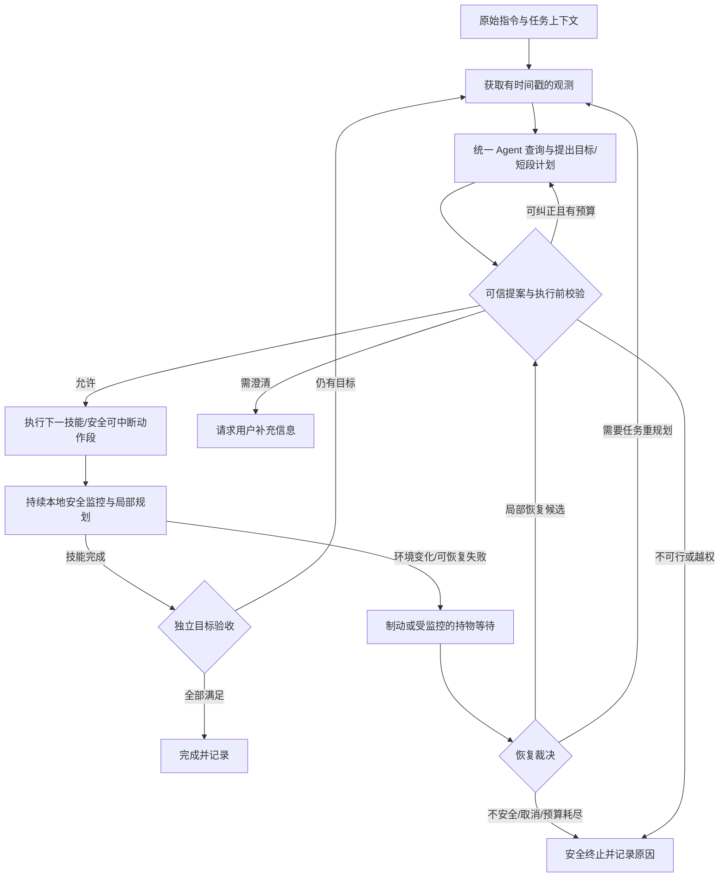
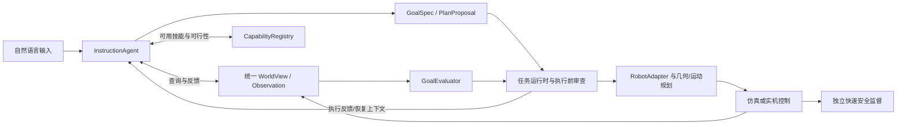

# 通用具身 Agent：差距与改造方案
> 2026-10-07清理更新：本文中的旧语言/规划模块与M3执行器属于历史分析，现已删除，未保留兼容入口。当前实现与P0/P1/P2完成状态见[自然语言任务执行链路](自然语言任务执行链路.md)。


日期：2026-10-06。本文原为改造前的架构与研究方案；本轮已完成P0/P1/P2及集成验收。当前实现见[新版执行链路](自然语言任务执行链路.md)，实施/失败处理与证据见[执行记录](../task-records/20261006-212836-general-agent-p0-p2/analysis.md)。第1–8节描述的是改造前问题与后续路线；其中“当前尚不存在”“没有恢复”等事实以新版链路为准。P3训练和P4感知/实机未实施。

## 1. 总体判断与目标边界

用户提出的三个方向都需要推进，但当前问题比“放开目的地、增加碰撞检测、合并语言文件”更深：**项目目前是两个受限场景的模型推理与技能执行 Demo，尚未形成可训练、可评测、可恢复的通用具身 Agent。**

需要先校正三个事实：

1. Home 的限制不完全是“代码只允许茶几和餐桌两个名字”。`resolve_home_goals()` 会读取当前地图的家具和操作点，因此同类新桌面有一定数据扩展空间；但它明确拒绝地板、拒绝非桌面放置，并依赖预登记操作点和固定姿态。Panda 的 `cube/target_a/target_b` 则确实是模型契约中的固定 ID。
2. 项目已经有实际碰撞检测、每步风险检查、失败制动和持物检查。缺少的是提前处理动态障碍、动作中断与续跑，以及把执行异常反馈给模型的恢复闭环。
3. 自然语言已经在真实模型路径中交给模型解析。现存规则仍在限制模型解析后的结构化目标、动作和底层技能；仅取消语言预解析不能解决这些限制。

“任意环境、任意任务”应转化为可验证的研究目标：**在未见地图、对象和任务组合中，对物理能力范围内的任务正确理解、探索、执行和恢复；对信息不足、暂时不可行和能力之外的任务给出可解释处理。** 把所有请求都返回成功，或允许模型执行任意动作，都无法代表泛化能力。

首先区分四类泛化：表达泛化（同一任务的新说法）、布局/对象泛化（新地图与实例）、任务组合泛化（已有技能的新组合）、技能泛化（新物理操作）。前三类可以逐步依靠统一表示、闭环规划和数据改进；第四类还需要新控制器、演示数据或技能学习。

## 2. 当前缺陷与源码证据

下表的行号对应调查时的工作树，函数名用于后续定位。

| 位置 | 当前处理 | 缺陷及改造方向 |
| --- | --- | --- |
| `agents/language.py`（历史，已删除） L96、L114–122 | Panda 目标仅能表示 `place/unsupported`、`cube/unknown` 和 A/B 等有限目标 | 换成动态实体引用和通用目标；保留类型、可观测性、权限校验 |
| [contracts.py](src/embodied_agent/contracts.py) L131、L148–171；`agents/planning.py`（历史，已删除） L155 | Panda 强制两步 `pick(cube,top) → place(target)`，并向模型提供 `required_plan` | 取消任务模板唯一性；允许合法的不同技能组合和已持物状态 |
| `agents/home_language.py`（历史，已删除） L248、L283–307 | 结构化目标被重新编译；抓取依赖有限操作点，地板在 L294–295 被拒绝，非桌面在 L298–299 被拒绝 | 目标解析与几何求解分开；操作候选由能力与运动规划层生成 |
| 同文件 L309、L371、L394 | 目标动作词汇有限；搬运生成固定结束模板；模型动作必须与重编译计划完全相同 | 校验目标、前后置条件和安全性，允许不同但可行的计划；停车/稳定策略由技能内部负责 |
| [skills/stretch.py](src/embodied_agent/skills/stretch.py) L125、L133–134、L186、L196 | 抓取仅验证特定小盒体尺寸/重量；放置仅支持桌面 | 泛化还需要真实抓姿、IK、轨迹和支撑面能力，不能只删除拒绝分支 |
| [agents/query_tools.py](src/embodied_agent/agents/query_tools.py) L25、L53、L120–135 | 查询读取捕获快照；能力报告有 fixture 限制 | 动态世界需要有时间与来源的新观测；能力报告应与执行条件共用判定逻辑 |
| [maps/schema.py](src/embodied_agent/maps/schema.py) L17、L20、L126、L134；[maps/home_schema.py](src/embodied_agent/maps/home_schema.py) L21–29、L117、L193、L324 | 桌面模板固定；Home 限定家具、状态和操作类别、单房间入口及操作点支撑关系 | 构建可扩展世界表示；未知语义允许进入世界模型，执行能力仍须验证 |
| [maps/unified_store.py](src/embodied_agent/maps/unified_store.py) L16、L27 | 统一目录仍只分派 Home/WorldMap 两类 schema | 地图导入通过适配器转成共同世界视图，Agent 不直接判断地图类型 |
| [skills/navigation.py](src/embodied_agent/skills/navigation.py) L34、L76；[skills/stretch.py](src/embodied_agent/skills/stretch.py) L62 | 导航开始时计算 A*，随后跟踪固定路径点 | 增加持续障碍更新、短时路径安全检测和局部重规划 |
| [simulation/stretch.py](src/embodied_agent/simulation/stretch.py) L151、L255；[safety/home.py](src/embodied_agent/safety/home.py) L61、L77 | 已逐物理步检查接触、几何风险、持物碰撞和漂移 | 保留这些保护，扩展预测与恢复；它们无需等待 LLM |
| [simulation/robot_episode.py](src/embodied_agent/simulation/robot_episode.py) L284、L352 | 顺序执行整套动作；异常后停止并返回失败 | 增加单步执行接口、执行监督器和恢复 attempt |
| [evaluation/home.py](src/embodied_agent/evaluation/home.py) L25；[evaluation/placement.py](src/embodied_agent/evaluation/placement.py) L98 | 已有独立接触、位置与稳定判定，但围绕放置任务 | 复用测量逻辑，扩展为目标关系/状态谓词验收 |
| [models/dialogue.py](src/embodied_agent/models/dialogue.py) L179、L275–286；`agents/home_language.py`（历史，已删除） L436 | 多轮循环只反馈查询结果；最终文本返回后才进行业务校验 | 将最终提案校验纳入有界对话修正；执行反馈纳入任务生命周期 |
| `configs/m3_runtime.json`（历史，已删除） L13–14 | `skill_retries=0`、`replans=0` | 加入恢复预算和任务共享预算，不能无上限重复尝试 |
| [evaluation/task_records.py](src/embodied_agent/evaluation/task_records.py) L318、L338、L384 | 已有任务记录、成功筛选、attempt/parent 字段 | 这些是数据基础；尚无训练样本导出、训练执行和泛化评测闭环 |

历史失败记录与此一致：`20261006_hlr_000003.json` 中模型已经正确输出 `support_id: floor`，随后目标契约拒绝；`000004` 的解释文字导致严格 JSON 解析失败，遮盖了模型指出的能力缺口。两次均未进入物理执行，不是输出 token 耗尽。

## 3. 缺陷一：从场景模板契约改为通用目标与能力约束

### 3.1 应删除、替换和保留的约束

| 约束 | 处理方式 | 理由 |
| --- | --- | --- |
| `cube/target_a/target_b`、目的地别名和默认桌名 | 从通用 Agent 移除，来自当前实体目录 | 实例名称不是机器人的能力边界 |
| 强制两步、完整动作列表完全相等 | 替换为前后置条件、目标与安全校验 | 不同路线、顺序和恢复方式可能都有效 |
| 预置抓点、固定放置偏移 | 逐步替换为几何/运动规划候选 | 新地图不应需要手工逐项登记操作姿态 |
| 固定家具/类别枚举 | 语义层允许扩展和未知类别；几何/控制由注册能力处理 | 可以理解新对象，但不能因此虚构新技能 |
| 参数类型、有限数值、真实实体引用、权限、安全规则 | 保留 | 防止幻觉对象、非法控制和危险执行 |
| 载荷、夹爪开度、可达域、碰撞间隙 | 保留，并由真实机器人能力提供 | 属于物理事实，需要实验扩大能力范围 |
| 输入长度、查询轮数、时间/token/动作预算 | 保留可配置资源边界，按任务复杂度调整 | 通用性不要求无限计算或无限重试 |

### 3.2 通用 GoalSpec

目标描述“希望世界变成什么样”，计划描述“如何达到它”。建议支持 `supported_on`、`inside`、`near`、`robot_at`、`held`、`state_equals` 等可验收关系，结合 `all/any`、数量和任务依赖；每个谓词须有对应验收实现。

例如“把遥控器放到地板上”的目标可以表示为：

```json
{
  "schema_version": 2,
  "goal": {
    "all": [
      {"predicate": "supported_on", "object_id": "object/remote-17", "surface_id": "surface/floor-1"},
      {"predicate": "released", "object_id": "object/remote-17"},
      {"predicate": "stable", "object_id": "object/remote-17"}
    ],
    "requested_method": "controlled_place"
  }
}
```

ID 是当前观测分配的实体句柄，不是全局白名单。稳定窗口、危险阈值等由可信验收策略决定，不能让模型通过修改阈值降低成功标准。模型可在充分观测后输出动作提案，执行器负责验证实体、参数、前提和实际效果。

还要保存来源、用户明确指定的方法、顺序和禁止事项。**“扔下桌面”与“安全放到地板”不能仅因最终位置相同就视为同一任务。** 如果缺少 throwing 技能，应报告该能力缺口并提出需用户接受的替代方案，不能偷偷改成普通放置。

### 3.3 目的地开放与能力落地

目的地可以是家具、支撑面、容器、区域、相对某个对象的区域或指定姿态。统一表示至少包括：实体 ID、坐标系、几何、可用区域、支撑性质、可达性和不确定性。

执行能力由 `CapabilityRegistry` 动态提供：

```text
SkillSpec:
  id / description / parameter_schema
  preconditions / expected_effects
  physical_limits / safety_constraints
  interruption_policy / evidence_requirements

check_feasibility(action, observation):
  feasible | infeasible | unknown
  reason_codes / candidate_pose_ids / required_observations
```

能力查询与执行前检查应复用同一组校验器。当前 `grasp_points` 没有包含执行技能的宽度、高度、质量门槛，是一个具体的不一致：模型得到“可抓候选”后仍可能执行失败。先消除这类漂移，再扩展技能覆盖。

地板放置要贯通支撑面建模、低位抓持/释放姿态、底座与手臂碰撞检查、真实支撑证据和稳定验收；沙发还涉及几何及支撑特性。去掉 `floor` 拒绝分支不会自动产生这些能力。

让 LLM 选择语义目标、经验证的候选姿态和技能组合；让几何/运动规划器计算导航、停靠、IK、抓取、放置和轨迹。SayCan 展示了把语言任务相关性与技能可行性结合的思路，本项目可借鉴这种能力落地方式，而不直接照搬其模型或技能集合。[SayCan 官方项目](https://say-can.github.io/)

## 4. 缺陷二：形成动态执行与恢复闭环

### 4.1 三个时间层次

| 层次 | 工作 | 是否依赖 LLM |
| --- | --- | --- |
| 控制周期/物理步安全层 | 碰撞、停止距离、持物稳定、关节限制、紧急制动 | 否，必须即时执行 |
| 技能/局部运动层 | 路径更新、减速、绕行、短时等待、抓取后实测 | 通常否，先使用本地算法 |
| 任务决策层 | 更换执行顺序、探索遮挡区域、处理目标移动或技能失败、规划剩余目标 | 可以调用 LLM |

突发状况不能先等待模型决定是否停车。先停止危险运动并确认可等待状态，再由模型处理任务层决策。局部障碍能绕开时，也不必为每次改道调用远程模型。

### 4.2 建议执行状态机



模型仍输出 `actions` 提案；`observe/query_world/get_capabilities/check_action` 等查询通过原生工具调用。实际 action 的执行权仍属于执行器，执行结果由任务运行时作为结构化反馈进入下一轮决策。

### 4.3 动态碰撞与变化处理

现有接触检测用于发现实际碰撞；要适应动态环境，还需要障碍物的位置、尺寸、速度、观测时刻和不确定性，以及对短时轨迹和停止距离的检测。导航途中持续更新局部障碍表示，检验剩余路线：能改道就本地重规划；暂时无路就受监控地等待；长期无路或需要调整任务顺序再请求 LLM。

第一阶段可以复用当前 A* 做中断后的重新寻路，但不能将其称为完整动态避障。后续再引入适合当前底座动力学的局部轨迹/速度规划，并实测制动、携物外廓和传感器延迟。

### 4.4 恢复信息与恢复分级

反馈包应包含原始指令及已确认目标、最新观测、动作与计划版本、失败阶段/原因、已实际完成步骤、仍未满足的目标、持物接触证据、剩余预算及当前允许能力。只发送“FAILED COLLISION”不足以让模型合理恢复。

| 状况 | 首选处理 |
| --- | --- |
| 动作尚未执行，JSON/字段格式不合法 | 在共享预算内返回 schema 和字段错误，有限修正 |
| 路径被挡，但任务目标未变 | 本地制动、更新障碍、重新寻路；必要时请求任务重规划 |
| 对象或目的地移动 | 获取新观测，撤销受影响的旧动作许可和候选姿态 |
| 空抓、滑落或部分放置 | 核对真实持物/支撑/位置，再规划剩余工作；不能重放整套动作 |
| 目标已完成但随后被扰动 | 验收撤销满足状态，按当前状态恢复 |
| 不支持的物理技能或永久不可达 | 说明能力缺口、探索其他可行方法或请求用户接受替代方案 |
| 持续接触、持物失稳、停车失败、取消 | 本地安全终止；不能等待 LLM 解除保护 |
| 记录失败 | 尽力安全收尾并报告；不能因此重复物理动作 |

Inner Monologue 研究把场景、成功检测和交互反馈送回语言规划器，支持这里的闭环设计方向；它不意味着可以删除安全控制或保证所有异常都能恢复。[Inner Monologue 官方项目](https://innermonologue.github.io/)

### 4.5 当前实现需要特别处理的边界

- **冻结快照与线程：** 当前 QueryTools 深拷贝规划前状态；模型 worker 不触碰 MuJoCo，UI 等待时也不持续推进物理。动态版本要让物理线程持续运行，通过消息队列生成新的不可变观测。单次观测保持一致，多次观测明确编号；不能让语言线程直接读写 `MjData`。
- **持物等待：** 现有有界 emergency stop 不是能够长时间等待模型的 HOLD 状态。新增等待模式必须持续制动、检测夹持/漂移和超时；不能冻结世界或自动松爪，也不能长期沿用紧急停车的 `on_step=None/check=False` 来跳过安全检查。无可靠等待条件时应本地终止。
- **计划时效：** Home 当前 plan 没有 Panda 的 `base_obs_id` 约束；全局 `world_version` 在正常动作中也变化，不能简单要求整项任务版本永远不变。应绑定 episode、地图/政策版本、计划代次，以及每个动作相关的实际状态与路径；执行前复验、许可仅消费一次。
- **任务预算与取消：** 轮次和单次超时已存在，任务总时间、累计 token、恢复次数和取消传播仍需统一。恢复 attempt 不重置预算，关闭 UI 或取消后不能继续发起新模型轮次。已发出的远程请求不一定能撤回，应丢弃迟到回复。
- **首错与收尾：** 新的恢复运行时必须分列执行、停止、观测、记录、清理错误，不能让二次错误盖住首错。优先沿用现有 H04/H07/H02 精简建议，不额外引入复杂插件框架。

## 5. 缺陷三：统一指令 Agent，保留底层适配器

建议一个 `InstructionAgent` 负责指令理解、信息查询、目标/计划提案与恢复决策；不直接依赖 `HomeWorld`、固定 cube、操作点模板或 MuJoCo 控制字段。旧语言文件直接删除，核心实现只保留一套（2026-10-07已完成）。



建议的最小共享接口：

```text
WorldAdapter.observe() -> Observation
WorldAdapter.search_entities(query) -> EntityCandidates
CapabilityRegistry.list_skills(observation) -> SkillSpecs
CapabilityRegistry.check_feasibility(action, observation) -> FeasibilityResult
InstructionAgent.decide(task_context, observation, feedback) -> Decision
ExecutionSupervisor.review_next_action(action, observation) -> ReviewResult
RobotAdapter.start(action, compiled_geometry) -> ExecutionHandle
RobotAdapter.poll(handle) -> ExecutionResult
RobotAdapter.cancel(handle)
RobotAdapter.safe_stop(context)
GoalEvaluator.evaluate(goal, observation, evidence) -> GoalStatus
```

`Decision` 显式区分 plan、query、clarify、capability_gap、done；`done` 仍需独立验收。接口返回 unknown 与依据，而不是把信息缺失当成不可行，或把“可能成功”当成已验证。

Panda 和 Stretch 的夹爪、自由度、导航和控制器不同，因此仍保留机器人执行、运动规划、观测、安全和验收适配器。合并文件时不能把能力压缩成两种机器人共同拥有的最小集合；同一个 Agent 根据当前机器人注册能力规划。

建议新增的代码边界为 `agents/instruction.py`、通用世界/目标类型、`capabilities/` 和恢复运行时；具体目录名在实施时确定。这些是拟议模块，当前尚不存在。会话通过适配器装配 Agent，不再在高层分别选择 HomePlanner 与 Panda GoalInterpreter。

## 6. 其他与期望存在差距的方面

| 差距 | 当前事实或影响 | 解决方法 |
| --- | --- | --- |
| 缺少真实感知与部分可观测建模 | 工具的来源标为 `captured_declared_simulation_state`；已知地图不是自主理解未见环境 | 初期提供带来源的仿真真值适配器；再加入相机/深度/定位、对象跟踪、置信度和遮挡状态。把感知评测与规划评测分开 |
| 世界表示不能覆盖生活任务 | 单房间、固定类别/状态，箱体近似杯子/书等；开门、容器内部、液体操作未真实实现 | 分层场景图表示房间、区域、实体、表面、容器、可动关节、关系；逐项扩展资产与技能，不把名称模拟等同于物理能力 |
| 缺少主动信息获取与歧义处理 | 不知道与不能执行容易混为一谈；同名对象、遮挡物难以处理 | 区分 known/unknown/infeasible；实体搜索、定位与受监控探索；多个候选时询问用户，不任意选一个合法 ID |
| 目标与用户意图一致性不足 | 结构化目标与动作一致，不等于目标忠实于原话 | 保存原始要求、来源、方法和禁忌；通过标注的目标语义评测、歧义澄清和独立结果判定检测误解 |
| 长任务与上下文规模受限 | 全地图输入和固定动作长度不适合多房间长任务 | 层次目标、任务相关子图检索、执行摘要与短段计划，避免仅不断增大 token |
| 错误尚未形成可学习恢复数据 | 查询错误能反馈；最终契约与执行错误通常结束任务 | 有限提案修正与恢复 attempt；记录实际状态和正确修正，而不是只收成功答案 |
| 任务记录尚未成为训练管线 | `training_only=True` 只是筛选已验证成功记录；没有样本导出/训练程序 | 新增标注、导出、去重、拆分、训练、模型版本管理与闭环回归 |
| 泛化效果尚无独立证据 | 当前仅一个家居布局；多数家居用例直接提供 `robot_plan`，验证执行/守卫，不能证明 LLM 规划泛化 | 留出地图族、对象、组合和动态扰动；保持测试集独立，报告失败分类与置信区间 |
| 缺少跨任务经验复用 | 现有记录是证据，尚无经评测的经验检索 | 后续可检索同类失败/成功摘要；每次用当前状态复验，不能照搬旧坐标或旧动作 |
| 初态编辑与动态世界不同 | 环境修改 Agent 编辑并保存初始地图，再刷新场景；不是执行期间的真实物体运动 | 保持编辑与机器人任务的权限边界；动态扰动经真实物理/控制链产生并记录，不能改 JSON 或重置地图冒充恢复 |
| 仿真到现实有差距 | 精确位置、接触、简化物体和项目损坏规则，与实物传感器不同 | 质量/摩擦/几何/延迟随机化、传感器误差、硬件在环和实机验证；仿真成功不代表实机成功 |

评测现状可查 [demo_cases.json](configs/demo_cases.json) L4、L99 和 [demo_language_cases.json](configs/demo_language_cases.json) L7–28；[evaluation/cases.py](src/embodied_agent/evaluation/cases.py) L82–86 的故障协议目前也是固定茶几导航场景。

大地图表示可借鉴 SayPlan 的分层场景图、任务相关子图搜索与经典路径规划结合；其研究也使用预构建场景图，因此它不能替代本项目所缺的环境感知。[SayPlan 官方项目](https://sayplan.github.io/)

## 7. 训练路线：先明确要训练哪一层

当前 [requirements.txt](requirements.txt) 与实际源码没有模型训练框架/执行链；`CAREER_ROADMAP_2026.md` 中的本地部署与 LoRA 是未来计划，不是已训练成果。外部 LLM 推理成功与“构造并训练自己的 Agent”需要分别报告。

### 7.1 近期：训练高层决策，而非从零训练所有能力

先用现有外部模型和统一运行时建立基线、生成经过执行与人工语义检查的轨迹。再为可部署的文本规划模型准备监督微调样本，输入原话、任务相关世界状态、能力、执行反馈；输出查询、目标/短段动作、澄清或能力缺口。

数据至少包含：新对象/地图下的可行任务、已有技能的新组合、同义和复杂指代、格式修正、动态障碍后的恢复、空抓/滑落/目标移动后的剩余规划、正确澄清，以及真实不可行/不安全任务的合理处理。成功筛选不能成为唯一数据来源，失败轨迹也不能未经审查当作正确答案。

建议导出单位为一个决策转移或完整多轮片段，包含 `task_id/attempt_id/episode_id`、观测来源与编号、地图族/任务族、能力/政策版本、前态、模型/工具记录、实际动作与后态、原始语义标注、独立验收及恢复标签。兼容当前任务 JSON，避免建立第二套互不关联的主记录。

先比较同一运行时下的外部模型、未微调模型与监督微调模型。只有明确改善留出任务后，再考虑偏好学习或基于真实结果的强化学习；奖励包含目标正确性、安全、资源消耗和恢复效果，不能只奖励合法 JSON 或技能正常返回。无需训练模型吐出内部推理过程，重点保留可核验的决策与执行证据。

### 7.2 中后期：感知与底层技能学习

高层文本模型训练不会自动学会抓取新形状、操作门把手或稳定投掷。若目标扩展到这些能力，需要视觉/深度输入、动作表示与机器人演示轨迹，适配已有策略或开展模仿学习，再单独验证安全性和真实动作。

Open X-Embodiment 提供跨机器人标准化数据与正迁移研究，说明广泛行为经验与统一数据表示的价值；其连续控制轨迹不能直接当成当前 JSON 动作计划的训练样本。[Open X-Embodiment 官方项目](https://robotics-transformer-x.github.io/)

OpenVLA 是可参考的视觉—语言—动作模型和适配路线，但控制动作、视觉输入和机器人数据与本项目高层规划不同；即使使用已有模型，仍需当前机器人的动作映射、数据适配和评测。其论文也报告较难语义泛化下的失败，不能把接入 VLA 视为“任意任务保证”。[OpenVLA 官方项目](https://openvla.github.io/)

如果继续沿用旧路线中的 8 GB 本地显存假设，近期应优先验证轻量高层模型的推理/参数高效微调资源，再决定模型、序列长度和批量；本轮未测显存，不能承诺某个配置可运行。完整 VLA 预训练和实机大规模采样另立资源计划。

## 8. 如何证明泛化能力

### 8.1 数据拆分

在采样前固定场景族、对象实例、任务族和随机种子划分，再生成训练数据。测试地图不能只是训练地图改名，测试指令也不能只是同一轨迹换一句话。分别测量：

1. 已见布局中的新表达、指代和歧义。
2. 未见布局/房间数量/目标 ID，使用已支持技能。
3. 未见对象实例、尺寸与姿态，并标注是否位于能力范围。
4. 训练未出现的技能组合、关系目标和长任务。
5. 动态障碍、对象/目标移动、空抓和滑落等未见扰动组合。
6. 信息不足、能力缺口、不可达和不安全任务，评价合理澄清与终止。

测试整个任务和相关派生轨迹必须在同一拆分；冻结教师模型生成规则、能力版本与评测器，防止用测试反馈继续调优却仍宣称留出表现。LIBERO 将空间、对象与目标知识迁移分开评测，可以借鉴这种拆分思路；它主要是机器人操作基准，不能覆盖本项目的全部移动导航和动态恢复要求。[LIBERO 论文](https://arxiv.org/abs/2306.03310)

### 8.2 指标

| 指标 | 判定方式 |
| --- | --- |
| 语义正确率 | 目标对象、目的地、方法、来源、约束与标注意图一致 |
| 可行任务成功率 | 独立验收满足目标与过程要求；不能只看返回 SUCCESS |
| 错误拒绝率 | 对已验证可行、能力范围内任务的错误拒绝；与合理能力拒绝分开 |
| 碰撞与危险事件 | 区分允许的操作接触、危险实际接触、风险进入、近碰撞与守卫中止 |
| 动态恢复成功率 | 注入扰动后最终正确完成，记录恢复时延和额外动作 |
| 旧计划阻断与取消 | 变化后不执行失效动作，取消后不再发起任务动作/模型新请求；必要安全控制继续执行 |
| 澄清/能力缺口处理 | 歧义不乱选、未知不伪造、不可行有准确依据 |
| 成本与效率 | 全任务 token、调用、墙钟/仿真时间、路径长度、尝试次数 |
| 长任务部分完成与持续稳定 | 报告完成子目标、目标撤销及最终稳定，不掩盖中途失败 |

使用多随机种子与区间估计；阶段验收同时看静态回归、动态恢复、失败语义和成本。恢复实验应以相同初态、扰动种子和任务预算，比较不恢复、固定重试、本地恢复与 LLM 重规划；如果要单独研究恢复效果，可固定初次计划。零碰撞的有限测试不能构成对所有环境的安全证明。

当前快照不是可恢复的物理 checkpoint。成对重放/修复实验需控制完整物理与控制器状态，或用确定性初态重新构造同一事件流程；实际恢复期间不能重置世界来抹去失败，也不能把未来扰动或评测答案放进模型输入。

## 9. 建议实施顺序与可交付验收

| 阶段 | 状态 | 实际交付或后续内容 | 验收 |
| --- | --- | --- | --- |
| P0：统一语义与接口 | **已完成** | GoalSpec/WorldObservation/动态能力；单一InstructionAgent；模型意图确认/方法来源冻结；多种合法计划与相关部分段；统一审查和可靠收尾 | 新region/实体ID、持物续执行、目标已满足、模型修正/能力缺口、原安全回归通过；真实模型新程序化地图任务通过 |
| P1：动态执行与恢复 | **已完成** | 真实单动作执行/中断、HOLD、新观测、动态路线与局部改道、执行反馈、多attempt、预算与取消 | 真实外力使障碍进入路线后制动/绕行通过；状态/控制/几何变化阻断旧许可；目标冻结/已完成前缀复验；GUI关闭与预算检查通过 |
| P2：扩大环境与技能覆盖 | **已完成** | 自动停靠/抓放、几何支撑面、地板/沙发座面/新平台/桌面、开放家居实体类别与动态桌面区域、程序化布局 | 地板双向搬运、新平台和沙发经原控制实际接触/释放/稳定验收通过；无手填操作点的新图实际模型搬运通过；默认同model/data可视通过 |
| P3：数据与高层训练 | 未实施 | 标注与导出、去重和留出拆分、基线与监督微调、版本化报告 | 相同运行时下，留出语义与执行成功率优于基线，安全与错误拒绝率没有退化 |
| P4：感知与策略迁移 | 未实施 | 部分可观测、感知/跟踪、视觉动作策略、域随机化与硬件验证 | 噪声/遮挡和更真实对象下保持目标正确性；实机结果单独报告 |

完成范围和源码逐节点映射见[新版执行链路](自然语言任务执行链路.md)。[最终回归](../task-records/20261006-212836-general-agent-p0-p2/verification-final.log)为258项发现测试（254通过，4项GUI另测全通过），[实际模型验收](../task-records/20261006-212836-general-agent-p0-p2/acceptance/actual-model-summary-v3.json)保留查询、方法和物理证据。阶段完成不能替代第8节的正式训练/留出泛化评测。

P0 以现有支持的技能验证“高层解耦”；P2 才验证新增物理覆盖，两者不能混为一项完成声明。开始训练数据采集时至少固定 P0 接口，并纳入 P1 的恢复标签，避免训练完成后又大幅更换动作语言。

### 首批跨地图/动态验收场景

- 新地图使用随机家具和物品 ID，以第三个支撑面为目标；不修改指令 Agent 代码。
- 同一任务从空手和已正确持物两种状态启动；模型能生成不同合法方案。
- 受控放置到地板真实执行成功；明确投掷任务在没有投掷能力时被准确解释和报告，不能冒充完成。
- 导航过程中障碍通过正常控制进入路线；无安全路线时停车，有可行路线时改道。
- 已抓取后目的地移动、或放置完成后目标被扰动；重新观测和验收，继续真实剩余任务。
- 同名对象/遮挡目标引发信息查询或澄清，禁止猜测实例。
- 首次执行错误后最终观测也失败；保留首错、停止结果与记录状态。
- 等待模型期间取消或预算耗尽；无后续新模型请求和任务动作，可信制动、持物监控与安全收尾继续执行。

这套路线首先解决“架构是否允许泛化”，再扩大“机器人实际能做什么”，最后用训练和留出实验验证“模型是否学会泛化”。新增代码、数据和训练结果都需要各自的真实证据。
